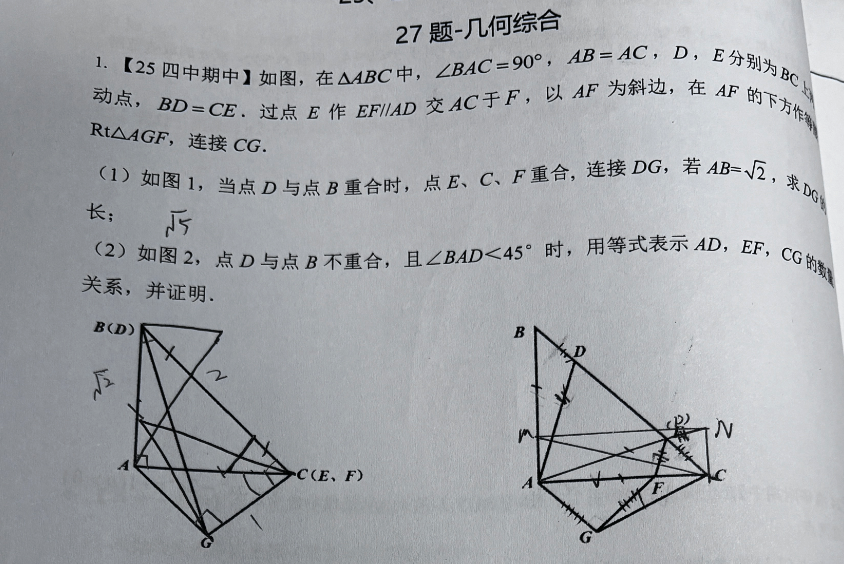
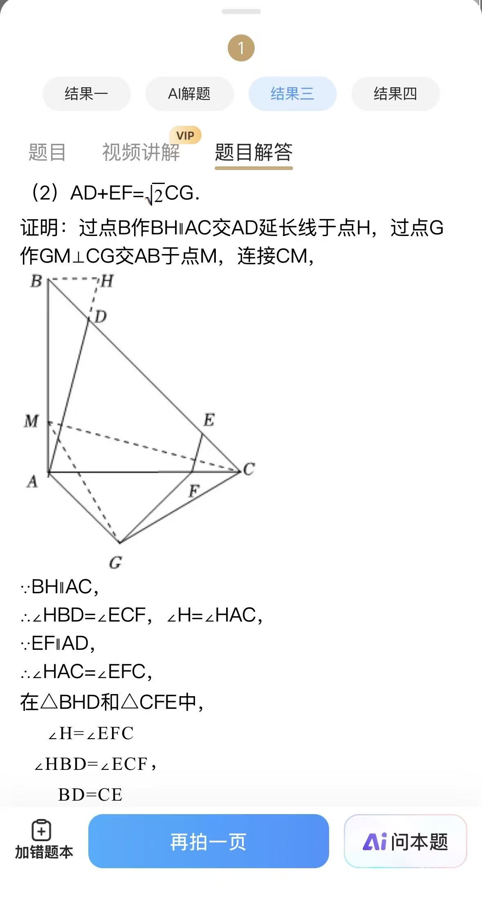

# 老刘数学-几何综合：25 四中期中 27 题

## 题目

如图，在 △ABC 中，∠BAC=90°，AB=AC，D、E 分别为 BC 上的动点，BD=CE。过点 E 作 EF∥AD 交 AC 于 F，以 AF 为斜边，在 AF 的下方作等腰直角三角形 Rt△AGF（即 ∠AGF=90°，AG=GF），连接 CG。

（1）如图 1，当点 D 与点 B 重合时，点 E、C、F 重合，连接 DG，若 AB=√2，求 DG 的长；

（2）如图 2，点 D 与点 B 不重合，且 ∠BAD<45° 时，用等式表示 AD、EF、CG 的数量关系，并证明。

> 注：照片第 4 行末尾被书页折缝吞掉了 Rt△AGF 前面的修饰词，该词只能是「等腰」（即 AG=GF）。理由：若只知 ∠AGF=90°，G 可以是「以 AF 为直径的下半圆」上任意一点，(1) 的 DG 随 G 移动而变化、没有唯一答案；而用 (1) 的答案 √5 反推，恰好 AG=GF。转述题目时务必补上这个条件。

- 来源：25 四中期中（照片原标注）
- 难度：⭐⭐ 中考综合（压轴几何综合）
- 考查知识点：等腰直角三角形性质、全等三角形（AAS/ASA/SAS）、平行线的角、勾股定理、线段和的拼接（平移拼接）、旋转模型（手拉手）

## 解题思路

- **等式左边（AD+EF）**：两段平行但不同线，不能直接相加 → 用全等把 EF「平移」到直线 AD 上、与 AD 首尾相接，把和拼成一条整段 AH
- **等式右边（√2·CG）**：G 是等腰直角三角形的直角顶点，GA=GF、∠AGF=90° —— 这是「旋转中心」：绕 G 转 90° 能让 A、F 互换，而任何点绕 G 转 90° 后，「原点与像的连线」自动是到中心距离的 √2 倍。√2 就从这里来
- **证明结构**：三组全等环环相扣 —— 第 ① 组的副产品（BH=CF）是第 ③ 组的原料；第 ② 组是旋转的落地写法

## 解答过程

### 第（1）问

**第 1 步：读清退化位置上的所有线段和角**

D 与 B 重合、E、C、F 重合时：AF=AC=AB=√2。等腰直角 △AGF 斜边 AF=√2，故直角边 AG=GF=1，∠GAF=∠GFA=45°（G 在 AC 下方）。

要求的是 DG，此时即 BG。手里有：BA=√2，AG=1，以及它们的夹角 ∠BAG=∠BAC+∠CAG=90°+45°=135°。

**第 2 步：造直角（垂线作到 BA 的延长线上）**

> **追问：为什么在这里作垂线？垂足为什么落在延长线上？**
> 「两边夹一角求第三边」，初三的工具只有勾股定理，而勾股定理必须站在直角三角形里；可 BG 所在的图里一个直角都没有，所以必须自己造。夹角是 135° 钝角，从 G 向直线 AB 作垂线，正好把 135° 拆成 90°+45°：拆出的 45° 与已知斜边 AG 配成等腰直角三角形，腿立刻算得出。而 135° 是钝角，G 在 A 处「往后仰」，垂足必然落在钝角张口的外面——即 BA 的延长线上——不延长 BA 就接不住垂足。这不是偏好，是钝角逼的。

过 G 作 GK⊥AB，交 BA 的延长线于 K。则 ∠GAK=180°−135°=45°，△AKG 是以 AG=1 为斜边的等腰直角三角形，故 AK=GK=√2/2。

**第 3 步：勾股定理收尾**

BK=BA+AK=√2+√2/2=3√2/2。在 Rt△BKG 中：

$$
DG=BG=\sqrt{BK^2+GK^2}=\sqrt{\frac{9}{2}+\frac{1}{2}}=\sqrt{5}
$$

**答案**：DG=√5。

### 第（2）问

**结论**： $AD+EF=\sqrt{2} CG$。

**辅助线**：过点 B 作 BH∥AC 交 AD 的延长线于点 H；过点 G 作 GM⊥CG 交 AB 于点 M；连接 CM。

> **问 1：「√2·CG」是怎么冒出来的？**
> 有三个独立入口，任何一个都能走到：
>
> ① **模型反射（主路径）**：把不变量列全后会发现，G 与整个图形的唯一联系是两条相等线段 GA、GF 和它们之间夹的 90°。「一点发出两条相等线段 + 夹角固定」是旋转中心的标准信号（手拉手模型的本体）：绕 G 转 90° 可以让 F 和 A 互换。于是自然动作是把 △GFC 绕 G 转 90°，让 GF 落到 GA 上，C 落到 C′。这个动作有两个自动副产品：直线 AC 被 90° 旋转变成「过 A 且垂直于 AC 的直线」，即直线 AB，所以 C′ 落在 AB 上，图形回到「直线世界」；并且任何点绕 G 转 90° 后，原点与像的连线必然满足 GC=GC′、∠CGC′=90°，即 △CGC′ 自动是等腰直角三角形，故 CC′=√2·CG。**√2 不是「想把 CG 放大 √2 倍」才造出来的，它是旋转的影子**——只要绕 G 转 90°，原像与像的连线就自带 √2 倍。
>
> ② **用 (1) 猜 (2)（考场保险）**：27 题的 (1) 往往是 (2) 结论的退化特例。图 1 正是图 2 的一个极端位置：AD=AB=√2；E、F 都与 C 重合，故 EF=0；此时 FC=0，CG 就是 GF=1。三个数代入：√2+0=√2×1，等式在 (1) 里已经成立。再想：这张图里唯一能生产无理数比例的「工厂」是 45° 等腰直角三角形，它能产的系数只有 1、2、√2、√2/2，逐个试一遍，√2 一次命中；不放心就再取一个 BD 的具体值算三条线段验证。
>
> ③ **汇率直觉**：CG 的一个端点是 G，而 G 对外界的「汇率」只有 45°/90°/135° 这组角和 GA=GF。要把 CG 写进与 AD、EF 同台的等式，必须先把它换成一条两端点都落在直线世界里的线段；最省的做法是让 CG 当等腰直角三角形的直角边、用斜边做代表。这与 ① 是同一件事，只是「造出来」而非「转出来」的说法。

> **问 2：BH 这条线是怎么想出来的？（倒推链）**
>
> 第 1 步，**看目标左边**：AD+EF 是「两段平行但不同线的线段之和」。线段求和只有两种标准手法：截长补短，或把其中一段平移到另一段所在直线上、首尾相接拼成一条整段。这里 EF∥AD，平移拼接最顺：把 EF 搬到直线 AD 上接在 AD 后面，和就变成直线 AD 上的一条整段 AH。
>
> 第 2 步，**平移要靠全等，去全等三角形库里找现成材料**：要搬 EF，就需要一个以 EF 为边的三角形（现成的：△CEF，三边是 CE、EF、FC），把它「复制」到 D 处，让 EF 的对应边落在直线 AD 上。这时扫一遍还没用过的条件：只剩 BD=CE。而 D、E 恰好是两条平行线 AD、EF 与 BC 的交点——BD 和 CE 天然就是这对全等三角形的对应边。于是目标锁定：△BHD≌△CFE（对应 B↔C、H↔F、D↔E），其中 H 是待定新点。
>
> 第 3 步，**盘点这对全等「已有」和「还缺」什么，缺什么就造什么**：边 BD=CE，已知，有了；角一，H 在 AD 延长线上时 ∠BDH=∠ADC（对顶角），而 EF∥AD 得 ∠CEF=∠ADC（同位角），所以这对角自动相等、不需要辅助线；还缺角二：∠HBD=∠FCE，而 ∠FCE 就是 ∠ACB=45°，是死值，于是要求「过 B 的那条线与 BC 夹 45°（且与 ∠ACB 成内错角位置）」。过 B 的直线有无数条，但能与 BC 构成和 ∠ACB 相等的内错角的，只有与 AC 平行的那一条。所以 BH∥AC 不是灵感，是被「凑齐 △BHD≌△CFE 的最后一块角」这个需求唯一刻出来的线。
>
> 第 4 步，**副产品验证选择**：画完后 ① DH=EF，和成功拼成 AH；② BH=CF——这个副产品当时看似无用，但走到第三组全等时会发现，它与第二组全等得到的 AM=FC 拼成 BH=AM，恰好是最后一座桥 △ABH≌△CAM 的原料。官方三组全等环环相扣：第一组的副产品是第三组的原料。
>
> （反过来问：为什么搬 EF 而不搬 AD？搬 AD 到 EF 上，拼出的整段两端都悬在 EF 世界，后面要接回 AB、AC、C、G 得绕远；搬 EF 到 AD 上，整段 AH 留着端点 A 这个定点，且 △ABH 因 BH∥AC 自动带一个直角，正好和 △CAM 对上。）

**第 1 步（拼和）：△BHD≌△CFE（AAS）**

∵ BH∥AC，∴ ∠HBD=∠FCE（内错角，截线 BC），∠BHD=∠HAC（内错角，截线 AH）。

∵ EF∥AD，∴ ∠HAC=∠EFC（同位角，截线 AC）。∴ ∠BHD=∠EFC。

在 △BHD 和 △CFE 中：∠BHD=∠CFE，∠HBD=∠FCE，BD=CE，

∴ △BHD≌△CFE（AAS）。∴ DH=EF，BH=CF。

∴ $AD+EF=AD+DH=AH$。

**第 2 步（造 √2）：△GAM≌△GFC（ASA）**

∵ △AGF 是等腰直角三角形，∴ GA=GF，∠GAF=∠GFA=45°，∠AGF=90°。

∴ ∠GAM=∠GAB=90°+45°=135°（G 在 AC 下方、M 在 AB 上），∠GFC=180°−45°=135°，∴ ∠GAM=∠GFC。

∵ GM⊥CG，∴ ∠MGC=90°=∠AGF，两边同减公共角 ∠MGF，得 ∠AGM=∠FGC。

在 △GAM 和 △GFC 中：∠AGM=∠FGC，GA=GF，∠GAM=∠GFC，

∴ △GAM≌△GFC（ASA）。∴ GM=GC，AM=FC。

∴ △MGC 是等腰直角三角形（∠MGC=90°，GM=GC），∴ $MC=\sqrt{2} CG$。

> 这一步就是追问 1 里「绕 G 旋转 90°」的落地写法：想的时候用旋转，写的时候用全等，是同一件事；M 就是旋转后 C′ 落在 AB 上的位置。

**第 3 步（搭桥）：△ABH≌△CAM（SAS）**

∵ BH∥AC，∠BAC=90°，∴ ∠ABH=180°−∠BAC=90°（同旁内角互补）；又 ∠CAM=∠CAB=90°。

∵ BH=CF（第 1 步），AM=FC（第 2 步），∴ BH=AM。

在 △ABH 和 △CAM 中：AB=CA，∠ABH=∠CAM=90°，BH=AM，

∴ △ABH≌△CAM（SAS，对应 A↔C、B↔A、H↔M）。∴ AH=CM。

**第 4 步（串联）**

$$
AD+EF=AH=CM=\sqrt{2} CG
$$

## 相关知识点

- **等腰直角三角形**：底角 45°；直角边 = 斜边 × √2/2；斜边 = 直角边 × √2
- **旋转模型（手拉手）**：一点发出两条相等线段 + 夹角固定 = 旋转中心；绕中心转 90° 后，原点与像的连线 = √2 × 到中心的距离
- **线段和的三种处理**：截长、补短、平移拼接；两段平行时优先平移拼接
- **辅助线倒推法**：先定「要证哪一对三角形全等」（或要做什么旋转），再盘点「已有 vs 还缺」，缺的条件唯一确定辅助线
- **两边夹钝角求第三边**：作高到边的延长线，把钝角拆成 90° + 特殊角（135°→45°、120°→60°、150°→30°）
- **全等链**：前一组全等的副产品（一对相等线段）往往是后一组全等的原料

## 易错点提醒

- **漏掉「等腰直角」条件**：只有「∠AGF=90°」时 G 不固定，(1)(2) 都不成立；照片折缝吞掉的正是这个词
- **(1) 垂足位置画错**：∠BAG=135° 是钝角，垂足 K 在 BA 的延长线上而非线段 AB 上；画错会把 BK 算成 BA−AK
- **① 的等角链用错截线**：∠BHD=∠HAC 用截线 AH，∠HAC=∠EFC 用截线 AC，两步是两组不同的平行线角关系，不能合并或写反
- **② 中直接断言 ∠AGM=∠FGC**：必须写「∠MGC=∠AGF=90°，两边同减公共角 ∠MGF」，否则扣分
- **③ 的对应关系写乱**：A↔C、B↔A、H↔M，结论边是 AH↔CM；对应写错就得不到结论
- **忽视 ∠BAD<45° 的作用**：它保证 F 落在线段 AC 上、E 在 D 与 C 之间（图形拓扑不变），证明中所有角关系都依赖这个位置关系

## 复盘

- 错因：方法不熟——辅助线（BH、GM）想不出来。根因是做「正向构造」而不是「需求倒推」：正确顺序是先决定要证哪一对三角形全等（或要做什么旋转），再盘点缺什么条件，缺的条件唯一确定辅助线（本题 BH∥AC 就是为补最后一对角而生）
- 顺序的另一面：思考时也可以从右边入手——先用旋转/全等 ② 把 √2·CG 处理成 MC 并得到 AM=FC，再从「要给 AH 和 MC 搭桥」倒推需要 BH=AM 和一个直角，同样走到 BH∥AC。两个方向的倒推在同一条线汇合，说明这条线是被需求唯一确定的
- 掌握状态：未掌握
- 复习记录：
