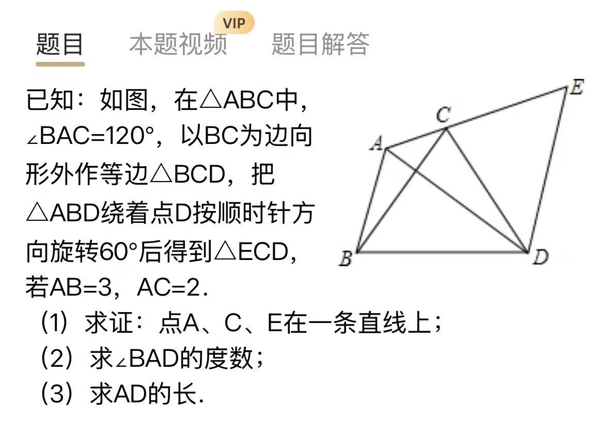
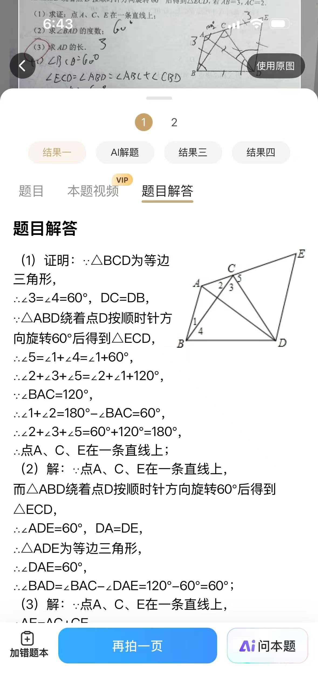
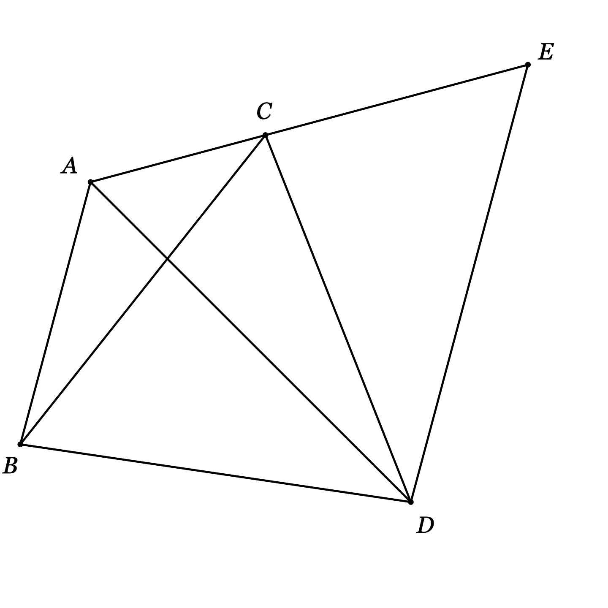

# △ABD 绕 D 顺时针旋转 60°：证 A、C、E 共线，求 ∠BAD 与 AD

## 题目

已知：如图，在 △ABC 中，∠BAC=120°，以 BC 为边向形外作等边 △BCD，把 △ABD 绕着点 D 按顺时针方向旋转 60° 后得到 △ECD，若 AB=3，AC=2。

（1）求证：点 A、C、E 在一条直线上；

（2）求 ∠BAD 的度数；

（3）求 AD 的长。

- 来源：学校（错题本 App 截图拍照）
- 难度：⭐⭐ 中考综合
- 考查知识点：旋转的性质（对应边、对应角、旋转角）、等边三角形的性质与判定、三角形内角和、平角与三点共线的证明、共线时的线段相加

## 解题思路

- **把旋转给的对应关系列全**：△ABD→△ECD（A↔E、B↔C、D↔D），于是 DA=DE、BA=CE=3、∠ABD=∠ECD，旋转角 ∠ADE=60°。后面三问全是这几条的复用。
- **共线 = 中间点处角凑成平角**：C 点周围三个角 ∠ACB、∠BCD、∠DCE 加起来，用 ∠DCE=∠ABD=∠ABC+60° 和三角形内角和 ∠ACB+∠ABC=60°，正好 180°。
- **(2) 靠等边 △ADE**：DA=DE 且夹角 60° → 等边 → ∠DAE=60°；又因共线，射线 AE 就是射线 AC，故 ∠BAD=120°−60°=60°。
- **(3) 靠共线才能相加**：AE=AC+CE=2+3=5，等边 △ADE 把 5 交给 AD。整道题的设计就是：**旋转把 AB 搬到 AC 的延长线上，共线保证搬得「正」，相加才有意义**。

## 解答过程

### 第（1）问：证 A、C、E 共线

证明：

∵ △BCD 是等边三角形，∴ ∠DBC=∠BCD=60°。

∵ △ABD 绕点 D 顺时针旋转 60° 得到 △ECD（A↔E、B↔C），

∴ ∠ECD=∠ABD（对应角）。而射线 BC 在 ∠ABD 内部，∴ ∠ABD=∠ABC+∠DBC=∠ABC+60°。

∴ ∠ACB+∠BCD+∠DCE=∠ACB+60°+(∠ABC+60°)=(∠ACB+∠ABC)+120°。

在 △ABC 中，∠BAC=120°，∴ ∠ACB+∠ABC=180°−120°=60°。

∴ ∠ACB+∠BCD+∠DCE=60°+120°=180°。

即 C 点处这三个角拼成平角，∴ 点 A、C、E 在一条直线上。

> **追问：证「三点共线」的套路是什么？**
> 让中间那个点（本题是 C）周围的角加起来等于 180°（平角）。所以先数 C 点周围被哪几条线分成了几个角：本题恰好是 ∠ACB、∠BCD、∠DCE 三个，把它们求和即可。反过来，题目若已告知共线，也要马上反应出「这里藏着一个平角可以列等式」。

### 第（2）问：求 ∠BAD

∵ 旋转角为 60°，A 的像是 E，∴ ∠ADE=60°；又 DA=DE（对应边），

∴ △ADE 是等边三角形（有一个角是 60° 的等腰三角形），∴ ∠DAE=60°。

∵ A、C、E 共线，∴ 射线 AE 与射线 AC 是同一条射线，∴ ∠DAC=∠DAE=60°。

∴ ∠BAD=∠BAC−∠DAC=120°−60°=60°。

**答案**： $\angle BAD=60^\circ$。

### 第（3）问：求 AD

∵ 旋转对应边相等，∴ CE=BA=3。

∵ A、C、E 共线且 C 在 A、E 之间，∴ $AE=AC+CE=2+3=5$。

∵ △ADE 是等边三角形，∴ AD=AE=5。

**答案**： $AD=5$。

> **追问：题目为什么非要绕 D 旋转 60°？共线到底有什么用？**
> AB 和 AC 原本从 A 出发岔成 120°，两条线段没法直接相加。旋转把 AB（变成 CE）恰好搬到 AC 的延长线上——第 (1) 问证的共线就是保证「搬得正」——于是 AE=AC+CE 把 2 和 3 加成了 5，再靠等边 △ADE 把 5 转交给 AD。**以后看到「旋转 60°/90°」又问「某几条线段的和」，先想：旋转是在把一条线段搬去和另一条拼接**。

## 相关知识点

- **旋转的性质**：对应线段相等（DA=DE、CE=BA）；对应角相等（∠ECD=∠ABD）；对应点与旋转中心连线的夹角等于旋转角（∠ADE=∠BDC=60°）
- **等边三角形的判定**：有一个角是 60° 的等腰三角形是等边三角形（△ADE）；性质：三边相等、三角都是 60°（△BCD）
- **三点共线的证明**：中间点周围的角之和为 180°（平角）
- **三角形内角和**：把 ∠BAC=120° 转成 ∠ACB+∠ABC=60° 供拼角使用
- **共线时的线段相加**：C 在 A、E 之间时 AE=AC+CE；不共线就不能这么加

## 易错点提醒

- **旋转对应写错**：△ABD→△ECD 是 A↔E、B↔C、D↔D；把 AB 的对应边写成 CD 或 ED，后面全错
- **(1) 漏加 ∠DBC**：∠ABD 不是 ∠ABC，射线 BC 在 ∠ABD 内部，∠ABD=∠ABC+60°；漏了这 60° 拼角就差 60°
- **(2) 直接写 ∠BAD=∠BAC−∠DAE**：必须先说明共线使射线 AE 与射线 AC 重合，否则 ∠DAE 和 ∠DAC 不是同一个角
- **(3) 默认 C 在 A、E 之间**：相加前要引用第 (1) 问的共线结论和图上位置；没有共线，AE=AC+CE 不成立
- **旋转角认错**：旋转中心是 D、旋转角 60°，得到的是 ∠ADE=60°（A 与它的像 E）、∠BDC=60°（B 与它的像 C）；∠ADC、∠BDE 之类都不是旋转角，别乱用

## 复盘

- 错因：待补充
- 掌握状态：未掌握
- 复习记录：
  - （待抽查）
