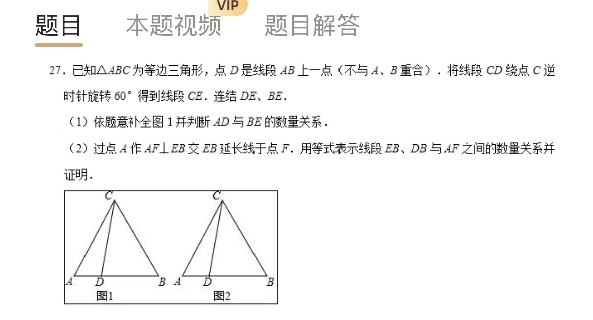
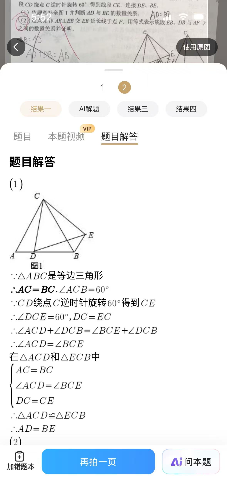
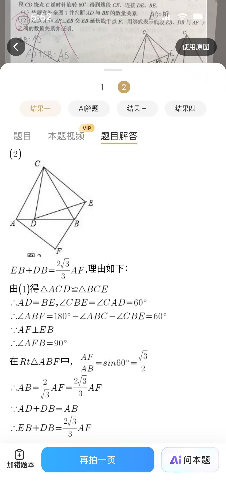
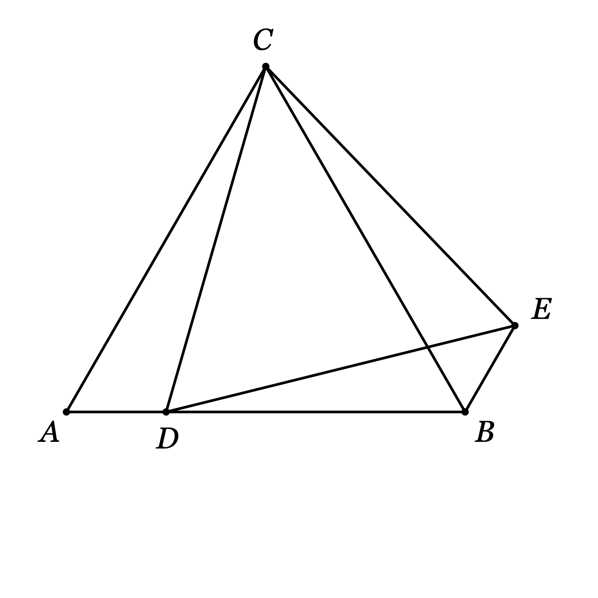
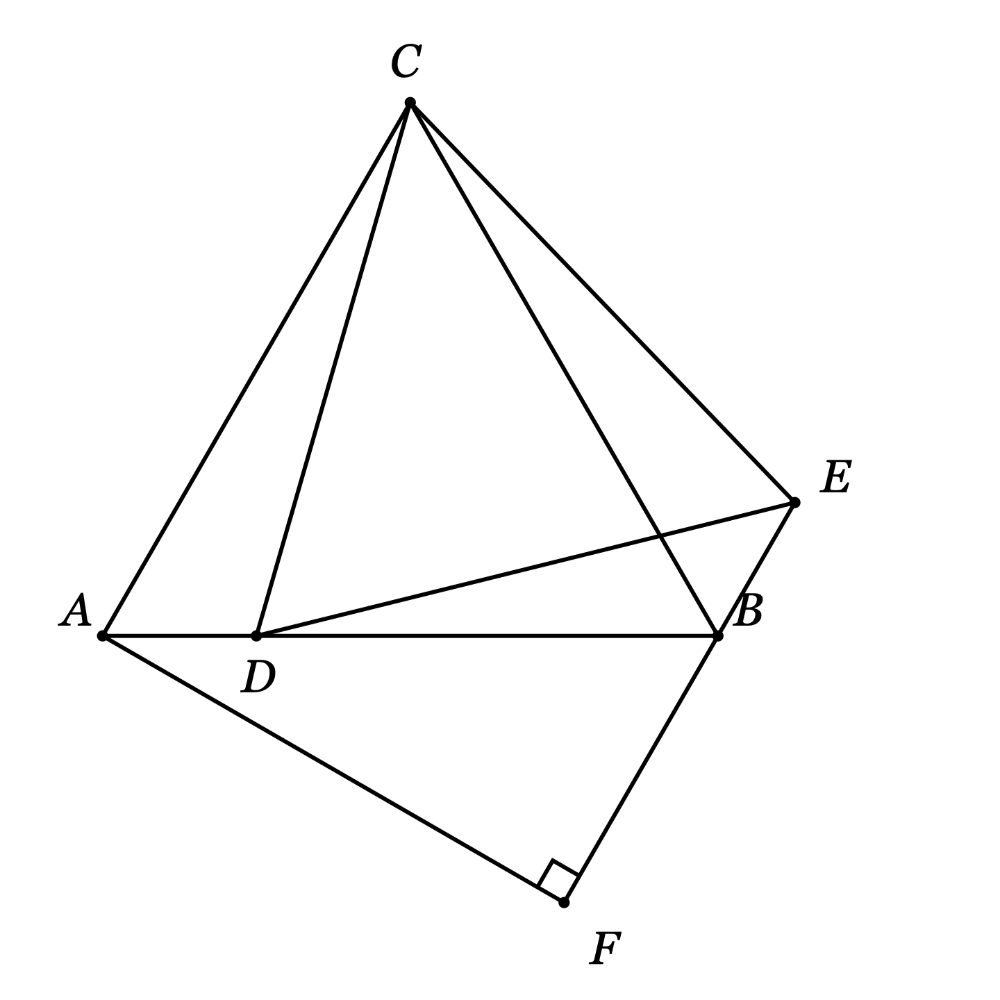

# 等边三角形旋转线段 CD 60°：AD 与 BE、EB+DB 与 AF 的数量关系

## 题目

已知 △ABC 为等边三角形，点 D 是线段 AB 上一点（不与 A、B 重合）。将线段 CD 绕点 C 逆时针旋转 60° 得到线段 CE。连结 DE、BE。

（1）依题意补全图 1 并判断 AD 与 BE 的数量关系。

（2）过点 A 作 AF⊥EB 交 EB 延长线于点 F。用等式表示线段 EB、DB 与 AF 之间的数量关系并证明。

- 来源：学校（错题本 App 截图拍照）
- 难度：⭐⭐ 中考综合
- 考查知识点：等边三角形性质、旋转的性质、全等三角形（SAS）、含 30° 角的直角三角形、勾股定理、平角与线段和差

## 解题思路

- **旋转给的就两样**：CE=CD、∠DCE=60°。这两条是 (1) 里全等的全部原料。
- **两个 60° 角叠在一起**：∠ACB=∠DCE=60°，中间叠着公共的 ∠DCB；等角减同角得 ∠ACD=∠BCE，配两组等边就是「手拉手」全等 △ACD≌△BCE。
- **(2) 先代换再合并**：把 EB 换成 AD，EB+DB 就变成 AD+DB，恰好是整段 AB；问题化为「求 AB 与 AF 的关系」。
- **AB 与 AF 放进同一个直角三角形**：Rt△ABF 里只缺 ∠ABF。F 在 EB 延长线上，所以 B 点处 ∠ABC、∠CBE、∠ABF 三角拼成平角，而 ∠CBE=∠CAD=60° 由全等给出，故 ∠ABF=60°。

## 解答过程

### 第（1）问：补全图形并判断 AD 与 BE 的关系

**补图做法**：以 C 为旋转中心，把点 D 逆时针转 60° 得到点 E（CE=CD、∠DCE=60°，E 落在 BC 右侧），再连接 CE、DE、BE。

**结论**： $AD=BE$。

证明：

∵ △ABC 是等边三角形，∴ AC=BC，∠ACB=60°。

∵ 线段 CE 由 CD 绕点 C 逆时针旋转 60° 得到，∴ CD=CE，∠DCE=60°。

∴ ∠ACB=∠DCE，两边同时减去公共的 ∠DCB：∠ACB−∠DCB=∠DCE−∠DCB，即 ∠ACD=∠BCE。

在 △ACD 和 △BCE 中：AC=BC，∠ACD=∠BCE，CD=CE，

∴ △ACD≌△BCE（SAS）。∴ $AD=BE$。

> **追问：为什么「两边减同一个角」就能得到一对等角？**
> 两个 60° 角 ∠ACB 和 ∠DCE 在图里是叠放的，重叠部分恰好是 ∠DCB。两个相等的量减去同一块重叠，剩下的部分必然相等。这就是旋转「手拉手」模型的标准动作：**旋转角与原图形的角相等（本题都是 60°）时，减去（或加上）公共的中间角，就得到全等需要的那对等角**。若某个位置下两个 60° 角不重叠、中间隔着缝，就改成加上中间角，道理相同。

顺带一提：由 CD=CE、∠DCE=60° 还能知道 △CDE 是等边三角形（DE=CD=CE），本题没用到，但画图时可以顺手验证 E 的位置对不对。

### 第（2）问：EB、DB 与 AF 的数量关系

**结论**： $EB+DB=\dfrac{2\sqrt{3}}{3} AF$。

证明：

**第 1 步：把 EB 换成 AD，让和落到一条直线上**

由 (1) △ACD≌△BCE，∴ EB=AD，且 ∠CBE=∠CAD=60°。

∵ D 在线段 AB 上，∴ AD+DB=AB。

∴ $EB+DB=AD+DB=AB$。

> **追问：为什么要做这个代换？**
> EB 和 DB 在两条不同的直线上，它们的和没法直接算。代换后 AD 与 DB 是同一条线上首尾相接的两段，和就是整段 AB。**处理线段和，先看能不能等量代换到同一条线上**；能，和就变成一条线段，问题立刻简化。

**第 2 步：求 ∠ABF**

∵ F 在 EB 的延长线上，∴ E、B、F 三点共线，B 点处直线 EF 同侧的三个角拼成平角：

∠ABC+∠CBE+∠ABF=180°。

∴ ∠ABF=180°−60°−60°=60°。

**第 3 步：在 Rt△ABF 中把 AB 与 AF 联系起来**

∵ AF⊥EB 于 F，∴ ∠AFB=90°。

在 Rt△ABF 中，∠ABF=60°，∴ ∠BAF=180°−90°−60°=30°。

∴ BF=½·AB（30° 角所对的直角边等于斜边的一半）。

由勾股定理：

$$
AF=\sqrt{AB^2-BF^2}=\sqrt{AB^2-\frac{1}{4}AB^2}=\frac{\sqrt{3}}{2} AB
$$

∴ $AB=\dfrac{2}{\sqrt{3}} AF=\dfrac{2\sqrt{3}}{3} AF$。

> **追问：参考解答里写 AF=AB·sin60°，为什么这里不用？**
> sin 是下学期「锐角三角函数」的工具，现在还没学，考试也不能这么写。「30° 所对直角边是斜边一半 + 勾股定理」就是 sin 60°=√3/2 的初二版本，结果完全一样。等下学期学了三角比，第 3 步可以压成一行： $AF=AB\cdot\sin 60^\circ=\dfrac{\sqrt{3}}{2} AB$。

**第 4 步：串联结论**

$$
EB+DB=AB=\frac{2\sqrt{3}}{3} AF
$$

## 相关知识点

- **旋转的性质**：旋转前后线段相等（CE=CD）；旋转角 ∠DCE=60°
- **手拉手模型（旋转全等）**：旋转角与原图形的角相等时，减（或加）公共中间角得一对等角，再配旋转中心发出的两组等边，即 SAS 全等
- **等边三角形**：三边相等、三角都是 60°；反过来「两边相等 + 夹角 60°」的三角形（如 △CDE）也是等边三角形
- **含 30° 角的直角三角形**：30° 所对直角边 = 斜边的一半；配合勾股定理，另一直角边 = (√3/2)×斜边，斜边 = (2√3/3)×该直角边
- **平角拆分**：一点处几个角的最外两边在同一条直线上时，这几个角之和为 180°
- **线段和的两条路线**：等量代换到同线合并成一条段（本题）；代换不动时用截长 / 补短 / 平移拼接（见「老刘数学-几何综合」笔记）

## 易错点提醒

- **补图方向画反**：题给逆时针 60°，E 落在 BC 右侧；画成顺时针则 E 跑到 AC 左侧，全等关系整个变样
- **直接断言 ∠ACD=∠BCE**：必须写「∠ACB=∠DCE=60°，两边同减公共角 ∠DCB」，跳步会扣分
- **F 的位置画错**：F 在 EB 的**延长线**上（B 的外侧），不是线段 EB 上；画错位置 ∠ABF 就变成 120°，后面全错
- **认错 30° 的对边**：Rt△ABF 中 ∠BAF=30° 的对边是 BF（等于斜边一半），AF 是 60° 的对边；两者弄反系数就倒过来了
- **系数忘有理化**： $AB=\dfrac{2}{\sqrt{3}} AF$ 要化成 $\dfrac{2\sqrt{3}}{3} AF$，最终等式分母不留根号

## 复盘

- 错因：待补充
- 掌握状态：未掌握
- 复习记录：
  - （待抽查）
