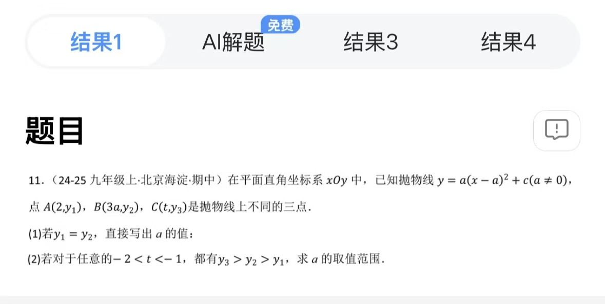
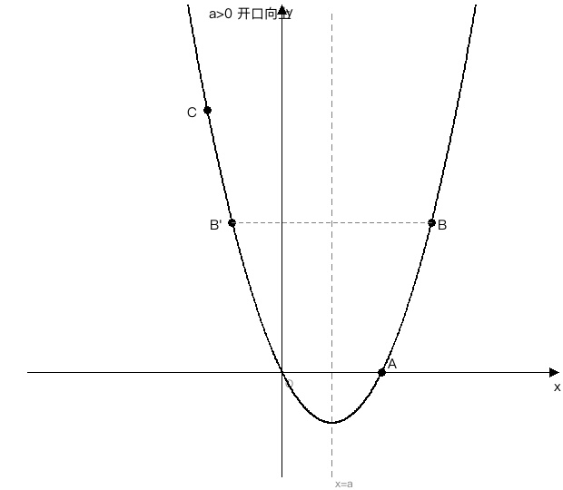
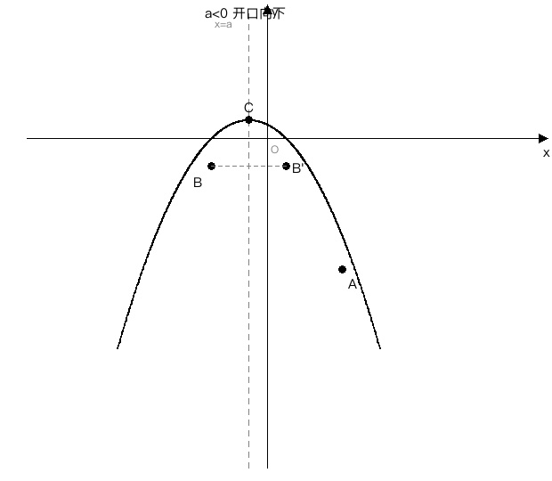

# 抛物线 $y=a(x-a)^2+c$ 上三点纵坐标大小关系求 $a$ 范围

## 题目

如图，在平面直角坐标系 $xOy$ 中，已知抛物线 $y=a(x-a)^2+c$（ $a\neq 0$ ），点 $A(2,y_1)$， $B(3a,y_2)$， $C(t,y_3)$ 是抛物线上不同的三点。

（1）若 $y_1=y_2$，直接写出 $a$ 的值；

（2）若对于任意的 $-2<t<-1$，都有 $y_3>y_2>y_1$，求 $a$ 的取值范围。

- 来源：24-25 九年级上·北京海淀·期中
- 难度：⭐⭐⭐ 超中考（含参二次函数综合，压轴题风格）
- 考查知识点：二次函数顶点式与对称轴、抛物线的增减性（离对称轴越远函数值越大/小）、分类讨论、不等式求解

## 解题思路

- **核心观察**：抛物线 $y=a(x-a)^2+c$ 的对称轴就是 $x=a$（顶点横坐标恰好等于参数 $a$，这是本题的特殊之处）
- **第（1）问**： $y_1=y_2$ 意味着 $A$、 $B$ 关于对称轴对称，直接用对称轴公式列方程
- **第（2）问**：把 $y_3>y_2>y_1$ 翻译成「各点到对称轴的距离关系」，再按 $a>0$ 和 $a<0$ 分类讨论——开口方向决定了「距离大」对应「函数值大」还是「函数值小」

## 解答过程

### 第（1）问

抛物线 $y=a(x-a)^2+c$ 的对称轴为直线 $x=a$。

$\because$ $A(2,y_1)$， $B(3a,y_2)$ 在抛物线上，且 $y_1=y_2$，

$\therefore$ $A$、 $B$ 关于对称轴 $x=a$ 对称，

$\therefore$ $\dfrac{2+3a}{2}=a$，

即 $2+3a=2a$，

解得 $a=-2$。

**答案**： $a=-2$。

---

### 第（2）问（重点）

**第 1 步：分析各点到对称轴的距离**

抛物线 $y=a(x-a)^2+c$ 的对称轴为 $x=a$。

各点横坐标到对称轴 $x=a$ 的距离：

- 点 $A(2,y_1)$：距离 $= |2-a|$
- 点 $B(3a,y_2)$：距离 $= |3a-a| = |2a| = 2|a|$
- 点 $C(t,y_3)$：距离 $= |t-a|$

> **为什么关注「到对称轴的距离」？**
> 对于抛物线 $y=a(x-h)^2+k$，函数值 $y$ 只跟「横坐标到对称轴 $x=h$ 的距离」有关——距离越大， $(x-h)^2$ 越大。具体是「越大越大」还是「越大越小」，取决于 $a$ 的正负（开口方向）。这是把 $y_3>y_2>y_1$ 翻译成距离不等式的关键。

**第 2 步：按开口方向分类讨论**

#### 情形一： $a>0$（抛物线开口向上）

开口向上时，离对称轴**越远**，函数值**越大**。

**由 $y_2>y_1$：** $B$ 比 $A$ 离对称轴更远，

$$2|a| > |2-a|$$

$\because$ $a>0$， $\therefore$ $2|a|=2a$，

$$2a > |2-a|$$

分两种情况：

- 若 $a \geqslant 2$： $|2-a|=a-2$，不等式为 $2a > a-2$，即 $a > -2$，与 $a \geqslant 2$ 取公共部分得 $a \geqslant 2$。但此时 $B(3a, y_2)$ 的横坐标 $3a \geqslant 6$， $A(2, y_1)$ 在对称轴附近，需要进一步验证 $y_3>y_2$（后面会排除）。

- 若 $0 < a < 2$： $|2-a|=2-a$，不等式为 $2a > 2-a$，即 $3a > 2$，

$$a > \frac{2}{3}$$

取公共部分： $\dfrac{2}{3} < a < 2$。

> **为什么 $a \geqslant 2$ 的情况后面会排除？**
> 当 $a \geqslant 2$ 时， $B$ 的横坐标 $3a \geqslant 6$，离对称轴非常远， $y_2$ 会非常大。而 $C$ 的横坐标 $t \in (-2,-1)$，离对称轴 $x=a \geqslant 2$ 的距离最大为 $a+2$。要 $y_3>y_2$ 需要 $C$ 比 $B$ 更远，即 $|t-a| > 2a$，也就是 $a-t > 2a$（因 $t<0<a$），即 $t < -a \leqslant -2$。但 $t > -2$，矛盾。所以 $a \geqslant 2$ 不成立。

**由 $y_3>y_2$（对任意 $-2<t<-1$）：** $C$ 比 $B$ 离对称轴更远，

$$|t-a| > 2a$$

$\because$ $t \in (-2,-1)$ 且 $a > 0$， $\therefore$ $t < 0 < a$， $|t-a| = a-t$，

$$a - t > 2a \implies t < -a$$

这个不等式要对**任意** $t \in (-2,-1)$ 都成立，即 $-a$ 必须不小于 $-1$（因为 $t$ 可以无限接近 $-1$ 但取不到 $-1$）：

$$-a \geqslant -1 \implies a \leqslant 1$$

> **为什么是 $-a \geqslant -1$ 而不是 $-a \geqslant -2$？**
> $t$ 的范围是 $(-2,-1)$， $t$ 最大只能无限接近 $-1$（但永远取不到 $-1$）。要让 $t < -a$ 对所有这样的 $t$ 都成立，只需要 $-a$ 不小于 $-1$ 就够了。
>
> 举个例子验证一下：
> - 若 $a=1$，则 $-a=-1$，需要 $t < -1$。对 $t \in (-2,-1)$ 中所有的 $t$，确实都小于 $-1$ ✓
> - 若 $a=0.5$，则 $-a=-0.5$，需要 $t < -0.5$。对 $t \in (-2,-1)$ 中所有的 $t$，都小于 $-1 < -0.5$，也成立 ✓
> - 若 $a=1.5$，则 $-a=-1.5$，需要 $t < -1.5$。但 $t$ 可以取 $-1.2 \in (-2,-1)$，而 $-1.2 > -1.5$，不满足 ✗

所以条件是 $-a \geqslant -1$，即 $a \leqslant 1$。

**合并两个条件**（ $a>0$ 的情形）：

$$\frac{2}{3} < a < 2 \quad \text{且} \quad a \leqslant 1 \implies \frac{2}{3} < a \leqslant 1$$

> **验证端点 $a=1$**：抛物线 $y=(x-1)^2+c$，对称轴 $x=1$。
> - $A(2, 1+c)$， $B(3, 4+c)$， $|2-1|=1$， $|3-1|=2$， $2>1$ ✓， $y_2>y_1$ ✓
> - $C(t, (t-1)^2+c)$， $|t-1|=1-t$（因 $t<0<1$），需要 $1-t > 2$，即 $t < -1$。对 $t \in (-2,-1)$ 恒成立 ✓

**情形一答案**： $\dfrac{2}{3} < a \leqslant 1$。

---

#### 情形二： $a<0$（抛物线开口向下）

开口向下时，离对称轴**越近**，函数值**越大**。

**由 $y_2>y_1$：** $B$ 比 $A$ 离对称轴**更近**，

$$2|a| < |2-a|$$

$\because$ $a<0$， $\therefore$ $|a|=-a$， $2|a|=-2a$；又 $a<0<2$， $|2-a|=2-a$，

$$-2a < 2-a \implies -a < 2 \implies a > -2$$

**由 $y_3>y_2$（对任意 $-2<t<-1$）：** $C$ 比 $B$ 离对称轴**更近**，

$$|t-a| < 2|a| = -2a$$

$\because$ $a<0$， $t \in (-2,-1)$，需要分 $t$ 与 $a$ 的大小关系讨论 $|t-a|$：

**子情形 2a： $a \leqslant -2$**

此时 $a \leqslant -2 < t$（因 $t > -2$），所以 $t > a$， $|t-a| = t-a$。

不等式变为 $t - a < -2a$，即 $t < -a$。

$\because$ $a \leqslant -2$， $\therefore$ $-a \geqslant 2 > -1 > t$，所以 $t < -a$ 恒成立。

但前面 $y_2>y_1$ 要求 $a > -2$，与 $a \leqslant -2$ 矛盾，此子情形无解。

**子情形 2b： $-2 < a < 0$**

此时 $a \in (-2, 0)$，而 $t \in (-2, -1)$， $t$ 与 $a$ 的大小关系不确定。

$|t-a| < -2a$ 等价于：

$$-(-2a) < t - a < -2a \implies 2a < t - a < -2a \implies 3a < t < -a$$

> **推导细节**： $|t-a| < -2a$（注意 $-2a > 0$），展开绝对值不等式：
> $-(-2a) < t - a < -2a$，即 $2a < t - a < -2a$。
> 左边： $2a < t - a \implies t > 3a$。
> 右边： $t - a < -2a \implies t < -a$。
> 合并： $3a < t < -a$。

需要 $3a < t < -a$ 对**任意** $t \in (-2,-1)$ 都成立，即 $t$ 的取值范围 $(-2,-1)$ 要完全落在 $(3a, -a)$ 里面：

$$3a \leqslant -2 \quad \text{且} \quad -a \geqslant -1$$

$$a \leqslant -\frac{2}{3} \quad \text{且} \quad a \leqslant 1$$

取公共部分： $a \leqslant -\dfrac{2}{3}$。

**合并两个条件**（ $a<0$ 的情形）：

$$-2 < a < 0 \quad \text{且} \quad a \leqslant -\frac{2}{3} \implies -2 < a \leqslant -\frac{2}{3}$$

> **验证端点 $a=-\dfrac{2}{3}$**：抛物线 $y=-\dfrac{2}{3}(x+\dfrac{2}{3})^2+c$，对称轴 $x=-\dfrac{2}{3}$。
> - $A(2, y_1)$： $|2-(-\frac{2}{3})| = \frac{8}{3}$
> - $B(-2, y_2)$： $|-2-(-\frac{2}{3})| = \frac{4}{3}$
> - $\frac{4}{3} < \frac{8}{3}$， $B$ 更近，开口向下 $\implies y_2 > y_1$ ✓
> - $C(t, y_3)$： $|t+\frac{2}{3}|$，需要 $|t+\frac{2}{3}| < \frac{4}{3}$，即 $-2 < t < \frac{2}{3}$
> - 对 $t \in (-2,-1)$： $t > -2$ 且 $t < -1 < \frac{2}{3}$，所以 $-2 < t < \frac{2}{3}$ 恒成立 ✓

> **为什么 $a=-2$ 不包含？**
> 若 $a=-2$，则 $B(3a,y_2)=B(-6,y_2)$。 $A(2,y_1)$ 和 $B(-6,y_2)$ 关于 $x=-2$ 对称（ $\frac{2+(-6)}{2}=-2$），所以 $y_1=y_2$，不满足 $y_2>y_1$ 的严格不等式 ✗。

**情形二答案**： $-2 < a \leqslant -\dfrac{2}{3}$。

---

**综合两种情形：**

$-2 < a \leqslant -\dfrac{2}{3}$ 或 $\dfrac{2}{3} < a \leqslant 1$

## 配图说明

### 情形一： $a>0$（开口向上）

图中抛物线开口向上，对称轴 $x=a$（虚线）。 $A$ 在对称轴右侧较近处， $B$ 在更远处（ $y_2>y_1$）。 $B'$ 是 $B$ 关于对称轴的对称点（与 $B$ 等高）。 $C$ 在对称轴左侧，离对称轴比 $B$ 更远（ $y_3>y_2$）。

### 情形二： $a<0$（开口向下）

图中抛物线开口向下，对称轴 $x=a$（虚线）。 $A$ 离对称轴较远（函数值小）， $B$ 离对称轴较近（函数值大， $y_2>y_1$）。 $B'$ 是 $B$ 关于对称轴的对称点（与 $B$ 等高）。 $C$ 在 $B$、 $B'$ 上方，离对称轴更近（ $y_3>y_2$）。

## 相关知识点

- **二次函数顶点式**： $y=a(x-h)^2+k$ 的对称轴为 $x=h$，顶点为 $(h,k)$
- **抛物线的对称性**：若两点纵坐标相等，则它们关于对称轴对称；对称轴 $= \dfrac{x_1+x_2}{2}$
- **开口方向与函数值的关系**：
  - $a>0$（开口向上）：离对称轴越远，函数值越大
  - $a<0$（开口向下）：离对称轴越近，函数值越大
- **含参不等式的分类讨论**：按参数 $a$ 的正负分类，每类内再解不等式
- **「对任意 $m<t<n$，不等式恒成立」的处理方法**：让 $t$ 能取到的极端值（最大或最小）满足不等式即可。本题中 $t$ 最大能无限接近 $-1$，所以用 $-1$ 来列条件。

## 易错点提醒

- **忽略 $a$ 的正负对函数值大小关系的影响**：开口向上和向下时，「距离大」对应的函数值大小关系相反，必须分类讨论
- **不等式 $y_3>y_2>y_1$ 是严格不等式**：端点值需要单独验证能否取等（本题 $a=-\frac{2}{3}$ 和 $a=1$ 可以取等， $a=-2$ 和 $a=\frac{2}{3}$ 不能取等）
- **「对任意 $-2<t<-1$」的理解**：不是「存在某个 $t$」，而是要对 $-2<t<-1$ 范围内的每一个 $t$ 值，条件都要成立。关键是要看 $t$ 最大能无限接近 $-1$（但取不到 $-1$），所以边界条件由 $-1$ 决定。
- **情形 $a=0$ 不在考虑范围内**：题目明确 $a \neq 0$，且 $a=0$ 时不是二次函数

## 复盘

- 核心方法：把纵坐标大小关系转化为「到对称轴的距离关系」，再按开口方向分类讨论
- 关键技巧：当要求「对 $m<t<n$ 范围内的每一个 $t$，不等式都成立」时，只要让 $t$ 能取到的最大值（或最小值）满足不等式就行了。本题中 $t$ 最大能无限接近 $-1$，所以用 $-1$ 来列条件。
- 掌握状态：未掌握
- 复习记录：

## 考试标准答案（纯净版，照抄答题卡用）

### 第（1）问

解：∵ 抛物线 $y=a(x-a)^2+c$（ $a \neq 0$ ），

∴ 对称轴为直线 $x=a$。

∵ $y_1=y_2$，且 $A(2,y_1)$， $B(3a,y_2)$ 是抛物线上不同的两点，

∴ 点 $A$、 $B$ 关于直线 $x=a$ 对称，

∴ $\dfrac{2+3a}{2}=a$，即 $2+3a=2a$，

解得 $a=-2$。

### 第（2）问

解：抛物线的对称轴为直线 $x=a$，

点 $A$、 $B$、 $C$ 的横坐标到对称轴的距离分别为 $|2-a|$、 $|3a-a|=2|a|$、 $|t-a|$。

**① 当 $a>0$ 时，抛物线开口向上，离对称轴越远，纵坐标越大。**

由 $y_2>y_1$，得 $2|a|>|2-a|$，∵ $a>0$，∴ $2a>|2-a|$。

当 $0<a<2$ 时， $2a>2-a$，解得 $a>\dfrac{2}{3}$；

当 $a \geqslant 2$ 时， $2a>a-2$ 恒成立。

∴ $a>\dfrac{2}{3}$。

由 $y_3>y_2$，得对任意 $-2<t<-1$，都有 $|t-a|>2a$。

∵ $-2<t<-1$， $a>0$，∴ $t-a<0$，即 $|t-a|=a-t$，

∴ $a-t>2a$，即 $t<-a$，对任意 $-2<t<-1$ 都成立，

∴ $-a \geqslant -1$，解得 $a \leqslant 1$。

∴ $\dfrac{2}{3}<a \leqslant 1$。

**② 当 $a<0$ 时，抛物线开口向下，离对称轴越近，纵坐标越大。**

由 $y_2>y_1$，得 $2|a|<|2-a|$，∵ $a<0<2$，∴ $-2a<2-a$，解得 $a>-2$。

由 $y_3>y_2$，得对任意 $-2<t<-1$，都有 $|t-a|<-2a$，

即 $2a<t-a<-2a$，即 $3a<t<-a$，对任意 $-2<t<-1$ 都成立，

∴ $3a \leqslant -2$ 且 $-a \geqslant -1$，即 $a \leqslant -\dfrac{2}{3}$ 且 $a \leqslant 1$，

∴ $a \leqslant -\dfrac{2}{3}$。

∴ $-2<a \leqslant -\dfrac{2}{3}$。

综合①②， $a$ 的取值范围是 $-2<a \leqslant -\dfrac{2}{3}$ 或 $\dfrac{2}{3}<a \leqslant 1$。
