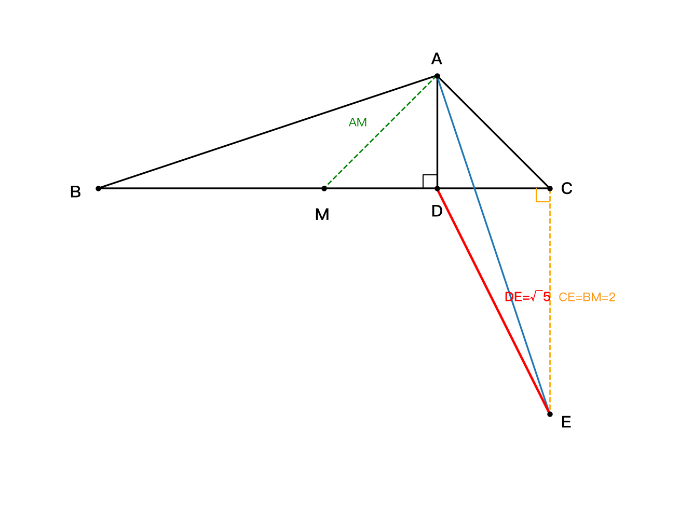
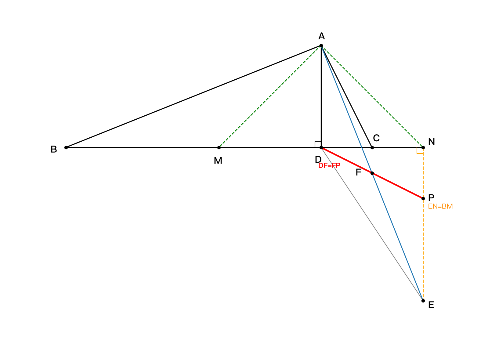

# 旋转 90° 得 AE，连 DE，中点 F 与 AC 关系

## 题目

在 $\triangle ABC$ 中， $AD \perp BC$ 于点 $D$， $AD + CD = \dfrac{1}{2}BC$，将线段 $AB$ 绕点 $A$ 逆时针旋转 $90°$ 得到线段 $AE$，连接 $DE$。

（1）如图 1，当 $AD = DC = 1$ 时，补全图形，并求 $DE$ 的长；

（2）如图 2，取 $AE$ 的中点 $F$，连接 $DF$，用等式表示线段 $DF$ 与 $AC$ 的数量关系，并证明。

---

## 第（1）问解答（几何法）

**辅助线**：补全图形（画出 $AE$、 $DE$）；取 $BC$ 的中点 $M$，连接 $AM$；连接 $CE$。

**第一步：求出各线段长度**

由 $AD + CD = \dfrac{1}{2}BC$， $AD = DC = 1$，得 $BC = 2 \times (1+1) = 4$。

于是 $BD = BC - DC = 3$， $BM = MC = \dfrac{1}{2}BC = 2$。

**第二步：发现两个等腰直角三角形**

$DM = MC - DC = 2 - 1 = 1 = AD$。

∵ $AD \perp BC$， $DM = AD$， ∴ $\triangle ADM$ 是等腰直角三角形，

∴ $\angle AMD = \angle MAD = 45°$， $AM = \sqrt{2}\,AD = \sqrt{2}$。

又 $AD = DC = 1$， ∴ $\triangle ADC$ 也是等腰直角三角形， $\angle DAC = 45°$， $AC = \sqrt{2}$。

∴ $AM = AC$，且 $\angle MAC = \angle MAD + \angle DAC = 90°$。

**第三步：旋转全等 $\triangle BAM \cong \triangle EAC$**

∵ 旋转， ∴ $AB = AE$， $\angle BAE = 90°$。

∴ $\angle BAM = \angle BAE - \angle MAE = 90° - \angle MAE$，

$\angle EAC = \angle MAC - \angle MAE = 90° - \angle MAE$，

∴ $\angle BAM = \angle EAC$。

在 $\triangle BAM$ 和 $\triangle EAC$ 中： $AB = AE$， $\angle BAM = \angle EAC$， $AM = AC$，

∴ $\triangle BAM \cong \triangle EAC$（SAS），

∴ $CE = BM = 2$， $\angle ABM = \angle AEC$。

**第四步：证 $CE \perp BC$**

在 Rt $\triangle ABD$ 中， $\angle ABD = 90° - \angle BAD$；

又 $\angle DAE = \angle BAE - \angle BAD = 90° - \angle BAD$；

∴ $\angle DAE = \angle ABD = \angle ABM = \angle AEC$，

∴ $AD \parallel CE$（内错角相等，被 $AE$ 所截），

∵ $AD \perp BC$， ∴ $CE \perp BC$。

**第五步：勾股定理求 $DE$**

在 Rt $\triangle DCE$ 中：

$$DE = \sqrt{CD^2 + CE^2} = \sqrt{1^2 + 2^2} = \boxed{\sqrt{5}}$$

---

## 第（2）问解答（几何法）

### 结论

$$DF = \frac{1}{2}AC$$

### 思路：三个信号 → 三步操作（辅助线为什么这么画）

本问的辅助线不是灵感，是三个信号依次翻译出来的：

**信号 1：条件里出现 $\frac{1}{2}BC$ → 取 $BC$ 的中点。**

设 $M$ 为 $BC$ 中点，则 $MC = \frac{1}{2}BC = AD + CD$；而 $MC = MD + DC$，两式一对比立刻得到 $DM = AD$。

整个条件浓缩成一句话： $\triangle ADM$ 是等腰直角三角形（ $\angle AMD = 45°$）。

**信号 2：有"绕 $A$ 旋转 $90°$" → 旋转搬的是整套配置，不是一个点。**

旋转把 $B$ 送到 $E$；再追问一句：从 $A$ 出发的 $AM$ 旋转后去哪？设它的像为 $N$，则必有 $AN = AM$、 $\angle MAN = 90°$。

怎么画出 $N$？利用信号 1 的 $\angle MAD = 45°$：把 $M$ 沿 $AD$ 翻折过去（即在射线 $DC$ 上截 $DN = DM$），就有 $\angle DAN = 45°$、 $\angle MAN = 90°$、 $AN = AM$——恰好就是 $M$ 的旋转像该有的样子。

所以 $\triangle ABM \cong \triangle AEN$ 不是硬凑的巧合：它本身就是"旋转把线段 $BM$ 整体搬成 $EN$"这件事（ $AB \to AE$、 $AM \to AN$、夹角相等）的 SAS 写法。它的两个产出：

- $EN = BM = \frac{1}{2}BC = AD + CD$（长度搬过来了）；
- $\angle ANE = \angle AMB = 135°$，减去 $\angle AND = 45°$ 得 $EN \perp BC$（横着的线旋转 $90°$ 后必然竖起来）。

**与第（1）问呼应：第（1）问里 $N$ 就是 $C$。**

第（1）问中 $AD = DC$，于是 $DM = AD = DC$，满足 $DN = DM$ 的点 $N$ 与 $C$ 重合；第（1）问证的" $CE \perp BC$、 $CE = BM$、 $\triangle BAM \cong \triangle EAC$"就是信号 2 这套全等在 $N \equiv C$ 时的特例（当时还额外有 $AM = AC$，所以可以直接写 $C$、不必引 $N$）。

所以第（1）问当跳板的正确用法是：做完回头问" $C$ 到底扮演什么角色？"——答案是" $M$ 的旋转搭档"（满足 $AM = AC$、 $\angle MAC = 90°$ 的点）。第（2）问里 $AD \neq DC$， $C$ 不再胜任，就按定义自己造一个 $M$ 的旋转搭档——这就是 $N$，辅助线 $DN = DM$ 不过是这个构造的写法。

**信号 3：结论带 $\frac{1}{2}$ 系数 + $F$ 是中点 → 倍长中线。**

要证 $DF = \frac{1}{2}AC$，而 $F$ 恰是 $AE$ 中点；"中点 + 一半"的标准武器只有两件：中位线、倍长中线。这里 $DF$ 的一端 $F$ 就是中点，于是把 $DF$ 延长一倍：延长交 $EN$ 于 $P$。

由 $AD \parallel EN$ 得 X 型全等 $\triangle AFD \cong \triangle EFP$： $FD = FP$（ $DF$ 被倍长成 $DP$），顺便 $EP = AD$。

目标变成不含分数的等式 $DP = AC$，用直角三角形全等 $\triangle DNP \cong \triangle ADC$ 搭桥（ $DN = AD$、 $NP = EN - EP = CD$、直角相等）。

| 信号 | 操作 |
|------|------|
| 条件有 $\frac{1}{2}BC$ | 取中点 $M$ ⇒ $DM = AD$ ⇒ 45° |
| 绕 $A$ 的 90° 旋转 | 造 $M$ 的旋转搭档 $N$（ $DN = DM$）⇒ $\triangle ABM \cong \triangle AEN$ ⇒ $EN \perp BC$、 $EN = AD + CD$ |
| 结论有 $\frac{1}{2}$ + $F$ 是中点 | 倍长 $DF$ 到 $P$（X 型全等）⇒ 桥 $\triangle DNP \cong \triangle ADC$ |

一句话：每条辅助线都对应一个信号的翻译—— $\frac{1}{2}BC$ ⇒ 中点 $M$；90° 旋转 ⇒ $M$ 的旋转搭档 $N$；一半系数 + 中点 ⇒ 倍长中线到 $P$。

### 证明

**辅助线**：取 $BC$ 的中点 $M$，连接 $AM$；延长 $DC$ 至 $N$，使 $DN = DM$，连接 $AN$、 $EN$；延长 $DF$ 交 $EN$ 于 $P$。

**① 中点条件翻译出等腰直角三角形**

∵ $M$ 是 $BC$ 中点， ∴ $MC = \dfrac{1}{2}BC = AD + CD$，

∴ $DM = MC - DC = AD$。

∵ $AD \perp BC$， ∴ $\triangle ADM$ 是等腰直角三角形，

∴ $\angle AMD = 45°$，从而 $\angle AMB = 180° - 45° = 135°$。

**② 翻折出 $\triangle ADN$，凑出第二个 90°**

在 $\triangle ADM$ 和 $\triangle ADN$ 中： $DM = DN$， $\angle ADM = \angle ADN = 90°$， $AD = AD$，

∴ $\triangle ADM \cong \triangle ADN$（SAS），

∴ $AM = AN$， $\angle AND = \angle AMD = 45°$， $\angle NAD = \angle MAD = 45°$，

∴ $\angle MAN = \angle MAD + \angle NAD = 90°$。

**③ 旋转全等 $\triangle ABM \cong \triangle AEN$（把 $BM$ 搬到 $EN$）**

∵ 旋转， ∴ $AB = AE$， $\angle BAE = 90° = \angle MAN$，

∴ $\angle BAE - \angle MAE = \angle MAN - \angle MAE$，即 $\angle BAM = \angle EAN$。

在 $\triangle ABM$ 和 $\triangle AEN$ 中： $AB = AE$， $\angle BAM = \angle EAN$， $AM = AN$，

∴ $\triangle ABM \cong \triangle AEN$（SAS），

∴ $EN = BM = \dfrac{1}{2}BC = AD + CD$， $\angle ANE = \angle AMB = 135°$。

**④ 证 $EN \perp BC$，得 $AD \parallel EN$**

$\angle PND = \angle ANE - \angle AND = 135° - 45° = 90°$，即 $EN \perp BC$；

又 $AD \perp BC$， ∴ $AD \parallel EN$，即 $AD \parallel EP$。

**⑤ "X 型"全等： $F$ 也是 $DP$ 的中点**

∵ $AD \parallel EP$， ∴ $\angle FAD = \angle FEP$（内错角）；

又 $F$ 是 $AE$ 中点， ∴ $AF = EF$；且 $\angle AFD = \angle EFP$（对顶角），

∴ $\triangle AFD \cong \triangle EFP$（ASA），

∴ $FD = FP$， $EP = AD$。

**⑥ 搭桥全等： $DP = AC$**

$NP = EN - EP = (AD + CD) - AD = CD$。

在 $\triangle DNP$ 和 $\triangle ADC$ 中： $DN = AD$， $\angle DNP = \angle ADC = 90°$， $NP = DC$，

∴ $\triangle DNP \cong \triangle ADC$（SAS）， ∴ $DP = AC$。

**⑦ 收尾**

∵ $FD = FP$， ∴ $DF = \dfrac{1}{2}DP = \boxed{\dfrac{1}{2}AC}$。 $\blacksquare$

---

## 易错点

- **等角相减**： $\angle BAM = \angle EAC$（或 $\angle EAN$）是"两个 90° 同时减去公共角 $\angle MAE$"得来的，不能直接看图断言。
- **全等对应**： $\triangle AFD \cong \triangle EFP$ 的对应是 $A \leftrightarrow E$、 $F \leftrightarrow F$、 $D \leftrightarrow P$，得到的是 $FD = FP$ 和 $AD = EP$，别写串。
- **垂直必须证**：第（1）问里 $CE \perp BC$ 是证出来的（ $AD \parallel CE$），不能当显然事实用。
- ** $BD$ 的长度**： $BD = BC - CD$，不是 $BC/2$；要先由 $AD+CD = BC/2$ 求出 $BC$ 再减（若设 $AD = a$、 $CD = b$，则 $BD = 2a + b$，易错算成 $a + 2b$）。

---

## 复盘

| 项目 | 内容 |
|------|------|
| 核心条件 | $AD + CD = \frac{1}{2}BC$ $\Rightarrow$ $DM = AD$（ $M$ 为 $BC$ 中点），产出等腰直角三角形 |
| 核心技巧 | 三组全等：旋转全等 $\triangle ABM \cong \triangle AEN$、X 型全等 $\triangle AFD \cong \triangle EFP$、搭桥全等 $\triangle DNP \cong \triangle ADC$ |
| 关键发现 | $EN \perp BC$ 且 $EN = BM = AD + CD$； $F$ 同时是 $DP$ 的中点 |
| 结论 | $DF = \frac{1}{2}AC$ |
| 考查知识点 | 旋转的性质、全等三角形（SAS/ASA）、等腰直角三角形、平行线判定与性质、勾股定理 |
