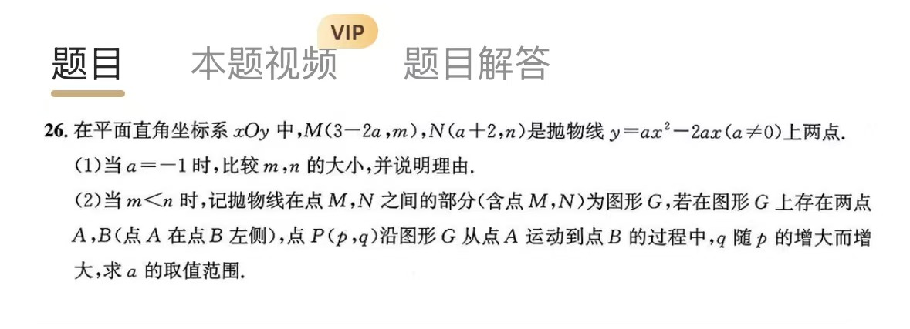
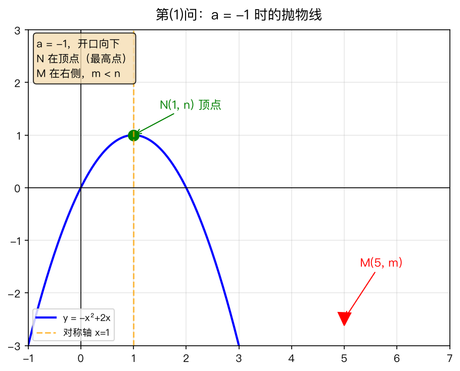
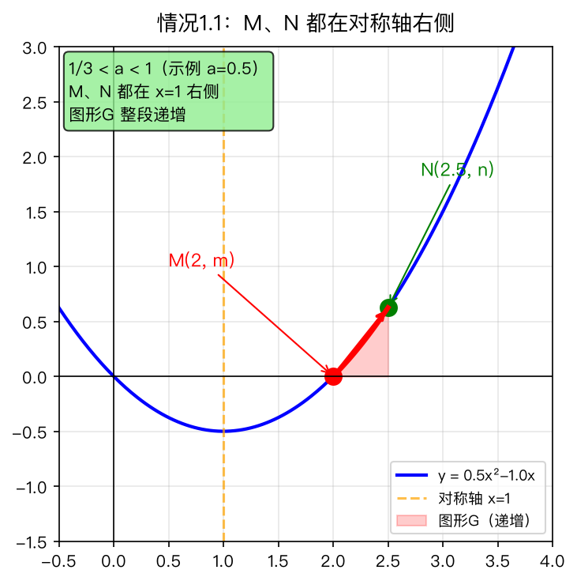
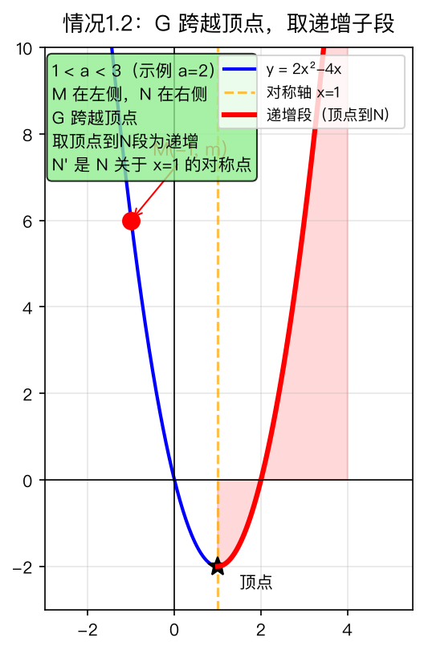
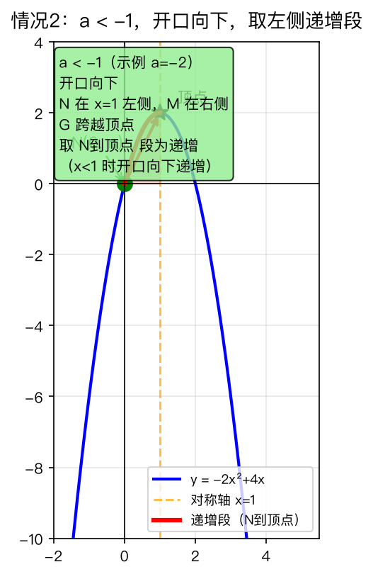

# 二次函数存在性问题：抛物线上找递增子段

## 题目

在平面直角坐标系 $xOy$ 中， $M(3-2a, m)$ 和 $N(a+2, n)$ 是抛物线 $y = ax^2 - 2ax$（ $a \neq 0$）上的两点。

（1）当 $a = -1$ 时，比较 $m$ 与 $n$ 的大小，并说明理由；

（2）当 $m < n$ 时，将抛物线在点 $M$、 $N$ 之间的部分（含端点）记为图形 $G$。若存在图形 $G$ 上的两点 $A$、 $B$（ $A$ 在 $B$ 左侧），使得点 $P(p, q)$ 沿图形 $G$ 从 $A$ 运动到 $B$ 的过程中， $q$ 随 $p$ 的增大而增大，求 $a$ 的取值范围。

- 来源：北京市各区模拟及真题精选
- 难度：⭐⭐⭐ 超中考
- 考查知识点：二次函数对称性、单调性、对称点方法、存在性问题

## 解题思路

**核心观察**：
1. 抛物线 $y = ax^2 - 2ax = a(x-1)^2 - a$ 的对称轴为 $x = 1$
2. $m < n$ 意味着 $M$ 比 $N$ 离对称轴更远（开口向上时）或更近（开口向下时）
3. 要存在递增段，需要图形 $G$ 有一部分在对称轴的"递增侧"

## 解答过程

### 第（1）问

当 $a = -1$ 时，抛物线为 $y = -x^2 + 2x$，开口向下，对称轴 $x = 1$。

**第一步：确定 M、N 的坐标**

$M$ 的横坐标： $3 - 2(-1) = 5$，所以 $M(5, m)$
$N$ 的横坐标： $-1 + 2 = 1$，所以 $N(1, n)$

**第二步：比较 m、n 的大小**

从图中可以看出：
- $N(1, n)$ 在对称轴上，是抛物线的顶点（最高点）
- $M(5, m)$ 在对称轴右侧，纵坐标必然小于顶点

计算验证：
- $m = -5^2 + 2 \times 5 = -15$
- $n = -1^2 + 2 \times 1 = 1$

所以 $m < n$。

### 第（2）问

**关键分析**：

抛物线 $y = ax^2 - 2ax$ 的对称轴为 $x = 1$。

$M$ 的横坐标为 $3-2a$， $N$ 的横坐标为 $a+2$。

**情况 1： $a > 0$（开口向上）**

此时抛物线在 $x > 1$ 时递增，在 $x < 1$ 时递减。

因为 $a > 0$，所以 $a + 2 > 2 > 1$，即 $N$ 一定在对称轴右侧。

**子情况 1.1： $M$ 也在对称轴右侧（ $3-2a > 1$，即 $a < 1$）**

此时 $M$、 $N$ 都在对称轴右侧，图形 $G$ 全部在递增区域。

由 $m < n$（ $M$ 比 $N$ 低），结合开口向上，说明 $M$ 离对称轴更远：
$$3 - 2a < a + 2$$
$$-3a < -1$$
$$a > \frac{1}{3}$$

结合 $a < 1$，得 $\frac{1}{3} < a < 1$。✓

**子情况 1.2： $M$ 在对称轴左侧或对称轴上（ $3-2a \leq 1$，即 $a \geq 1$）**

此时 $M$ 在左侧， $N$ 在右侧，图形 $G$ 跨越顶点。

**关键技巧**：设 $N$ 关于对称轴 $x=1$ 的对称点为 $N'$。

$N$ 的横坐标为 $a+2$，到对称轴的距离为 $(a+2) - 1 = a+1$。
所以 $N'$ 的横坐标为 $1 - (a+1) = -a$。

由 $m < n$ 和对称性， $N'$ 的纵坐标也为 $n$。

在对称轴左侧，开口向上时，离对称轴越远（横坐标越小），纵坐标越大。

因为 $m < n$，即 $M$ 的纵坐标小于 $N'$ 的纵坐标，说明 $M$ 离对称轴比 $N'$ 更近，即 $M$ 在 $N'$ 的右侧：
$$3 - 2a > -a$$
$$3 > a$$
$$a < 3$$

结合 $a \geq 1$，得 $1 \leq a < 3$。✓

**综合情况 1**： $\frac{1}{3} < a < 1$ 或 $1 \leq a < 3$，即 $\frac{1}{3} < a < 3$。

**情况 2： $a < 0$（开口向下）**

此时抛物线在 $x < 1$ 时递增，在 $x > 1$ 时递减。

因为 $a < 0$，所以 $3 - 2a > 3 > 1$，即 $M$ 一定在对称轴右侧。

要存在递增段，图形 $G$ 必须有一部分在 $x < 1$ 的区域，即 $N$ 必须在对称轴左侧：
$$a + 2 < 1$$
$$a < -1$$

**验证 $m < n$ 的条件**：

设 $N$ 关于 $x=1$ 的对称点为 $N'(-a, n)$。

因为 $a < -1$，所以 $-a > 1$，即 $N'$ 在对称轴右侧。

$M$ 的横坐标 $3-2a$，因为 $a < -1$，所以 $3-2a > 5$。

比较 $M$ 和 $N'$ 的位置：
$$3 - 2a - (-a) = 3 - a$$

因为 $a < -1$，所以 $3 - a > 4 > 0$，即 $M$ 在 $N'$ 的右侧。

在对称轴右侧，开口向下时，离对称轴越远，纵坐标越小。 $M$ 离对称轴比 $N'$ 更远，所以 $m < n$。✓

**综合情况 2**： $a < -1$。

**最终答案**： $a < -1$ 或 $\frac{1}{3} < a < 3$。

## 相关知识点

- 二次函数的对称轴公式
- 二次函数的单调性（开口方向决定增减区间）
- 对称点方法：利用对称性简化比较
- "存在性"问题的理解（只要有一段递增即可）

## 易错点提醒

- **对称点方法的符号**：设 $N(a+2, n)$ 关于 $x=1$ 的对称点 $N'$，横坐标为 $1 - [(a+2) - 1] = -a$
- **开口方向的影响**：开口向上时，离对称轴越远越高；开口向下时，离对称轴越远越低
- **存在性 vs 任意性**：题目要求"存在"递增段，不要求整段 $G$ 都递增

## 复盘

- 错因：方法不熟（对称点方法的应用）
- 掌握状态：复习中
- 复习记录：
