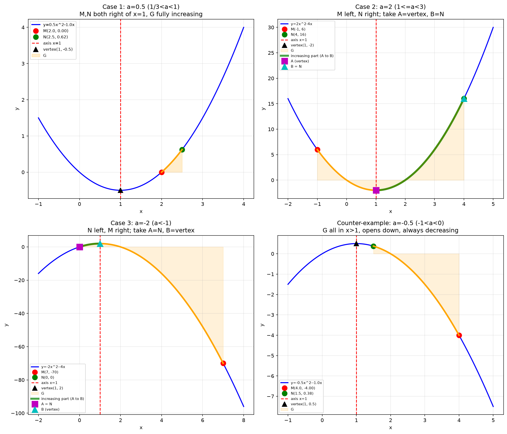

# 二次函数存在性问题：抛物线上找递增子段

## 题目

在平面直角坐标系 $xOy$ 中， $M(3-2a, m)$ 和 $N(a+2, n)$ 是抛物线 $y = ax^2 - 2ax$（ $a \neq 0$）上的两点。

（1）当 $a = -1$ 时，比较 $m$ 与 $n$ 的大小，并说明理由；

（2）当 $m < n$ 时，将抛物线在点 $M$、 $N$ 之间的部分（含端点）记为图形 $G$。若存在图形 $G$ 上的两点 $A$、 $B$（ $A$ 在 $B$ 左侧），使得点 $P(p, q)$ 沿图形 $G$ 从 $A$ 运动到 $B$ 的过程中， $q$ 随 $p$ 的增大而增大，求 $a$ 的取值范围。

- 来源：北京市各区模拟及真题精选
- 难度：⭐⭐⭐ 超中考
- 考查知识点：二次函数对称性、单调性、含参不等式、存在性问题

## 解题思路

**核心观察**：抛物线 $y = ax^2 - 2ax = a(x-1)^2 - a$ 的对称轴为 $x = 1$，与 $a$ 无关。

**关键点拨**：
- 题目说"存在"两点 $A$、 $B$ 满足递增，不是"对任意"两点都递增
- 只要图形 $G$ 上能找到一段是递增的即可，不要求整段 $G$ 都递增
- 因此当 $G$ 跨越顶点时，可以从顶点取到某一端点，这段就是单调的
- 注意区分"对称轴两侧"和"坐标轴两侧"： $A$、 $B$ 可以在 $y$ 轴两侧，但必须在对称轴 $x=1$ 的同侧

## 解答过程

### 第（1）问

当 $a = -1$ 时，抛物线为 $y = -x^2 + 2x$，开口向下，对称轴 $x = 1$。

点 $M$ 的横坐标： $3 - 2(-1) = 5$
点 $N$ 的横坐标： $-1 + 2 = 1$

因为 $N$ 在对称轴上，是抛物线的顶点（最高点），而 $M$ 在对称轴右侧，所以 $M$ 的纵坐标小于顶点的纵坐标。

因此 $m < n$。

**验证**：
- $m = -5^2 + 2 \times 5 = -25 + 10 = -15$
- $n = -1^2 + 2 \times 1 = -1 + 2 = 1$

确实 $m = -15 < 1 = n$。

### 第（2）问

**第一步：计算 $m$、 $n$ 的表达式**

点 $M(3-2a, m)$ 在抛物线上：
$$m = a(3-2a)^2 - 2a(3-2a)$$
$$= a(9 - 12a + 4a^2) - 6a + 4a^2$$
$$= 9a - 12a^2 + 4a^3 - 6a + 4a^2$$
$$= 4a^3 - 8a^2 + 3a$$

点 $N(a+2, n)$ 在抛物线上：
$$n = a(a+2)^2 - 2a(a+2)$$
$$= a(a^2 + 4a + 4) - 2a^2 - 4a$$
$$= a^3 + 4a^2 + 4a - 2a^2 - 4a$$
$$= a^3 + 2a^2$$

**第二步：分析 $m < n$ 的条件**

$$m - n = 4a^3 - 8a^2 + 3a - a^3 - 2a^2$$
$$= 3a^3 - 10a^2 + 3a$$
$$= a(3a^2 - 10a + 3)$$
$$= a(3a - 1)(a - 3)$$

要求 $m < n$，即 $m - n < 0$：
$$a(3a - 1)(a - 3) < 0$$

用穿根法分析：三个根为 $a = 0$， $a = \frac{1}{3}$， $a = 3$。

- 当 $a < 0$ 时： $(-)(-)(-) = (-) < 0$ ✓
- 当 $0 < a < \frac{1}{3}$ 时： $(+)(-)(-) = (+) > 0$ ✗
- 当 $\frac{1}{3} < a < 3$ 时： $(+)(+)(-) = (-) < 0$ ✓
- 当 $a > 3$ 时： $(+)(+)(+) = (+) > 0$ ✗

所以 $m < n$ 的条件是： $a < 0$ 或 $\frac{1}{3} < a < 3$。

**第三步：分析图形 $G$ 的单调性**

图形 $G$ 是抛物线在 $M$、 $N$ 之间的部分。 $M$ 的横坐标为 $3-2a$， $N$ 的横坐标为 $a+2$。

对称轴为 $x = 1$。

**情况 1： $a > 0$（开口向上）**

抛物线在 $x < 1$ 时递减，在 $x > 1$ 时递增。

要使 $G$ 上存在递增段，需要 $G$ 有一部分在 $x > 1$ 的区域。

结合 $m < n$ 的条件，此时 $\frac{1}{3} < a < 3$。

分析 $M$、 $N$ 的位置：
- $N$ 的横坐标： $a + 2$。因为 $a > \frac{1}{3}$，所以 $a + 2 > \frac{7}{3} > 1$， $N$ 在对称轴右侧。
- $M$ 的横坐标： $3 - 2a$。
  - 当 $\frac{1}{3} < a < 1$ 时， $3 - 2a > 1$， $M$ 也在对称轴右侧。此时 $G$ 全部在 $x > 1$ 区域，整段递增。
  - 当 $a = 1$ 时， $3 - 2a = 1$， $M$ 在对称轴上。 $G$ 从顶点到 $N$，整段递增。
  - 当 $1 < a < 3$ 时， $3 - 2a < 1$， $M$ 在对称轴左侧。此时 $G$ 跨越顶点，从顶点到 $N$ 这一段是递增的。

综合 $\frac{1}{3} < a < 3$，都存在递增段。

**情况 2： $a < 0$（开口向下）**

抛物线在 $x < 1$ 时递增，在 $x > 1$ 时递减。

要使 $G$ 上存在递增段，需要 $G$ 有一部分在 $x < 1$ 的区域。

结合 $m < n$ 的条件，此时 $a < 0$。

分析 $M$、 $N$ 的位置：
- $N$ 的横坐标： $a + 2$。因为 $a < 0$，所以 $a + 2 < 2$。
  - 当 $a < -1$ 时， $a + 2 < 1$， $N$ 在对称轴左侧。
  - 当 $a = -1$ 时， $a + 2 = 1$， $N$ 在对称轴上。
  - 当 $-1 < a < 0$ 时， $a + 2 > 1$， $N$ 在对称轴右侧。
- $M$ 的横坐标： $3 - 2a$。因为 $a < 0$，所以 $3 - 2a > 3 > 1$， $M$ 在对称轴右侧。

要使 $G$ 上存在递增段（在 $x < 1$ 区域），需要 $N$ 在对称轴左侧或对称轴上，即 $a + 2 \leq 1$，解得 $a \leq -1$。

结合 $a < 0$，得 $a \leq -1$。

但当 $a = -1$ 时， $N$ 在对称轴上， $G$ 从 $N$（顶点）到 $M$，整段递减，不满足条件。

所以 $a < -1$。

**验证**：当 $a < -1$ 时， $N$ 在对称轴左侧， $M$ 在对称轴右侧， $G$ 跨越顶点。从 $N$ 到顶点这一段是递增的（因为开口向下，在 $x < 1$ 时递增）。

**最终答案**： $a < -1$ 或 $\frac{1}{3} < a < 3$。

## 相关知识点

- 二次函数 $y = ax^2 + bx + c$ 的对称轴 $x = -\frac{b}{2a}$
- 二次函数的单调性：开口向上时对称轴左侧递减、右侧递增；开口向下时相反
- 含参不等式的穿根法（根轴法）
- "存在性"问题与"任意性"问题的区别
- 分类讨论思想（按 $a > 0$ 和 $a < 0$ 分情况）

## 易错点提醒

- **混淆"存在"与"任意"**：题目说"存在两点满足递增"，不要求整段 $G$ 都递增，只要找到一段递增的子段即可
- **混淆"对称轴两侧"与"坐标轴两侧"**： $A$、 $B$ 可以在 $y$ 轴两侧，但必须在对称轴 $x=1$ 的同侧才能保证单调性
- **忽略开口方向**： $a > 0$ 和 $a < 0$ 时，递增区间不同，必须分类讨论
- **穿根法出错**：注意三个根的排序和符号变化，特别是 $a < 0$ 时的符号

## 复盘

- 错因：方法不熟（存在性问题与任意性问题的区分、穿根法）
- 掌握状态：复习中
- 复习记录：

