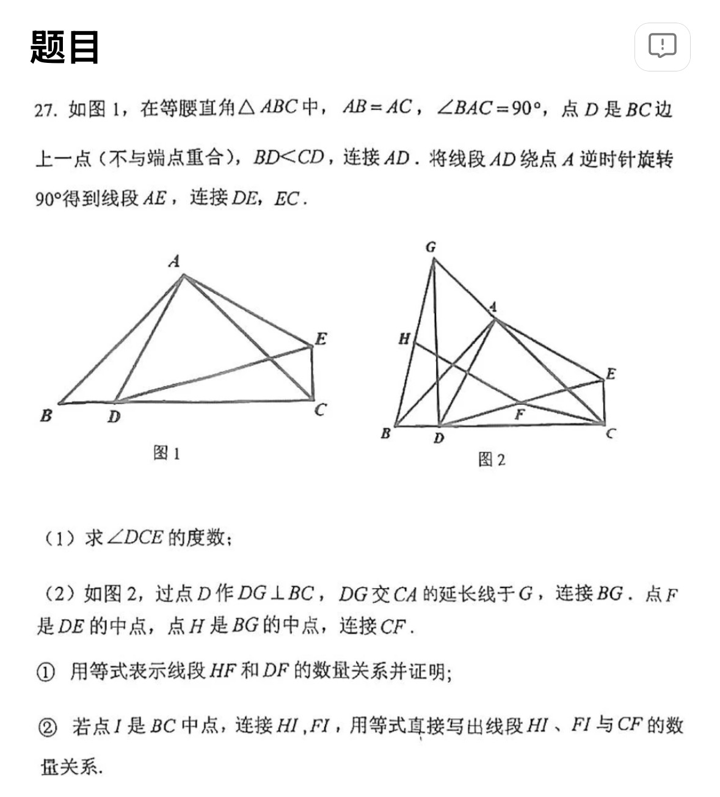
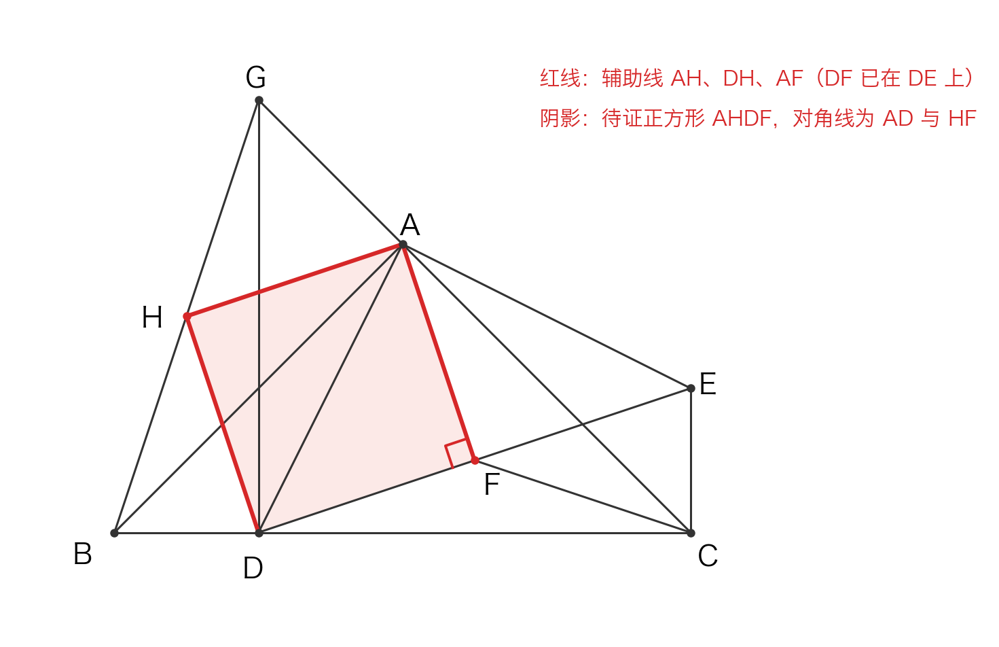
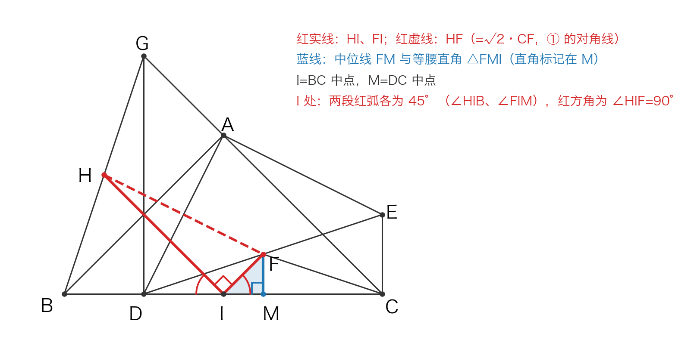

# 旋转 90° 后连中点凑正方形求线段关系

## 题目

27. 如图 1，在等腰直角 △ABC 中，AB=AC，∠BAC=90°，点 D 是 BC 边上一点（不与端点重合），BD<CD，连接 AD。将线段 AD 绕点 A 逆时针旋转 90° 得到线段 AE，连接 DE，EC。

（1）求 ∠DCE 的度数；

（2）如图 2，过点 D 作 DG⊥BC，DG 交 CA 的延长线于 G，连接 BG。点 F 是 DE 的中点，点 H 是 BG 的中点，连接 CF。

① 用等式表示线段 HF 和 DF 的数量关系并证明；

② 若点 I 是 BC 中点，连接 HI，FI，用等式直接写出线段 HI、FI 与 CF 的数量关系。

- 来源：错题本拍照（课外班讲义，题号 27）
- 难度：⭐⭐ 中考综合（压轴几何综合）
- 考查知识点：旋转与手拉手全等、直角三角形斜边中线等于斜边一半、正方形的判定（菱形 + 一个直角）、三角形中位线定理、等腰直角三角形边比、勾股定理

## 解题思路

- **旋转先送两样东西**：AD=AE、∠DAE=90°；再由 ∠BAD=∠CAE（同减 ∠DAC）配 AB=AC 得手拉手全等 △ABD≌△ACE，副产品 BD=CE 和 ∠DCE=90°
- **① 的关键信号是「两个直角共一条斜边」**：A、D 都对 BG 张直角（∠BAG=∠BDG=90°），所以它们到 BG 中点 H 的距离都是 ½BG；A、C 都对 DE 张直角（∠DAE=∠DCE=90°），所以它们到 DE 中点 F 的距离都是 ½DE。「斜边中线 = 斜边一半」连用四次，四边形 AHDF 的四条边就只剩一座桥：BG=DE（一组全等）
- **√2 从正方形对角线来**：证出 AHDF 是正方形后，HF 是对角线、DF 是边， $HF=\sqrt{2} DF$ 自动成立，不用另造等腰直角三角形
- **② 是「① 的正方形 + 藏在 I 处的直角」**：先证 △FMI 等腰直角（FM∥EC 且 FM=½EC=½BD=IM，直角在 M）得 ∠FIM=45°，与中位线平行送的 ∠HIB=45° 合出 ∠HIF=90°，勾股定理接上 ① 的 $HF=\sqrt{2} CF$；代数法（设 BD=m、DC=n 逐段算平方）只作交叉验证

## 解答过程

### 第（1）问

旋转得 AD=AE，∠DAE=90°。

∠BAD=∠BAC−∠DAC=90°−∠DAC，∠CAE=∠DAE−∠DAC=90°−∠DAC，∴ ∠BAD=∠CAE。

在 △ABD 和 △ACE 中：AB=AC，∠BAD=∠CAE，AD=AE，∴ △ABD≌△ACE（SAS）。

∴ BD=CE，∠ACE=∠ABD=45°，∴ ∠DCE=∠ACB+∠ACE=45°+45°=90°。

### 第（2）①

**结论**： $HF=\sqrt{2} DF$。

**辅助线**：连接 AH、DH、AF（DF 已在 DE 上，不用连）。要证的四边形按图 2 的顺序是 A→H→D→F，四条边恰为 AH、HD、DF、FA：

**第 1 步（H 到 A、D 等距：两次斜边中线）**

G 在 CA 的延长线上 ⇒ ∠BAG=180°−∠BAC=90°。Rt△BAG 中 H 是斜边 BG 的中点 ⇒ AH=½BG。

DG⊥BC ⇒ ∠BDG=90°。Rt△BDG 中 DH 是斜边 BG 上的中线 ⇒ DH=½BG。

**第 2 步（F 到 A、D 等距：再一次斜边中线 + 三线合一）**

Rt△DAE 中 F 是斜边 DE 的中点 ⇒ AF=½DE；又 AD=AE，等腰三角形底边上的中线就是高 ⇒ AF⊥DE，即 ∠AFD=90°。

DF=½DE（F 是 DE 中点）。

> 顺手再记一条留给 ②：Rt△DCE 中 CF 是斜边 DE 上的中线 ⇒ CF=½DE。即 F 到 A、C、D、E 四点等距，CF 恰好等于正方形的边长。

**第 3 步（搭桥 BG=DE）**

Rt△GDC 中 ∠GDC=90°，∠GCD=∠ACB=45° ⇒ ∠DGC=45° ⇒ DG=DC。

又 BD=CE（第 (1) 问），∠GDB=∠DCE=90°，

∴ △GDB≌△DCE（SAS，对应 G↔D、D↔C、B↔E）⇒ BG=DE。

**第 4 步（正方形）**

AH=HD=½BG=½DE=DF=FA ⇒ 四边形 AHDF 是菱形；又 ∠AFD=90° ⇒ AHDF 是正方形。

**第 5 步（结论）**

HF 是正方形的对角线，DF 是边 ⇒ $HF=\sqrt{2} DF$。∎

### 第（2）②

**结论**：

$$
HI^2+FI^2=2CF^2
$$

**解法一（几何法，主）：证 △FMI 等腰直角，把直角归到 I，再复用 ① 的正方形**

**第 1 步（△FMI 等腰直角）**：取 DC 的中点 M。△DEC 中 F、M 分别是 DE、DC 的中点 ⇒ FM∥EC 且 FM=½EC；由 ∠DCE=90° 知 EC⊥BC，故 FM⊥BC，即 ∠FMI=90°。

又 IM=IC−MC=½BC−½DC=½(BC−DC)=½BD；而 (1) 已证 EC=BD ⇒ FM=½EC=½BD=IM。

∴ △FMI 是两直角边 FM=IM 的等腰直角三角形 ⇒ ∠FIM=45°。

**第 2 步（∠HIF=90°）**：H、I 分别是 BG、BC 的中点 ⇒ HI 是 △BGC 的中位线 ⇒ HI∥GC（GC 在直线 AC 上）⇒ ∠HIB=∠GCB=45°。

I 处三个角拼成平角：∠HIF=180°−∠HIB−∠FIM=180°−45°−45°=90°。

**第 3 步（勾股 + ① 的正方形）**：Rt△HIF 中 $HI^2+FI^2=HF^2$ ；由 ①，HF 是正方形 AHDF 的对角线、CF=DF 是边（都等于 ½DE）⇒ $HF=\sqrt{2} CF$ ，即 $HF^2=2CF^2$ 。

∴ $HI^2+FI^2=2CF^2$ 。∎

> **为什么这条路线算「纯几何」**：全程不设未知数、不逐段算平方，只用了三块积木——两个 45° 角（一个来自中位线平行，一个来自等腰直角 △FMI）、一次勾股定理、① 的「正方形对角线 = √2 × 边」。证「△FMI 是直角三角形」承担两个作用：M 处的直角是 FM=IM 这对等腿成立的前提（等腿要放在同一个直角三角形里比），等腿又产出 ∠FIM=45°，与 ∠HIB=45° 一起把 I 处的平角「关」成 ∠HIF=90°——这是整个结论的唯一入口。

**解法二（代数法，交叉验证）**：设 BD=m，DC=n；由 (1) 知 CE=BD=m，∠DCE=90°。

**CF**：Rt△DCE 中 $DE^2=DC^2+CE^2=m^2+n^2$ ；CF 是斜边中线 ⇒ CF=½DE，故 $CF^2=(m^2+n^2)/4$。

**HI**：由解法一第 2 步 HI=½GC；Rt△GDC 中 DG=DC=n ⇒ $GC=\sqrt{2} n$ ，故 $HI^2=n^2/2$。

**FI**：由解法一第 1 步 Rt△FMI 两直角边 FM=IM=m/2 ⇒ $FI^2=m^2/2$。

**合并**： $HI^2+FI^2=(m^2+n^2)/2=2\cdot(m^2+n^2)/4=2CF^2$ ，与解法一一致。∎

## 相关知识点

- **直角三角形斜边中线 = 斜边一半**：本题连用四次（Rt△BAG、Rt△BDG 共用斜边 BG；Rt△DAE、Rt△DCE 共用斜边 DE）。记忆口诀：「两点都对同一条线段张直角，则它们到这条线段中点等距」
- **旋转与手拉手全等**：旋转不改变线段长度和角；共旋转中心 A 且 ∠BAC=∠DAE=90°，同减公共角得 ∠BAD=∠CAE
- **正方形的判定**：四边相等得菱形，再加一个直角得正方形；正方形对角线 = √2 × 边
- **三角形中位线定理**：平行于第三边且等于第三边的一半（② 中 HI 是 △BGC 的中位线，FM 是 △DEC 的中位线）
- **等腰直角三角形边比**：斜边 = √2 × 直角边
- **勾股定理**：把「平方和」型结论收口

## 易错点提醒

- **四边形顶点顺序写错**：要证的是按 A→H→D→F 顺序的四边形（四边为 AH、HD、DF、FA）。顺序排错时「四边相等」围不成菱形
- **漏证 ∠AFD=90°**：四边相等只到菱形为止，不补这个直角就不是正方形，对角线关系 $HF=\sqrt{2} DF$ 也用不了。这个直角来自等腰 Rt△DAE 的三线合一，不是白送的
- **全等对应写乱**：△GDB≌△DCE 的对应是 G↔D、D↔C、B↔E，结论边是 BG↔ED；对应写错就搭不上 BG=DE 这座桥
- **② 猜成线性关系**：如 $HI+FI=\sqrt{2} CF$ 是不成立的（代一组具体数即可否定，如 BD=1、DC=3 时左边 =2√2、右边 =√10）。本题三条线段之间是平方和关系
- **② 中 M 的位置**：IM=IC−MC 依赖「I 在 M 左侧」，而这由条件 BD<CD 保证；画成 BD>CD 的图会把符号搞反

## 复盘

- 错因：方法不熟——① 的正方形思路（连 AH、DH、AF）自己想对了但不敢确认；② 独立做时找不到入口（HI、FI 要用中位线换到 DC、BD 上，或发现 ∠HIF=90°）
- 掌握状态：未掌握
- 复习记录：
