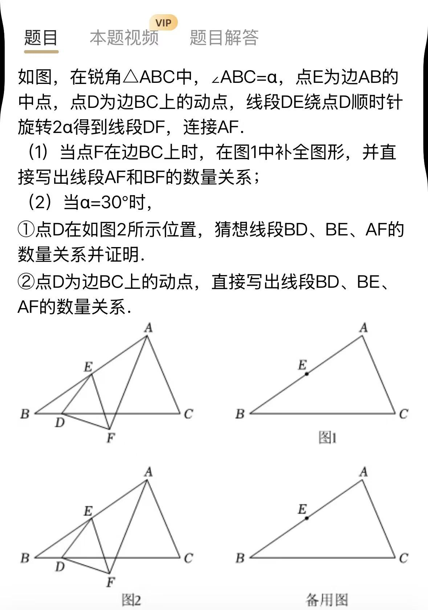
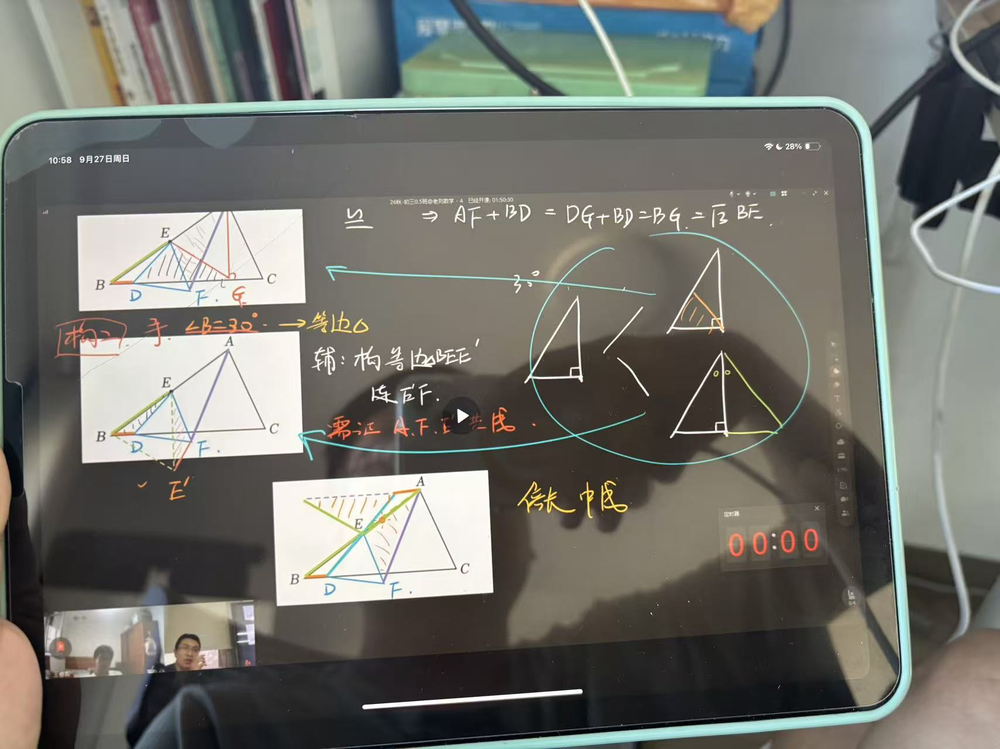
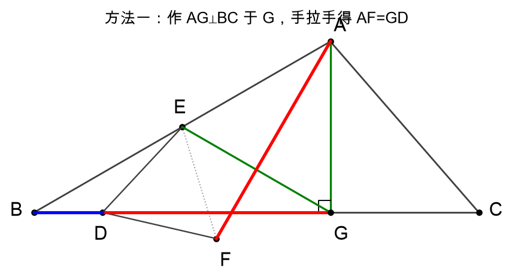
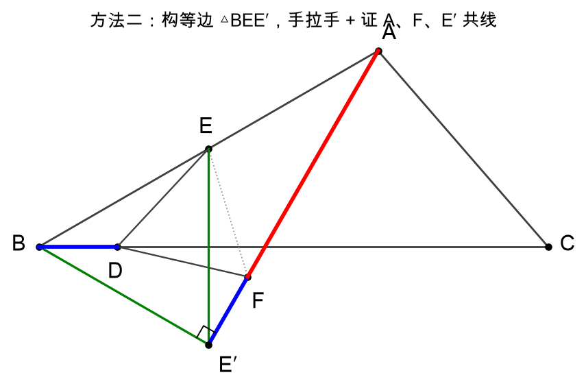
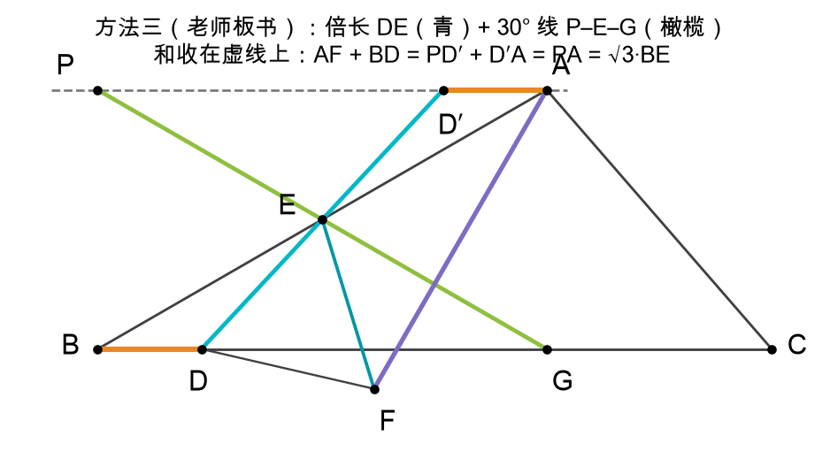
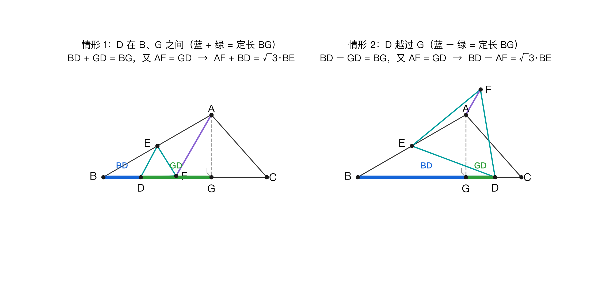

# 旋转 DE 顺时针 2α 得 DF：BD、BE、AF 的数量关系（α=30°，三法＋动点）

## 题目

如图，在锐角 △ABC 中，∠ABC = α，点 E 为边 AB 的中点，点 D 为边 BC 上的动点，线段 DE 绕点 D 顺时针旋转 2α 得到线段 DF，连接 AF。

（2）当 α = 30° 时，

① 点 D 在如图 2 所示位置，猜想线段 BD、BE、AF 的数量关系并证明；

② 点 D 为边 BC 上的动点，直接写出线段 BD、BE、AF 的数量关系。

- 来源：老刘数学课外班（26 秋）
- 难度：⭐⭐⭐ 超中考
- 考查知识点：旋转的性质、等边三角形的判定与性质、手拉手（旋转全等）、含 30° 角直角三角形的三边关系、斜边中线及其逆定理、倍长中线、平行四边形

## 解题思路：先列可能性，再逐个试探

不急着画辅助线。先把条件能触发的「结构清单」摊开：

| 条件                            | 联想到的结构                                                         |
| ------------------------------- | -------------------------------------------------------------------- |
| 旋转角 2α = 60°，且 DE = DF   | **△DEF 是等边三角形**（隐藏结论，三法都要先用）                     |
| 30° 角                         | 直角三角形：30° 所对直角边是斜边一半，三边比 1 : √3 : 2            |
| 60°（等边）                    | 手拉手：两个共顶点的等边三角形 ⇒ 旋转全等，能把一条线段「搬」到别处 |
| E 是 AB 中点                    | 斜边中线（造直角）、中位线、倍长中线                                 |
| 猜想（在图上用尺子量出来，见下段）：两条线段的和 = 第三条 | 把两条线段首尾接在同一条线上（共线三点、截长补短）                   |

**老师原话（可能性清单里再加一条「自由点」）**：「这个 C 点在我们已知的条件里看，在任意位置都可以。所以再结合前面有 30 度，我们其实可以把 C 点定位成特殊点，这样的话更方便我们计算。」翻译成操作：结论里的三条线段 BD、BE、AF 没有一条跟 C 的位置有关（C 只决定射线 BC 伸多远，也就是 D 的活动范围），所以 C 是**自由点**——证明时不妨把它放在算起来最舒服的特殊位置：**让 C 落在 A 向 BC 所作垂线的垂足上（即 ∠ACB = 90°）**，30° 直角三角形直接现成，连辅助线都省了。具体见解法一末的「老师的捷径」。

再看目标：BD 在 BC 上，AF「悬空」，BE 是 AB 的一半——三条线段散在三处，得先把其中两条「搬」到一起去。

**猜想怎么来（不是蒙的，是量出来的）**：①要求「猜想」数量关系，考场上就在图 2 位置用尺子量 BD、AF、BE：量一次发现 BD + AF 大约是 BE 的 1.7 倍；换个 D 的位置再量，和不变、还是约 1.7 倍 ⇒ 猜想 AF + BD = √3·BE（1.7 ≈ √3）。**证明的任务只是解释「为什么」**：为什么两条动线段的和是定值、为什么系数是 √3。

所以下面三种方法的共同点是：先搬线段（手拉手／共线／平行四边形），√3·BE 是搬完顺手续算出来的结果，**不需要事先知道**——事先知道的只有猜想里量出来的那个数。

## 隐藏结论（三法公用）

旋转不改变长度：DF = DE；旋转角 ∠EDF = 2α = 60°。

顶角 60° 的等腰三角形是等边三角形 ⇒ **△DEF 是等边三角形**。

所以 EF = ED = DF，∠DEF = ∠DFE = 60°。

## 解法一：见 30° 想直角三角形——作垂线造直角三角形，再手拉手把 AF 搬到 BC 上

**辅助线**：过 A 作 AG ⊥ BC 于 G；连接 EG、EF、AF。

**第 1 步（√3·BE 从哪来）**：在 Rt△ABG 中，∠ABG = 30°，

所以 AG = ½·AB（30° 所对直角边是斜边一半），由勾股定理 BG = √(AB² − AG²) = √(AB² − ¼·AB²) = (√3/2)·AB。

又 E 是 AB 中点，AB = 2BE，代入得 BG = √3·BE。——此刻还不知道这个数有什么用，只是把「由已知长度（BE）和角度能算的线段」先算出来；后面会看到它正好是结论的右边。

**第 2 步（发现第二个等边三角形）**：EG 是 Rt△ABG 斜边 AB 上的中线，

所以 EG = ½·AB = EA（直角三角形斜边上的中线等于斜边一半）。

又 ∠EAG = 90° − 30° = 60°，有一个角是 60° 的等腰三角形是等边三角形 ⇒ **△EAG 是等边三角形**。

于是 EA = EG，∠AEG = 60°。

**第 3 步（手拉手全等，把 AF 搬到 BC 上）**：现在点 E 处有两个等边三角形：△EAG 和 △EFD（隐藏结论）。

∠AEF = ∠AEG + ∠GEF = 60° + ∠GEF，∠GED = ∠FED + ∠GEF = 60° + ∠GEF（图 2 位置下射线 EG 在 ∠AEF 内部、射线 EF 在 ∠GED 内部；D 换到别的位置时两边同变成「60° 减公共角」，等式仍成立），

所以 ∠AEF = ∠GED。

在 △AEF 和 △GED 中：EA = EG，∠AEF = ∠GED，EF = ED，

所以 △AEF ≌ △GED（SAS），得 **AF = GD**。

**第 4 步（接段）**：AF + BD = GD + BD = BG = √3·BE。

**结论：AF + BD = √3·BE。**

**为什么会这么想**（按试探顺序，不是看着结论倒推）：

1. 条件里有 30° 角 ⇒ 想造直角三角形用上它。为什么从 A 作垂线：A 是悬空线段 AF 的端点，作垂线能把 AF 的端点落到 BC 上（把「悬空」的线段和 BC 搭上关系），顺带得到 Rt△ABG——它的三边都能用唯一已知长度 BE 表示（第 1 步）。
2. 垂足 G 出现后，注意到 E 恰好是 Rt△ABG 斜边 AB 的中点 ⇒ 触发「中点 ⇒ 斜边中线」：连 EG 得 EG = EA，再被 60° 角送一个等边 △EAG（第 2 步）。
3. 手里有了两个等边三角形（△EAG 和 △DEF），手拉手自动触发：一个旋转全等把 AF 搬到 GD，结论 AF + BD = BG = √3·BE 自己浮出来（第 3、4 步）。

全程没有「瞄准 √3 去作图」：√3 是第 1 步算出来的**结果**，不是出发点；出发点是「30° ⇒ 直角三角形」「中点 ⇒ 斜边中线」「等边 ⇒ 手拉手」这三个条件触发器。板书顶部「≌ ⇒ AF + BD = DG + BD = BG = √3 BE」就是这条链。

**还想到但放弃的可能**：从 E、F 分别向 BC 作垂线，用 30° 直角三角形逐段硬算（BH = (√3/2)BE 等）也能做，但要算三个直角三角形再拼，比手拉手绕得多，放弃。

**老师的捷径（自由点 C 特殊定位，连辅助线都省）**：既然 C 的位置不影响结论，干脆取 ∠ACB = 90°（C 落在 A 的垂足上），于是：

- Rt△ABC 本身就是那个 30° 直角三角形：BC = (√3/2)·AB = √3·BE（顶替第 1 步，且不用作 AG）；
- 斜边中线换成 CE：CE = ½·AB = EA，∠EAC = 60° ⇒ △EAC 等边（顶替第 2 步的 △EAG）；
- 手拉手照旧：△AEF ≌ △CED ⇒ AF = CD（顶替第 3 步的 GD）；
- 结论：AF + BD = CD + BD = BC = √3·BE（顶替第 4 步）。

小字提醒：题目要求**锐角**三角形，把 C 放到垂足上 ∠C 就是 90°、严格说不锐了；但整个证明只用到「BC 所在直线」，从没用 C 的具体位置，所以这个特殊定位不改变结论成立——卷面要么照老师这样取、补一句「C 的位置不影响结论，不妨取 ∠ACB = 90°」，要么像正文老老实实作垂足 G（对锐角条件最严谨）。两种写法本质是同一条链。

## 解法二：见 60° 想等边·手拉手——构等边 △BEE′，把 BD 搬到 E′F，再证 A、F、E′ 共线

**辅助线**：以 BE 为边、在 BC 下方（与 A 异侧）作等边 △BEE′；连接 EE′、E′F、AE′。

**第 1 步（手拉手搬 BD）**：点 E 处有两个等边三角形：△EBE′（作的）和 △EDF（隐藏结论）。

∠BED = ∠BEE′ − ∠DEE′ = 60° − ∠DEE′，∠E′EF = ∠DEF − ∠DEE′ = 60° − ∠DEE′，

所以 ∠BED = E′EF。

在 △EBD 和 △EE′F 中：EB = EE′，∠BED = ∠E′EF，ED = EF，

所以 △EBD ≌ △EE′F（SAS），得 **E′F = BD**，且 ∠EE′F = ∠EBD = 30°。

**第 2 步（证 A、F、E′ 共线——这步不能看图说话，必须证）**：A、E、B 共线（E 在 AB 上），∠BEE′ = 60°（等边 △BEE′），

所以 ∠AEE′ = 180° − ∠BEE′ = 120°（平角）。

在 △AEE′ 中 EA = ½·AB = EB = EE′，是等腰三角形，两底角 ∠EAE′ = ∠EE′A = (180° − 120°) ÷ 2 = 30°。

又第 1 步已得 ∠FE′E = ∠EBD = 30°，且 A、F 在直线 EE′ 同侧，

所以射线 E′A 与射线 E′F 重合（都在直线 EE′ 同一侧、与射线 E′E 成 30°）⇒ **A、F、E′ 三点共线**。

**为什么这步不循环（两个 30° 各算各的）**：∠EE′A = 30° 来自固定三角形 △AEE′——A、E 是题目给的，E′ 是作等边 △BEE′ 时定下的第三顶点，三个点都跟 F、跟共线无关，所以这个三角形和它的底角是独立算出的「固定资产」；∠EE′F = 30° 来自第 1 步手拉手全等（∠EE′F = ∠EBD = 30°），同样与共线无关。三角形先存在、角先算好，最后两条同侧、同夹角的射线「撞」在一起才拼出共线；不是先承认共线再回头算角。

**第 3 步（算 AE′）**：在上面这个顶角 ∠AEE′ = 120° 的等腰 △AEE′ 中，过 E 作 EH ⊥ AE′ 于 H，三线合一 ⇒ H 是 AE′ 中点；Rt△AEH 中 ∠EAH = 30° ⇒ EH = ½·EA，勾股定理 AH = √(EA² − EH²) = (√3/2)·EA，

所以 AE′ = 2·AH = √3·EA = √3·BE。

**副产品（注意顺序，别再写反）**：共线证完之后才回头看：∠AE′B = ∠AE′E + ∠EE′B = 30° + 60° = 90°，即「E′ 落在以 AB 为直径的圆上」是共线的**副产品**。本文档第一版曾把这个 90° 当成证明前提（逆用「中线等于这边一半 ⇒ 直角三角形」），但 ∠BE′E = 60° 是定值，「∠AE′B = 90°」与「∠AE′E = 30°」是同一句话，而后者正是共线要用的结论——那样写读起来就是拿结论当前提。改成上面「平角 120° ⇒ 等腰底角 30° ⇒ 与 ∠FE′E 拼共线」的正向顺序后，嫌疑全无，也省掉了中线逆定理。

**第 4 步（接段）**：F 在线段 AE′ 上，所以 AF = AE′ − E′F = √3·BE − BD，

即 **AF + BD = √3·BE**。

**为什么会这么想**：旋转角 60° 是等边三角形的内角，「见 60° 想等边、想手拉手」；在 BE 上补一个等边 △BEE′，E 就成为两个等边三角形的公共顶点，手拉手把 BD 搬到 E′F；「两线段之和」则靠 A、F、E′ 共线把 AF 与 E′F 接成一条线段 AE′。板书「构等边 △BEE′，连 E′F，需证 A、F、E′ 共线」就是这条链。

**还想到但放弃的可能**：共线也可以改用「∠AFE′ = 180°」去证（算 ∠AFE′ = ∠AFD + ∠DFE′ 之类），但角的位置随 D 变化要分类，不如上面「两条 30° 射线重合」干净。

### 解法二′：对偶构造——先把 E′ 定义成交点，共线免费（附成本账）

老师版是「先构等边 △BEE′，再证 A、F、E′ 共线」；对偶的想法是：**不先构 E′，把 E′ 定义成交点**——延长 AF，与「过 B、在 BC 下方作 ∠CBE′ = 30° 的射线」交于 E′。这样「A、F、E′ 共线」由构造自带、不用证，难度转移到「证 BE = BE′（或等价地证直角 ∠AE′B = 90°）」。

**拿到直角之后确实更顺**（「证出直角再往下走」的直觉是对的）：

1. Rt△ABE′ 中 ∠ABE′ = 30° + 30° = 60° ⇒ ∠BAE′ = 30° ⇒ BE′ = ½·AB = BE（30° 所对直角边是斜边一半）——BE = BE′ 在这里作为直角的推论被证出；
2. E 是斜边 AB 中点 ⇒ EE′ = ½·AB = EB，配 ∠EBE′ = 60° ⇒ △BEE′ 等边；
3. 手拉手：△EBD ≌ △EE′F ⇒ FE′ = BD；
4. AE′ = √(AB² − BE′²) = √3·BE ⇒ AF + BD = AF + FE′ = AE′ = √3·BE。

**但成本账要算清**：这个构造里直线 AF 的方向本是未知量，∠AE′B 是两条「未知直线」的夹角。设 ∠BAF = θ，△ABE′ 中 ∠AE′B = 180° − 60° − θ = 120° − θ，于是「∠AE′B = 90°」⇔「θ = 30°」⇔「BE = BE′」⇔ 老师版的「A、F、E′ 共线」——**四者是同一核心事实的四件衣服，谁也不比谁便宜**。直角的最短证明要么借解法一的全等（△AEF ≌ △GED 得 ∠EAF = ∠EGD = 30°），要么把解法二第 2 步「平角 120° ⇒ 底角 30°」重做一遍。反过来老师版里等边是构造白送、共线只花三行（∠FE′E = 30° 与 ∠AE′E = 30° 都是白送的），所以本题的最优包装仍是老师版。

**但「共线难证、改定义交点」的直觉在一般情况下是对的**：共线通常是难的结论类型，遇到「要证三点共线」先问对偶问题——能不能把其中一点定义为两条线的交点，让共线由构造免费、把难度搬到证新点的长度/角度性质上？具体题里两边各估一步、哪边便宜用哪边；本题恰好是「共线侧便宜」的少见情形。

## 解法三：见中点想倍长中线／中位线——把 FE 倍长，用平行四边形把 AF 搬到 BG

**入口想法**：E 是 AB 的中点。看 △ABF：FE 正好是边 AB 上的中线 ⇒ **倍长中线**：延长 FE 到 G，使 EG = FE，连接 GA、GB、GD。

**第 1 步（倍长中线搬 AF）**：在 △BEG 和 △AEF 中：BE = AE，∠BEG = ∠AEF（对顶角），EG = EF，

所以 △BEG ≌ △AEF（SAS），得 **BG = AF**（顺带 ∠GBE = ∠FAE，故 BG ∥ AF）。

同理由 △AEG ≌ △BEF 得 AG = BF。对角线 AB、FG 互相平分 ⇒ 四边形 AFBG 是平行四边形——AF 被「搬」到了从 B 出发的 BG 上。

**第 2 步（GD 的性质）**：EG = EF = ED（隐藏结论），且 G、E、F 共线，

所以在 △GDF 中，DE 是边 GF 上的中线且 DE = ½·GF ⇒ ∠GDF = 90°；

又 △EGD 中 EG = ED，顶角 ∠GED = 180° − ∠DEF = 120°，两底角 ∠EGD = ∠EDG = 30°，过 E 作 GD 的垂线用 30° 直角三角形可得 GD = √3·ED。

**第 3 步（收尾的实话）**：到此 BD、BG(=AF)、GD = √3·ED 都进了 △BGD，但这个三角形的角随 D 的位置变化，想直接加出 √3·BE 还得再引一个 30° 直角三角形或共线结论（即回到解法一、二的那一步）。**这条路线的价值在思维入口**：见中点 E 先试「倍长中线／中位线」，把分散的线段集中（BG = AF、AG = BF、AG ∥ BF 都是这一搬的产物），试探后发现收口不顺，就换解法一、二写卷面。板书把「倍长中线／中位线」和图列在第三种，正是当作试探入口用的。

**为什么会这么想**：「见中点想中位线、倍长中线」是固定触发器；本题 E 同时是 AB 中点和 FG 中点（倍长后），平行四边形自动出现，是搬线段最暴力的工具。试探结论：搬得动、收不了口，故卷面用解法一或二。

## 第②问：D 是动点——和①到底差在哪

**先回答「我没看出和①有多大区别」**：你的感觉是对的——**证明过程和①完全一样**（解法二的四步一步不用改），区别只有一处：D 动起来以后，F 会跑过 A 点，「和」就变成「差」。

用解法二的眼光看全程：无论 D 在哪，△EBD ≌ △EE′F 都成立（手拉手与 D 的位置无关），所以

- E′F = BD 恒成立；
- A、F、E′ 共线恒成立（F 永远落在定直线 AE′ 上）；
- AE′ = √3·BE 是定长。

于是一切只看 **F 在线段 AE′ 上的位置**：

- **F 在 A、E′ 之间**（即 E′F < AE′，即 BD < √3·BE）：AF = AE′ − E′F ⇒ AF + BD = √3·BE。①的图（F 在 BC 下方）只是这里 D 靠 B 端的一个特例；D 再往右一点 F 翻到 BC 上方、只要没越过 A，关系式不变。
- **D 走到临界位置**：BD = √3·BE 时 E′F = AE′，F 与 A 重合，AF = 0（图中 G 点，即解法一里 A 向 BC 所作垂线的垂足，BG = √3·BE）。
- **F 跑到 A 的外侧**（即 E′F > AE′，即 BD > √3·BE）：AF = E′F − AE′ ⇒ BD − AF = √3·BE。

**答案**：

- 当 BD ≤ √3·BE（D 在 B 与垂足 G 之间，含 G）时：AF + BD = √3·BE；
- 当 BD > √3·BE（D 在 G、C 之间）时：BD − AF = √3·BE。

（合起来写就是 AF = |√3·BE − BD|。）

**为什么会这么想**：动点问题先问「证明里哪一步会随位置失效」。逐条检查解法二：全等、共线、定长都不失效，失效的只是「F 在 A、E′ 之间」这个看图默认的位置假设 ⇒ 按 F 与 A 的先后分类，一类一个式子。临界位置顺手用①里已有的 G（BG = √3·BE）来描述，不用新造点。

顺带这也解释了题目为什么要求**锐角**三角形：∠C 是锐角 ⇔ C 在垂足 G 的右边 ⇔ D 才有机会越过 G，②的第二种情况（BD − AF）才存在；若 ∠C 是钝角，C 在 G 左边，D 永远过不了 G，就只剩一种关系式了。「锐角」两个字是在保证动点 D 的活动范围够大。

## 易错点提醒

- 漏掉隐藏结论 △DEF 是等边三角形（DE = DF 且夹角 60°），后面全等全没原料。
- 手拉手写角相等时只写「∠AEF = ∠GED」不给理由：必须写成「60° 加（减）同一个公共角」。
- 解法二里 A、F、E′ 共线是**证**出来的（平角 120° ⇒ 等腰底角 30° ⇒ 与 ∠FE′E = 30° 的同侧射线重合），不能「由图可知」；也别把副产品 ∠AE′B = 90° 挪到证明前面当前提。
- ②只写一个关系式：动点越过了临界位置 G 就变号，漏一种扣分。
- 旋转方向：顺时针 60° 才使 F 落在图中那一侧；方向画反，全等的对应关系跟着反。

## 相关知识点

- 旋转的性质：对应线段相等、旋转角相等
- 有一个角是 60° 的等腰三角形是等边三角形
- 手拉手模型：共顶点的两个等边三角形 ⇒ 旋转全等（SAS），夹角 = 60° ± 公共角
- 含 30° 角的直角三角形：30° 所对直角边是斜边一半，三边比 1 : √3 : 2
- 直角三角形斜边中线 = 斜边一半；其逆：一边上的中线等于这边一半 ⇒ 直角三角形
- 倍长中线 / 中位线：见中点的两个标准动作（对角线互相平分 ⇒ 平行四边形）

## 复盘

- 错因：方法不熟（拿到条件不会先列「可能性清单」，辅助线靠碰）
- 掌握状态：未掌握
- 复习记录：
  - （待抽查）
