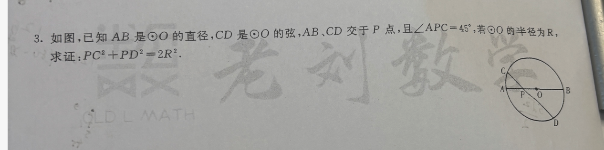
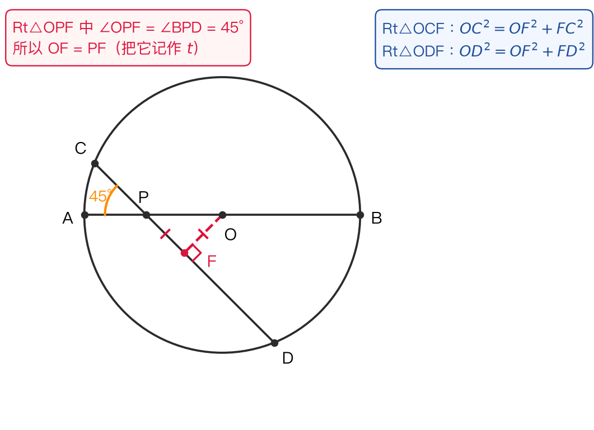
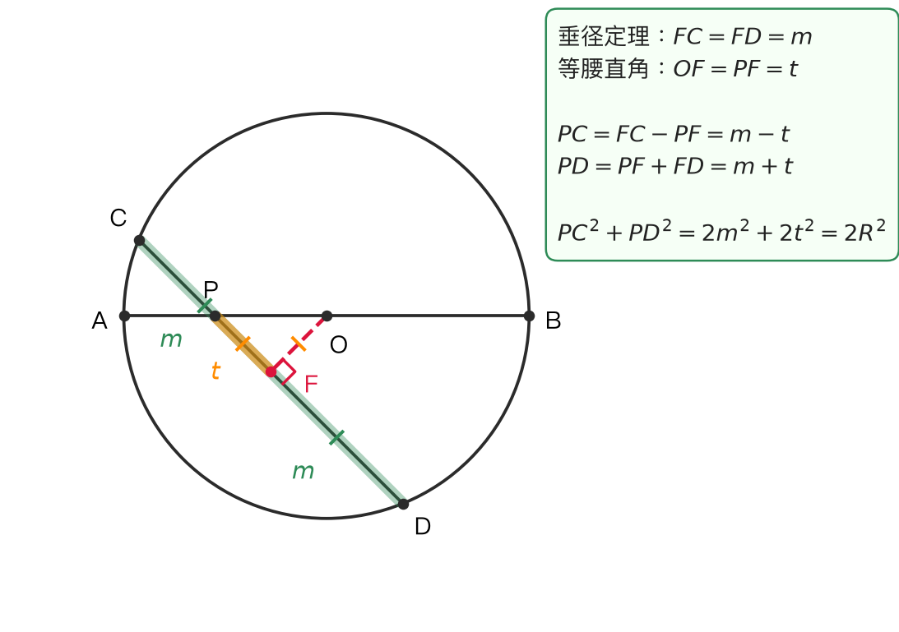

# 直径与 45° 弦相交：求证 $PC^2 + PD^2 = 2R^2$

## 题目

3. 如图，已知 AB 是 ⊙O 的直径，CD 是 ⊙O 的弦，AB、CD 交于 P 点，且 ∠APC = 45°，若 ⊙O 的半径为 R，求证： $PC^2 + PD^2 = 2R^2$ 。

- 来源：错题本拍照（老刘数学讲义，第 3 题）
- 难度：⭐⭐ 中考综合（圆 + 整式变形的证明题）
- 考查知识点：垂径定理、含 45° 的直角三角形是等腰直角三角形、勾股定理、完全平方公式与整体代入

## 解题思路

- **见「弦 + 圆心」就作垂线**：过 O 作 OF⊥CD 于 F，垂径定理白送两样东西—— $FC = FD$ （F 是弦 CD 的中点），以及两个可勾股定理的直角三角形 Rt△OCF、Rt△ODF（斜边都是半径 R）
- **45° 送等腰**：AB 与 CD 的夹角是 45°，所以 Rt△OPF 里另一个锐角也是 45°，于是 $OF = PF$ ，把它记作 $t$
- **关键是「以中点 F 为对称中心」看两条线段**：直线上四点顺序是 $C - P - F - D$ ，所以 $FC = PC + t$ 、 $FD = PD - t$ 。两条勾股式列出来后，**先相减、再相加**：相减得到 $PD - PC = 2t$ 这把钥匙，相加时交叉项正好被它抵消
- 本题最容易翻车的地方不在几何，而在代数： $2t \cdot PC$ 和 $2t \cdot PD$ 不是同类项，不能一消了之

## 解答过程

### 辅助线与两个基本结论

过 O 作 OF⊥CD，垂足为 F。

① 垂径定理：OF 过圆心且 OF⊥CD ⇒ $FC = FD$ 。

② $OF = PF$ ：因为 ∠APC = 45° ，它的对顶角 ∠BPD = 45° ；而 O 在射线 PB 上、垂足 F 落在射线 PD 上（垂足总是落在两条直线张成锐角的那一侧），所以 Rt△OPF 中 ∠OPF = 45° ，另一个锐角 ∠POF = 45° ，两个 45° 对着两条直角边 ⇒ $OF = PF$ ，记作 $t$ 。

> **追问：为什么不能说「∠OPC = 45°」？** 看图，O 在 P 靠 B 的一侧，C 在靠 A 的一侧，射线 PO 与射线 PC 张的是钝角，∠OPC = 180° − 45° = 135° ，它进不了直角三角形。真正用的是 ∠OPF ，而 F 在 PD 那一段上，所以 ∠OPF = ∠BPD = 45° 。结论 $OF = PF$ 没错，但角的名字要叫对，否则考场上「45° 从哪来」这一步就说不清。

### 解法一：两条勾股方程 + 整体代换（我自己的路线，只差最后一步）

直线上四点顺序 $C - P - F - D$ ，所以

$$FC = PC + PF = PC + t, \qquad FD = PD - PF = PD - t$$

Rt△OCF 中（斜边 OC = R）：

$$(PC + t)^2 + t^2 = R^2 \qquad \cdots ①$$

Rt△ODF 中（斜边 OD = R）：

$$(PD - t)^2 + t^2 = R^2 \qquad \cdots ②$$

**第 1 步（① − ②：拿到钥匙）** ①② 右边都是 $R^2$ ，相减后右边为 0：

$$(PC + t)^2 = (PD - t)^2 \ \Longrightarrow\ PC + t = PD - t \ \Longrightarrow\ PD - PC = 2t \qquad ③$$

> ③ 其实就是垂径定理 $FC = FD$ 换了张脸： $PC + t = PD - t$ 。它不是多余的一步，而是第 2 步唯一能用的代换。

**第 2 步（① + ②：把交叉项喂给它）** 展开 ①② ：

$$PC^2 + 2t \cdot PC + 2t^2 = R^2$$
$$PD^2 - 2t \cdot PD + 2t^2 = R^2$$

两式相加：

$$PC^2 + PD^2 + 2t(PC - PD) + 4t^2 = 2R^2$$

由 ③ 知 $PC - PD = -2t$ ，代入 $2t(PC - PD) = 2t \cdot (-2t) = -4t^2$ ，与 $+4t^2$ 恰好抵消：

$$PC^2 + PD^2 = 2R^2 \qquad \blacksquare$$

> **我卡住的地方（原样记下来）**：相加时把 $+2t \cdot PC$ 与 $-2t \cdot PD$ 当成「一正一负同一个量」直接划掉，于是式子里凭空多出 $4t^2$ 无法处理，证不下去。正确做法是先提公因式写成 $2t(PC - PD)$ ，再用 ③ 换成 $-4t^2$ 。**字母长得像 ≠ 同类项**， $PC \neq PD$ ，它就是这道题全部的机关。

### 解法二：设中点两侧为 $m - t$、 $m + t$ （通法，推荐背这个）

设 $FC = FD = m$ （垂径定理）， $OF = PF = t$ （等腰直角）。因为 P 在 C、F 之间：

$$PC = FC - PF = m - t, \qquad PD = PF + FD = m + t$$

$$PC^2 + PD^2 = (m - t)^2 + (m + t)^2 = 2m^2 + 2t^2 = 2(m^2 + t^2)$$

Rt△OCF 中 $m^2 + t^2 = FC^2 + OF^2 = OC^2 = R^2$ ，

$$\Longrightarrow\ PC^2 + PD^2 = 2R^2 \qquad \blacksquare$$

**两种解法其实同源**：解法一的两条勾股式，展开整理后就是解法二里 $m^2 + t^2 = R^2$ 这一句。区别只在于——解法二一开始就把「中点 F」当成对称中心，用 $m - t$ 、 $m + t$ 表示两条线段，交叉项天生自动抵消，不需要再回头做「相减拿钥匙」那一步。**遇到「两段平方和 / 平方差」，优先想对称设法。**

### 顺手验算一下（取特殊位置）

令 P 与 O 重合（这时 CD 是过圆心且与 AB 成 45° 的直径），则 $PC = PD = R$ ， $PC^2 + PD^2 = 2R^2$ ✓ 。结论与 P 的具体位置无关，说明「 $=2R^2$ 」这个定值是对的，可以放心去证。

> 注：验算只能说明结论「不像错」，不能代替证明——考场上写上去不给分。

## 相关知识点

- **垂径定理**：垂直于弦的直径平分这条弦。见「弦长 / 半弦 / 弦心距」三者知二求一，第一反应就是过圆心作弦的垂线，构造以半径为斜边的直角三角形
- **含 45° 的直角三角形是等腰直角三角形**：两锐角都是 45° ⇒ 两直角边相等，本题 $OF = PF$ 由此而来
- **对称设法 $m \pm t$**：一条线段被中点分成相等的两半，而某个动点 P 到中点距离为 $t$ ，则 P 到两端点的距离必为 $m - t$ 与 $m + t$ ；它们的平方和、平方差都能立刻化简（和 $= 2m^2 + 2t^2$ ，差 $= 4mt$ ）
- **同类项**：只有字母部分完全相同的项才能合并。 $2t \cdot PC$ 与 $2t \cdot PD$ 字母部分不同，不能抵消
- **相交弦定理**（课外班拓展，课标外，仅作验算用）： $PC \cdot PD = PA \cdot PB$

## 易错点提醒

- **把 ∠OPC 当成 45°**：∠OPC = 135° ，能用的是它的邻补角 ∠OPD = 45° （即 ∠BPD ，与 ∠APC 对顶）。写证明时这一步要说清「F 在 PD 上」，否则 $OF = PF$ 缺依据
- **两个量用同一个字母**：开头设 $PD = x$ ，后面又把 $PF$ 记作 $x$ ，自己把自己绕晕。一条题里每个字母只伺候一个量，多一个量就换一个字母（ $t$ 、 $m$ ）
- **相加时误消交叉项**：见解法一的「我卡住的地方」，这是本题真正的失分点
- **垂足 F 的位置要看图定**：本题 P 靠近 A ，顺序是 $C - P - F - D$ ，故 $FC = PC + t$ 、 $FD = PD - t$ 。若图换成 P 靠近 B （即 $PC > PD$ ），顺序变成 $C - F - P - D$ ，两个式子整体反过来写，结论 $PC^2 + PD^2 = 2R^2$ 不变。别死记「+」还是「−」，按图上顺序推
- **别漏系数 2**：最后一步是 $2(m^2 + t^2) = 2R^2$ ，括号外的 2 来自 $(m-t)^2 + (m+t)^2$ 的二次项翻倍（ $m^2$ 两份、 $t^2$ 两份），不要只写成 $R^2$

## 复盘

- 错因：概念不清（∠OPC 与 ∠OPD 混为一谈，好在 $OF = PF$ 的结论蒙对了）+ 粗心（把 $2t \cdot PC$ 与 $2t \cdot PD$ 当同类项抵消，多出 $4t^2$ 卡死）。辅助线 OF⊥CD 与两条勾股方程的建模范式是自己想出来的，方向完全正确
- 掌握状态：未掌握
- 复习记录：
  - （20261002 口头讨论：式子列对，卡在相加合并的同类项判断上；已补 ③ 式 $PD - PC = 2t$ 的整体代换与解法二的 $m \pm t$ 通法）
