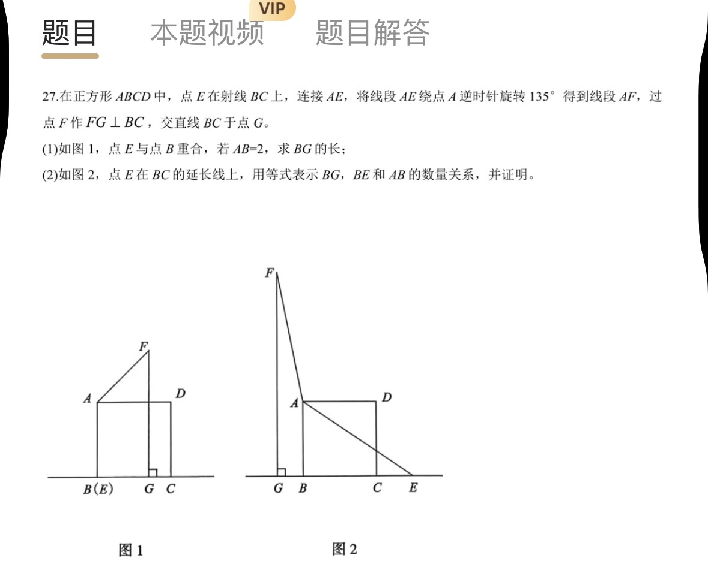
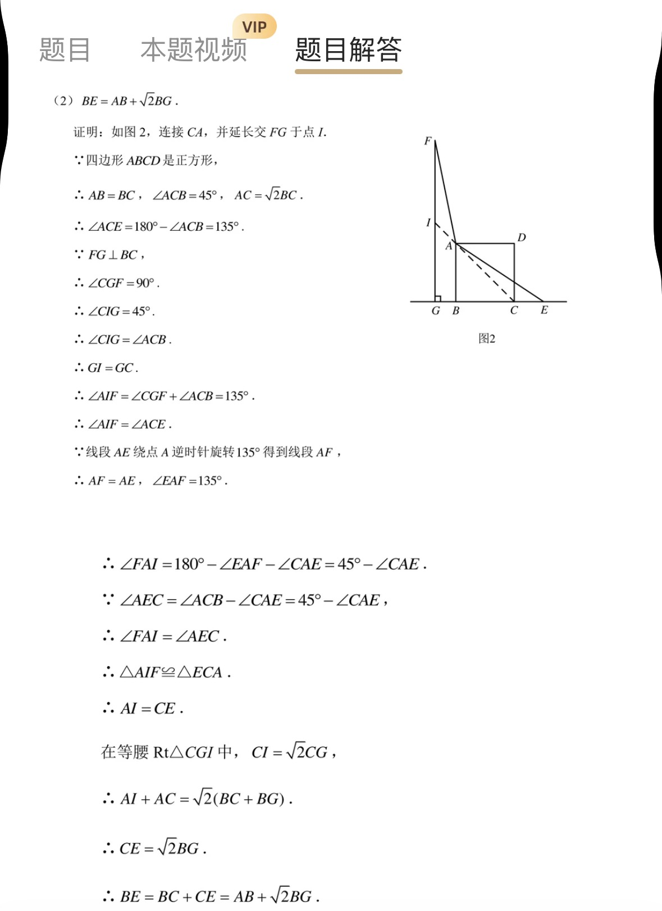

# 正方形中旋转 135° 构造全等（求 BG，证 BE = AB + √2BG）

## 题目
在正方形 ABCD 中，点 E 在射线 BC 上，连接 AE，将线段 AE 绕点 A 逆时针旋转 135° 得到线段 AF，过点 F 作 FG ⊥ BC，交直线 BC 于点 G。

(1) 如图 1，点 E 与点 B 重合，若 AB = 2，求 BG 的长；
(2) 如图 2，点 E 在 BC 的延长线上，用等式表示 BG、BE 和 AB 的数量关系，并证明。




- 来源：错题本拍照（APP 截图）
- 难度：⭐⭐⭐ 超中考（90° 旋转手拉手是中考压轴常客，135° 版本多一步「对角线找 45°」，属于压轴拔高）
- 考查知识点：旋转的性质、全等三角形（AAS）、正方形对角线的 45°、等腰直角三角形（√2）、三角形内角和与外角、线段数量关系的证明（拆分 + 等量代换）

## 解题思路

1. **见到「旋转」，先写下两条结论**（这是全等的全部原料）：
   - AF = AE（旋转不改变线段长度）
   - ∠EAF = 135°（旋转角）
   找不到全等时，先检查这两条是否都用上了。
2. **135° 要从图里「反推出处」**：135° = 180° − 45°，图中唯一的 45° 来自正方形对角线 ∠ACB = 45°，所以 ∠ACE = 180° − 45° = 135° = ∠EAF。旋转角和图里某个角相等，就是信号：**把产生那个角的线（对角线 CA）连上、延长**。
3. **辅助线一箭双雕**：延长 CA 交 FG 于 I——
   - 造出 ∠AIF = 135° = ∠ACE（全等需要的一组角）；
   - 造出等腰直角三角形 △CGI（√2 从这里来）。
   画辅助线前先问自己：这条线能造出哪个「含已知角 / 已知等线段」的图形？
4. **角平分「45° − ∠CAE」模板**：要证 ∠FAI = ∠AEC，两个角都等于「45° 减去同一个 ∠CAE」，自然相等。旋转题证角相等，常写成「定角 ± 同一个角」来比。
5. **倒推结论拆任务**：BE = AB + √2BG = BC + CE，目标 = 证 CE = √2BG。拆成两半：
   - CE = AI —— 靠旋转全等；
   - AI = √2BG —— 靠等腰直角三角形。
   两种工具（旋转全等 + 等腰直角三角形）合起来才完成。

## 解答过程

### (1) E 与 B 重合，AB = 2，求 BG

**答：BG = √2。**

做法：过 A 作 AH ∥ BC，交 FG 于 H。

- ∵ 四边形 ABCD 是正方形，∴ AB ⊥ BC，∠ABC = 90°，且 AE = AB = 2。
- ∵ 旋转不改变长度，∴ AF = AE = 2，∠BAF = 135°。
- ∵ AH ∥ BC，AB ⊥ BC，∴ ∠BAH = 90°；又 FG ⊥ BC，∴ ∠AHF = 90°。
- 四边形 ABGH 有三个直角（∠B、∠G、∠BAH），是矩形，∴ **BG = AH**。
- ∠FAH = ∠BAF − ∠BAH = 135° − 90° = 45°。
- 在 Rt△AHF 中，∠AHF = 90°、∠FAH = 45°，∴ △AHF 是等腰直角三角形（∠AFH 也是 45°），斜边 AF = √2·AH。
- ∴ AH = AF ÷ √2 = 2 ÷ √2 = √2，∴ **BG = √2**。

> 为什么这么作？135° 比 90° 多出 45°，只要从 A 引一条水平线把 90° 的 ∠BAH 分出去，剩下的 ∠FAH 正好 45°，配上 FG 的垂直，就凑出一个等腰直角三角形——「直角 + 45° ⇒ 等腰直角三角形 ⇒ ×√2」是全题的计算引擎。

### (2) E 在 BC 延长线上：BE = AB + √2BG，证明

**结论：BE = AB + √2·BG。**

证明：连接 CA 并延长，交 FG 于点 I。

第一步，先算出图中所有的 45° 和 135°：

- ∵ ABCD 是正方形，∴ AB = BC，∠ACB = 45°，AC = √2·BC。
- ∵ E 在 BC 延长线上（B、C、E 共线），∴ ∠ACE = 180° − ∠ACB = 135°。
- ∵ FG ⊥ BC，∴ ∠CGF = 90°。在 △CGI 中，∠GCI = ∠BCA = 45°，
  ∴ ∠GIC = 180° − 90° − 45° = 45°，∴ **GI = GC**（等腰），且 **CI = √2·CG**（等腰直角三角形斜边 = √2 × 直角边）。

第二步，造出全等需要的一组 135° 角：

- ∠AIF 是 △CGI 在顶点 I 处的外角（A 在线段 CI 上），
  ∴ ∠AIF = ∠IGC + ∠GCI = 90° + 45° = 135°。
- ∴ **∠AIF = ∠ACE = 135°**。

第三步，用「45° − ∠CAE」证出第二组角相等：

- ∵ I、A、C 共线，∴ ∠FAI = 180° − ∠EAF − ∠CAE = 180° − 135° − ∠CAE = **45° − ∠CAE**。
- 在 △ACE 中，∠AEC = 180° − ∠ACE − ∠CAE = 180° − 135° − ∠CAE = **45° − ∠CAE**（也可用外角：∠ACB = ∠CAE + ∠AEC）。
- ∴ **∠FAI = ∠AEC**。

第四步，全等：

- 在 △AIF 和 △ECA 中：
  - ∠AIF = ∠ECA = 135°
  - ∠FAI = ∠AEC
  - AF = EA（旋转的性质）
- ∴ △AIF ≌ △ECA（AAS），∴ **AI = CE**。

第五步，用等腰直角三角形把 AI 变成 √2 倍的 BG：

- ∵ G、B、C 依次排列，∴ CG = GB + BC。
- ∴ AI = CI − AC = √2·CG − √2·BC = √2(CG − BC) = √2·BG。
- ∴ CE = AI = **√2·BG**。

第六步，拼结论：

- BE = BC + CE = AB + √2·BG。∎

```
F
|\
| \        I 在 CA 延长线上，
|  \      △CGI 是等腰直角三角形
|   \       （G 是直角，√2 的来源）
I----A------------D
|    |            |
|    B-----C------E
G
```

## 相关知识点

- 旋转的性质：旋转前后线段相等；对应线段的夹角 = 旋转角（「旋转 ⇒ 找全等」的标准信号）
- 正方形对角线：把直角分成两个 45°；AC = √2·AB
- 全等判定 AAS（两角及其中一角的对边）
- 等腰直角三角形：斜边 = √2 × 直角边
- 三角形外角：等于两个不相邻内角之和（∠AIF = 90° + 45°）
- 证线段关系的方法：把目标拆成「一段 = 边长代换 + 待证段」，各段分别用工具处理

## 易错点提醒

- ∠AEC = 45° − ∠CAE：∠ACB 是 △ACE 在 C 处的外角，是「∠CAE + ∠AEC」的和，别写成 ∠AEC = 45° + ∠CAE。
- 位置关系：图 2 中 G 在 B 的左侧，CG = GB + BC，不是差；写等式前先在图上标一遍点的顺序。
- 图 1 和图 2 位置不同，(2) 的结论对 (1) 不成立（(1) 里 G 在 B、C 之间），两问不能互相套用。
- 全等对应关系：△AIF ≌ △ECA 是 A↔E、I↔C、F↔A，AF 对的是 EA，不是 EC。
- 135° 不是凭空多出来的角：它是「180° − 45°」，做题时要主动问「这个角的 45° 在哪」，答案几乎总在对角线里。

## 复盘

- 错因：方法不熟（想到旋转找全等，但卡住「135° 的 45° 从哪来」，不会延长对角线造等腰直角三角形）
- 掌握状态：未掌握
- 复习记录：
  - （待抽查）
