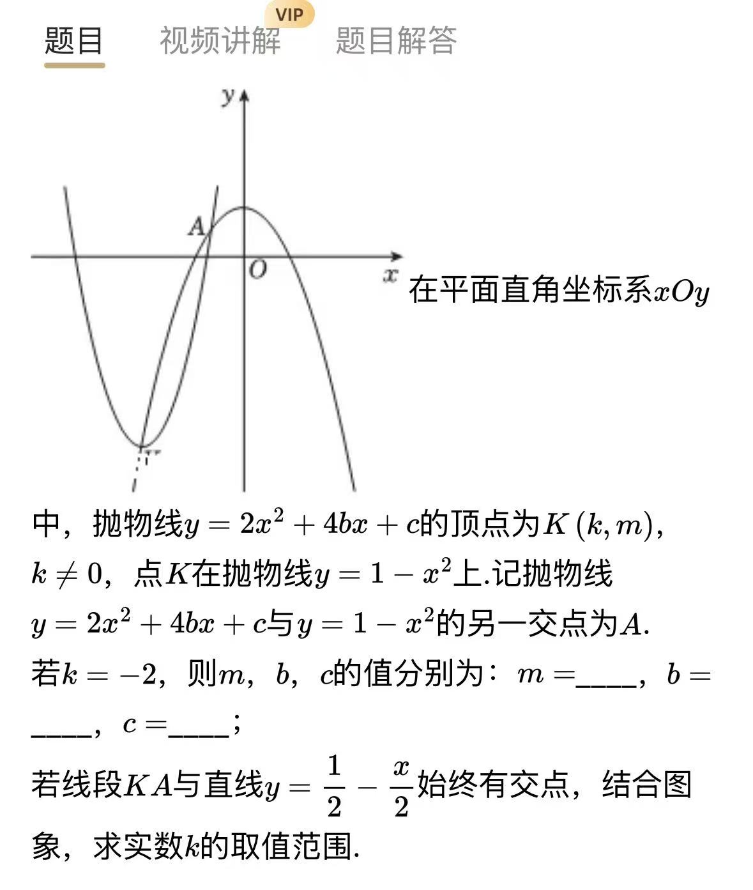
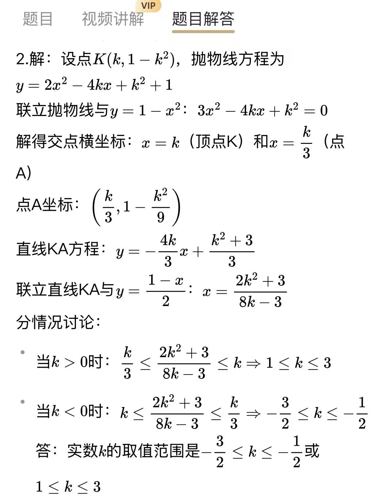
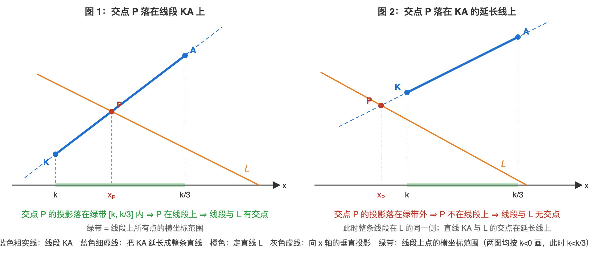

# 顶点在抛物线上的二次函数：线段 KA 与直线有交点求 k 范围

## 题目

在平面直角坐标系 $xOy$ 中，抛物线 $y=2x^2+4bx+c$ 的顶点为 $K(k, m)$， $k\neq 0$，点 $K$ 在抛物线 $y=1-x^2$ 上。记抛物线 $y=2x^2+4bx+c$ 与 $y=1-x^2$ 的另一交点为 $A$。

（1）若 $k=-2$，则 $m$， $b$， $c$ 的值分别为： $m=$ \_\_\_\_， $b=$ \_\_\_\_， $c=$ \_\_\_\_；

（2）若线段 $KA$ 与直线 $y=\dfrac{1}{2}-\dfrac{x}{2}$ 始终有交点，结合图象，求实数 $k$ 的取值范围。

- 来源：错题本拍照（App 截图，原题解答见 ，跳步较多，以本文档为准）
- 难度：⭐⭐⭐ 超中考（含参二次函数综合，压轴题风格）
- 考查知识点：二次函数顶点式、两函数图象交点与联立方程、待定系数法求一次函数解析式、线段与直线有交点的转化（端点夹逼 / 端点异侧）、分式不等式的符号讨论

## 解题思路

- **全题只有一个自由参数 $k$**：顶点 $K$ 在 $y=1-x^2$ 上 $\implies m=1-k^2$；用顶点式直接把抛物线写成含 $k$ 的式子，于是 $A$、直线 $KA$ 全能用 $k$ 表示。
- **"线段与直线有交点"的翻译**：先求整条**直线** $KA$ 与定直线 $L$ 的交点 $P$，再要求 $P$ 落**进线段里**。线段不竖直，所以"落进线段里"等价于" $P$ 的横坐标夹在两端点横坐标之间"。
- **等价的快捷判据**（结合图象的看法）：线段两端点在直线 $L$ 的两侧（或一个端点恰在 $L$ 上） $\iff$ 线段与 $L$ 有交点。用它可以一步列出不等式并验证答案。

## 解答过程

### 第（1）问

$K$ 在 $y=1-x^2$ 上： $m=1-(-2)^2=-3$。

顶点式： $y=2(x+2)^2-3=2x^2+8x+5$，与 $y=2x^2+4bx+c$ 对照： $4b=8$， $c=5$。

**答案**： $m=-3$， $b=2$， $c=5$。

---

### 第（2）问（重点）

**第 1 步：用顶点式把抛物线写成含 $k$ 的式子**

$K(k, m)$ 是顶点，且二次项系数为 $2$，所以抛物线可写成顶点式 $y=2(x-k)^2+m$。

又 $K$ 在 $y=1-x^2$ 上，得 $m=1-k^2$。代入展开：

$$y=2(x-k)^2+1-k^2=2x^2-4kx+2k^2+1-k^2=2x^2-4kx+k^2+1$$

> **为什么用顶点式，而不从 $y=2x^2+4bx+c$ 出发列方程解 $b$、 $c$？**
> 题目关于 $b$、 $c$ 的唯一信息就是"顶点是 $K$"。顶点式把"顶点"直接写进解析式，一步到位；若用一般式，还要先背出顶点坐标公式 $-\dfrac{4b}{2\times 2}=k$ 再解方程，绕路还容易算错。顺便也得到 $b=-k$， $c=k^2+1$（与第（1）问 $b=2$， $c=5$ 吻合）。

**第 2 步：联立两抛物线，求出点 $A$**

$$2x^2-4kx+k^2+1=1-x^2 \implies 3x^2-4kx+k^2=0$$

十字相乘分解： $3x^2-4kx+k^2=(x-k)(3x-k)$（展开验证： $3x^2-kx-3kx+k^2$ ✓；用求根公式也一样）。

$$x=k \quad \text{或} \quad x=\frac{k}{3}$$

$x=k$ 正是 $K$ 的横坐标—— $K$ 本来就在两条抛物线上，当然是交点之一；所以**另一交点** $A$ 的横坐标是 $\dfrac{k}{3}$。

> **条件 $k\neq 0$ 在这里干什么用？**
> 若 $k=0$，则 $\dfrac{k}{3}=k=0$，两根重合， $A$ 与 $K$ 是同一个点，"另一交点"和"线段 $KA$"都不存在。后面按 $k$ 的正负分类讨论，也建立在 $k\neq 0$ 上。

$A$ 的纵坐标代入 $y=1-x^2$ 算更简单： $y_A=1-\dfrac{k^2}{9}$。即 $A\left(\dfrac{k}{3}, 1-\dfrac{k^2}{9}\right)$。

**第 3 步：待定系数法求直线 $KA$**

直线 $KA$ 不竖直，可设成一次函数 $y=px+q$。点在直线上 $\iff$ 坐标满足解析式，把 $K\left(k, 1-k^2\right)$、 $A\left(\dfrac{k}{3}, 1-\dfrac{k^2}{9}\right)$ 分别代入：

$$pk+q=1-k^2 \qquad (1)$$

$$p\cdot\frac{k}{3}+q=1-\frac{k^2}{9} \qquad (2)$$

两个未知数 $p$、 $q$，恰好两个方程。

> **为什么把两式相减？**
> $q$ 在两个方程里的系数都是 $1$，相减时 $q$ 直接抵消，只剩含 $p$ 的一个方程，一次就能解出 $p$——这是待定系数法里最省事的消元顺序。

$(1)-(2)$，左右两边分别算：

- 左边： $(pk+q)-\left(\dfrac{k}{3}p+q\right)=pk-\dfrac{k}{3}p=\left(k-\dfrac{k}{3}\right)p=\dfrac{2k}{3}p$
- 右边： $(1-k^2)-\left(1-\dfrac{k^2}{9}\right)=-k^2+\dfrac{k^2}{9}=\dfrac{-9k^2+k^2}{9}=-\dfrac{8k^2}{9}$

于是 $\dfrac{2k}{3}p=-\dfrac{8k^2}{9}$。因为 $k\neq 0$，所以 $\dfrac{2k}{3}\neq 0$，两边同除以 $\dfrac{2k}{3}$（除以分数等于乘它的倒数）：

$$p=-\frac{8k^2}{9}\div\frac{2k}{3}=-\frac{8k^2}{9}\times\frac{3}{2k}=-\frac{8\times 3}{9\times 2}\cdot\frac{k^2}{k}=-\frac{4k}{3}$$

（约分： $8$ 与 $2$ 约剩 $4$， $3$ 与 $9$ 约剩 $\dfrac{1}{3}$， $k^2$ 与 $k$ 约剩 $k$。）

**回代求 $q$**：把 $p=-\dfrac{4k}{3}$ 代入 $(1)$（ $(1)$ 不含分母，比 $(2)$ 好算）：

$$q=1-k^2-pk=1-k^2-\left(-\frac{4k}{3}\right)\cdot k=1-k^2+\frac{4k^2}{3}=\frac{3-3k^2+4k^2}{3}=\frac{k^2+3}{3}$$

$$\text{直线 } KA:\ y=-\frac{4k}{3}x+\frac{k^2+3}{3}$$

**回代验证**（求出解析式后养成验算习惯）：把 $x=k$ 代入： $-\dfrac{4k}{3}\cdot k+\dfrac{k^2+3}{3}=\dfrac{-4k^2+k^2+3}{3}=1-k^2$ ✓ 恰为 $K$ 的纵坐标；把 $x=\dfrac{k}{3}$ 代入： $-\dfrac{4k}{3}\cdot\dfrac{k}{3}+\dfrac{k^2+3}{3}=\dfrac{-4k^2+3k^2+9}{9}=1-\dfrac{k^2}{9}$ ✓ 恰为 $A$ 的纵坐标。再对照图：图中 $k<0$，此时 $p=-\dfrac{4k}{3}>0$，直线从左往右上升，与图里 $KA$ 的走向一致。

> **两式相减到底在算什么？**
> $(1)-(2)$ 的右边是「 $K$ 的纵坐标比 $A$ 高多少」 $\left(-\dfrac{8k^2}{9}\right)$，左边是 $p$ 乘「 $K$ 的横坐标比 $A$ 大多少」 $\left(\dfrac{2k}{3}\right)$。所以 $p=$ 高度差 $\div$ 水平差，也就是「 $x$ 每增大 $1$， $y$ 变化多少」——正是一次函数 $y=px+q$ 里系数 $p$ 的含义。明白这层，相减就不是机械操作了。

**第 4 步：求直线 $KA$ 与定直线 $L$ 的交点，并先排掉平行的坑**

记定直线 $L:\ y=\dfrac{1}{2}-\dfrac{x}{2}$。联立：

$$-\frac{4k}{3}x+\frac{k^2+3}{3}=\frac{1}{2}-\frac{x}{2}$$

两边乘 $6$ 去分母： $-8kx+2k^2+6=3-3x$，移项合并： $(3-8k)x=-(2k^2+3)$，即

$$x_P=\frac{2k^2+3}{8k-3}$$

> **原解答跳过的一步：除之前必须看 $8k-3$ 是否为 $0$。**
> 若 $k=\dfrac{3}{8}$，直线 $KA$ 为 $y=-\dfrac{1}{2}x+\dfrac{67}{64}$，一次项系数与 $L$ 的 $-\dfrac{1}{2}$ 相同、截距不同（ $\dfrac{67}{64}\neq\dfrac{1}{2}$），两直线**平行**，永远没有交点，线段 $KA$ 自然与 $L$ 无交点。所以 $k=\dfrac{3}{8}$ 不合题意，先排除（下面的不等式也会自动把它排掉，但道理要先明白）。

**第 5 步：从"直线有交点"到"线段有交点"——原解答最该解释的一步**

**看图说明**（两图均按 $k<0$ 画，此时 $k<\dfrac{k}{3}$）：

- 蓝色粗实线才是题目说的**线段** $KA$；把它两端沿蓝色虚线延长，得到**整条直线** $KA$。整条直线与 $L$（橙色）不平行，就只有一个交点——即第 4 步解出的 $P$（横坐标 $x_P=\dfrac{2k^2+3}{8k-3}$）。
- 从 $K$、 $P$、 $A$ 向 $x$ 轴作垂线（灰色虚线）：两端点的投影在轴上围出绿色带，即从 $k$ 到 $\dfrac{k}{3}$ 的区间——它就是线段上所有点的横坐标范围。
- 图 1： $P$ 的投影落在绿带**内** $\iff$ $P$ 本身落在线段上 $\iff$ 线段与 $L$ 有交点；
- 图 2： $P$ 的投影落在绿带**外**（延长线那侧） $\iff$ $P$ 不在线段上。此时整条线段在 $L$ 的同一侧，怎么都没有交点——"直线有交点"也不算数。
- 边界情形： $P$ 与 $K$ 或 $A$ 重合（即 $x_P=k$ 或 $x_P=\dfrac{k}{3}$）时，交点恰是线段的端点，仍算"有交点"，所以第 6 步的不等号要带等号。

$x_P$ 是**整条直线** $KA$（向两端无限延长）与 $L$ 的交点横坐标；题目要求交点在**线段** $KA$ 上。

线段 $KA$ 不竖直（ $k\neq\dfrac{k}{3}$），沿线段从 $K$ 走到 $A$，横坐标从 $k$ 连续变到 $\dfrac{k}{3}$，中间每个值都取到、且只取到这些值。所以：

$$P \text{ 在线段 } KA \text{ 上（含端点）} \iff x_P \text{ 介于 } k \text{ 与 } \frac{k}{3} \text{ 之间（含等于）}$$

而 $k$ 与 $\dfrac{k}{3}$ 谁大要看 $k$ 的符号： $k>0$ 时 $\dfrac{k}{3}<k$； $k<0$ 时 $k<\dfrac{k}{3}$。**这就是原解答两行不等式和分类讨论的全部来历。**

> **为什么比横坐标就行，不用比纵坐标？**
> 线段是"斜着"的：在它上面，横坐标从一端单调变到另一端，"点在线段上"与"横坐标夹在两端点横坐标之间"是同一件事（只有竖直线段才例外，那时横坐标不变，要比纵坐标；本题 $k\neq 0$ 保证了不竖直）。

**第 6 步：解两种情况的不等式（补全计算细节）**

先把两个"差"通分并分解因式，后面反复用（这是原解答完全省略的计算核心）：

$$x_P-\frac{k}{3}=\frac{2k^2+3}{8k-3}-\frac{k}{3}=\frac{3(2k^2+3)-k(8k-3)}{3(8k-3)}=\frac{-2k^2+3k+9}{3(8k-3)}=-\frac{(2k+3)(k-3)}{3(8k-3)}$$

$$x_P-k=\frac{2k^2+3}{8k-3}-k=\frac{(2k^2+3)-k(8k-3)}{8k-3}=\frac{-6k^2+3k+3}{8k-3}=-\frac{3(2k+1)(k-1)}{8k-3}$$

**情况一： $k>0$，要求 $\dfrac{k}{3}\leqslant x_P\leqslant k$，即 $x_P-\dfrac{k}{3}\geqslant 0$ 且 $x_P-k\leqslant 0$。**

- $x_P-\dfrac{k}{3}\geqslant 0$：即 $-\dfrac{(2k+3)(k-3)}{3(8k-3)}\geqslant 0$。 $k>0$ 时 $2k+3>0$，两边同除以负数 $-\dfrac{2k+3}{3}$（不等号反向）： $\dfrac{k-3}{8k-3}\leqslant 0$。商 $\leqslant 0$ $\iff$ 分子分母异号或分子为 $0$： $k-3\leqslant 0$ 且 $8k-3>0$，得 $\dfrac{3}{8}<k\leqslant 3$（另一组合 $k-3\geqslant 0$ 且 $8k-3<0$ 无解）。
- $x_P-k\leqslant 0$：即 $-\dfrac{3(2k+1)(k-1)}{8k-3}\leqslant 0$。 $k>0$ 时 $2k+1>0$，同除以负数 $-3(2k+1)$（反向）： $\dfrac{k-1}{8k-3}\geqslant 0$。商 $\geqslant 0$ $\iff$ 同号或分子为 $0$： $k\geqslant 1$，或 $0<k<\dfrac{3}{8}$。
- 两个条件取交集： $1\leqslant k\leqslant 3$。

**情况二： $k<0$，要求 $k\leqslant x_P\leqslant \dfrac{k}{3}$，即 $x_P-k\geqslant 0$ 且 $x_P-\dfrac{k}{3}\leqslant 0$。**

- $x_P-k\geqslant 0$：即 $-\dfrac{3(2k+1)(k-1)}{8k-3}\geqslant 0$。 $k<0$ 时 $k-1<0$、 $8k-3<0$，故 $\dfrac{k-1}{8k-3}>0$，把它除掉不改变不等号方向，剩下 $-3(2k+1)\geqslant 0 \iff 2k+1\leqslant 0 \iff k\leqslant -\dfrac{1}{2}$。
- $x_P-\dfrac{k}{3}\leqslant 0$：即 $-\dfrac{(2k+3)(k-3)}{3(8k-3)}\leqslant 0$。 $k<0$ 时 $k-3<0$、 $8k-3<0$，故 $\dfrac{k-3}{8k-3}>0$，除掉后剩下 $-(2k+3)\leqslant 0 \iff 2k+3\geqslant 0 \iff k\geqslant -\dfrac{3}{2}$。
- 两个条件取交集： $-\dfrac{3}{2}\leqslant k\leqslant -\dfrac{1}{2}$。

**答案**： $-\dfrac{3}{2}\leqslant k\leqslant -\dfrac{1}{2}$ 或 $1\leqslant k\leqslant 3$。

**第 7 步：结合图象——四个端点值从哪来（验证与直觉）**

先求 $L$ 与定抛物线 $y=1-x^2$ 的交点： $1-x^2=\dfrac{1}{2}-\dfrac{x}{2} \implies 2x^2-x-1=0 \implies (2x+1)(x-1)=0$，得 $x=-\dfrac{1}{2}$ 或 $x=1$，即 $Q\left(-\dfrac{1}{2}, \dfrac{3}{4}\right)$、 $P(1, 0)$。

看图象： $y=1-x^2$ 位于 $Q$、 $P$ 之间的一段弧（ $-\dfrac{1}{2}<x<1$）在 $L$ **上方**；两侧的两段弧（ $x<-\dfrac{1}{2}$ 或 $x>1$）在 $L$ **下方**。而 $K$、 $A$ 都在这条抛物线上（横坐标分别为 $k$、 $\dfrac{k}{3}$），线段 $KA$ 是连它俩的线段。

- $k=-\dfrac{3}{2}$ 时 $A=Q$ 落在 $L$ 上； $k=-\dfrac{1}{2}$ 时 $K=Q$ 落在 $L$ 上；两者之间（ $-\dfrac{3}{2}<k<-\dfrac{1}{2}$） $K$ 在下方弧、 $A$ 在上方弧，线段跨着 $L$，必有交点；
- $k=1$ 时 $K=P$ 落在 $L$ 上； $k=3$ 时 $A=P$ 落在 $L$ 上；两者之间（ $1<k<3$） $K$ 在下方弧、 $A$ 在上方弧，线段又跨着 $L$。

所以答案的四个端点 $-\dfrac{3}{2}, -\dfrac{1}{2}, 1, 3$，正是" $K$ 或 $A$ 恰好落到 $L$ 与抛物线的交点 $Q$、 $P$ 上"的四个时刻。

**等价的快捷判据（端点异侧法，可作验算）**：把点代入 $d=y-\left(\dfrac{1}{2}-\dfrac{x}{2}\right)$， $d>0$ 表示点在 $L$ 上方：

$$d(K)=(1-k^2)-\frac{1}{2}+\frac{k}{2}=-\frac{(2k+1)(k-1)}{2},\qquad d(A)=\left(1-\frac{k^2}{9}\right)-\frac{1}{2}+\frac{k}{6}=-\frac{(2k+3)(k-3)}{18}$$

线段与 $L$ 有交点 $\iff d(K)\cdot d(A)\leqslant 0 \iff (2k+1)(k-1)(2k+3)(k-3)\leqslant 0$。

四个根从小到大为 $-\dfrac{3}{2}, -\dfrac{1}{2}, 1, 3$；每跨过一个根，恰好一个因式变号，乘积符号随之翻转一次，故符号在相邻区间正负交替（任取一值验证，如 $k=0$ 时乘积 $=9>0$）： $k<-\dfrac{3}{2}$ 正、 $-\dfrac{3}{2}<k<-\dfrac{1}{2}$ 负、 $-\dfrac{1}{2}<k<1$ 正、 $1<k<3$ 负、 $k>3$ 正。取 $\leqslant 0$ 的区间，得 $-\dfrac{3}{2}\leqslant k\leqslant -\dfrac{1}{2}$ 或 $1\leqslant k\leqslant 3$，与主解法一致。

> **为什么"两端点在直线两侧（或一端在直线上） $\iff$ 线段与直线有交点"？**
> 线段是连起来不断开的一条线。从一端走到另一端，若起点在路的北侧、终点在路的南侧，中途必然跨过这条路一次；若两端都在北侧，整条线段都在北侧，碰不到路。端点恰在路上的情形单独允许（ $d=0$），所以条件是 $d(K)\cdot d(A)\leqslant 0$。这个判据不用讨论平行、不用管分母符号，考场上更快更稳。

## 相关知识点

- **二次函数顶点式**： $y=a(x-h)^2+t$ 的顶点为 $(h, t)$；已知顶点时优先用顶点式
- **两函数图象的交点** $\iff$ 联立解析式所得方程的解；交点个数 $\iff$ 根的个数
- **待定系数法**：设 $y=px+q$，代入两点、相减消常数项，是求直线解析式的标准操作
- **线段与直线的位置关系**：交点落在线段上 $\iff$ 交点横坐标夹在两端点横坐标之间（线段不竖直时）；等价地，两端点在直线两侧或一端在直线上
- **商的符号法则**： $\dfrac{M}{N}\leqslant 0 \iff M$、 $N$ 异号或 $M=0$（且 $N\neq 0$）； $\dfrac{M}{N}\geqslant 0 \iff$ 同号或 $M=0$
- **不等式两边同除一个含参式子**：必须先定它的符号，负数要反向——这就是分类讨论的来源
- **一次因式乘积的符号规律**：每跨过一个根，乘积变号一次，符号在相邻根之间正负交替

## 易错点提醒

- **忘记 $k\neq 0$**： $k=0$ 时 $K$、 $A$ 重合，线段不存在；按 $k$ 正负分类也依赖它
- **忽略 $8k-3=0$ 的平行情形**： $k=\dfrac{3}{8}$ 时直线 $KA\parallel L$，无交点；解分式不等式时也不能把 $8k-3$ 当正数直接乘过去
- **夹逼不等式写反**： $k<0$ 时 $k<\dfrac{k}{3}$，应写 $k\leqslant x_P\leqslant \dfrac{k}{3}$；照抄 $k>0$ 的写法会算出错误范围
- **把"直线 $KA$ 与 $L$ 有交点"当成"线段 $KA$ 与 $L$ 有交点"**：求出交点后必须再要求它落在两端点之间
- **端点等号丢失**：交点可以恰好是 $K$ 或 $A$，不等式要带等号（ $\leqslant$），写成 $<$ 会漏掉四个端点值

## 复盘

- 错因：概念不清（原解答省略了"直线交点 $\to$ 线段交点"的转化依据与不等式的符号讨论，导致思路接不上）
- 掌握状态：未掌握
- 复习记录：
