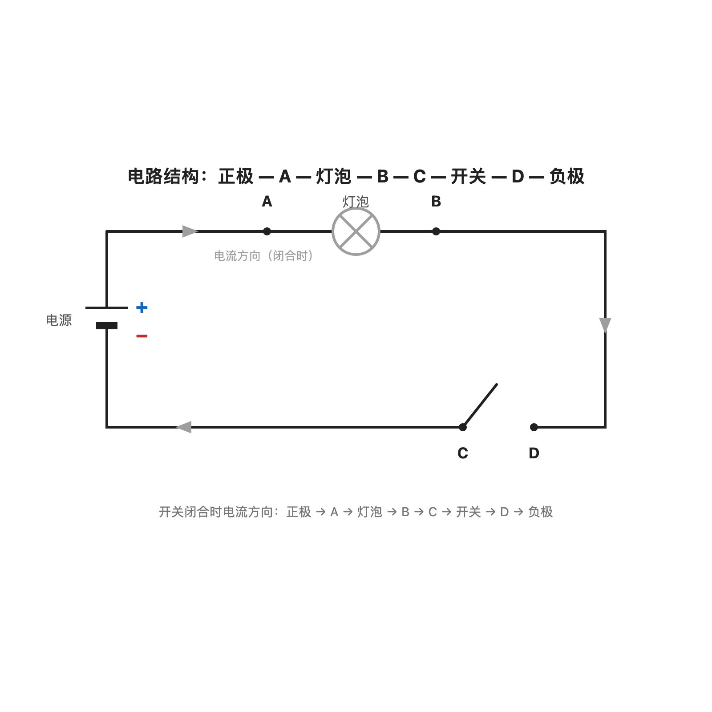
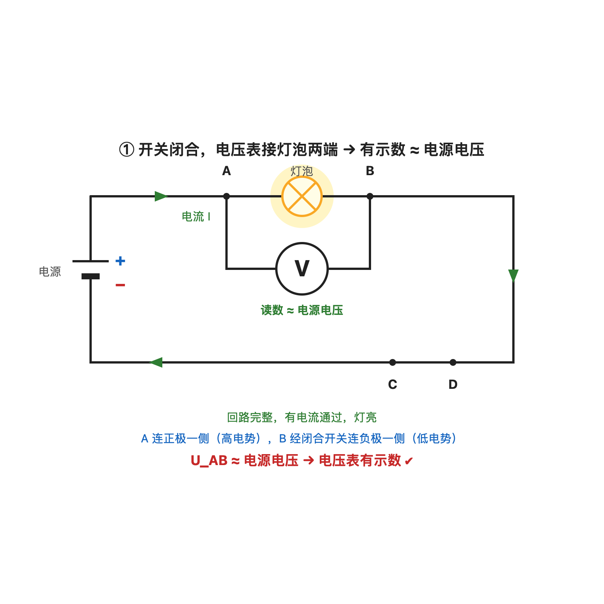
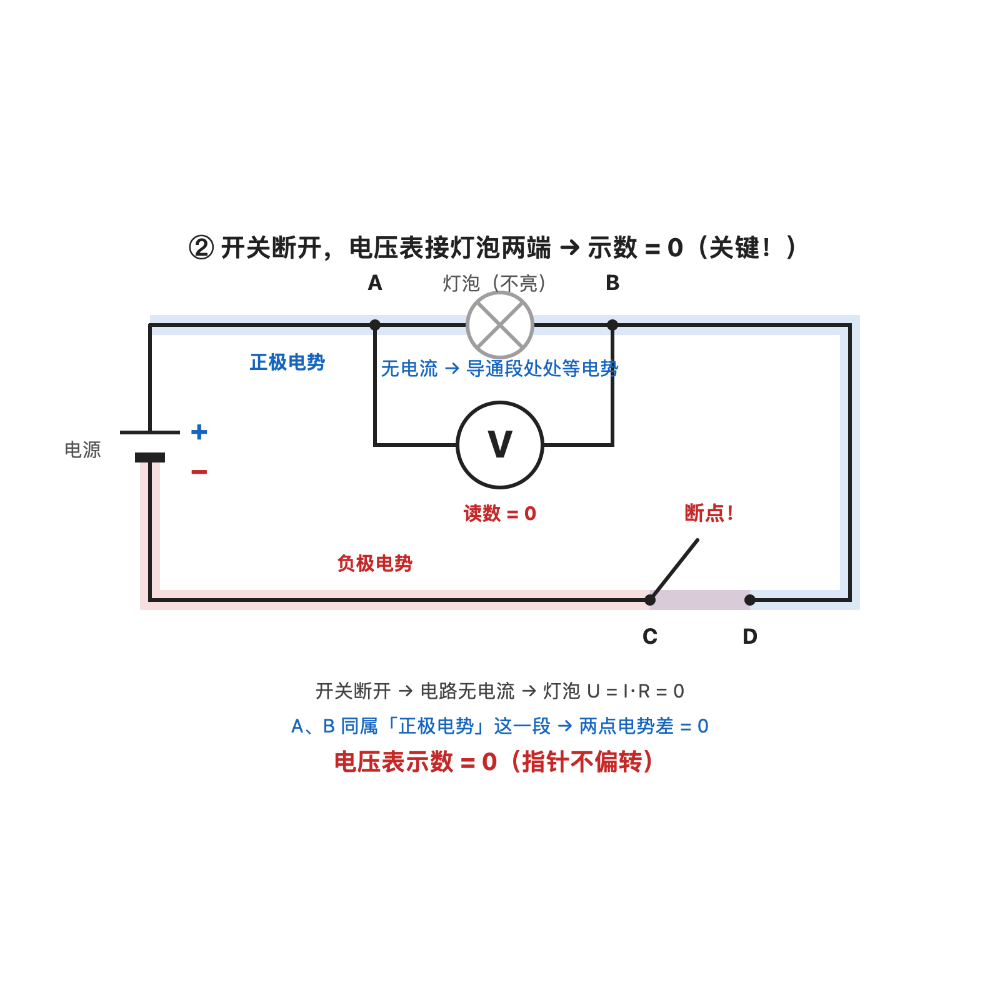
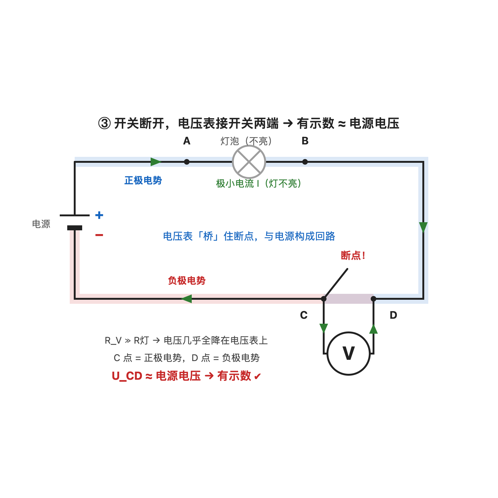

# 开关断开时，电压表有没有示数？（判断方法 + 常见错误）

## 题目

电路：一个电源、一个灯泡、一个开关串联。开关接在电源负极一侧，正极通过导线直接接灯泡（见下图）。

问：

1. 开关闭合时，电压表接在灯泡两端，能测出电压吗？
2. 开关断开时，电压表接在灯泡两端，能测出电压吗？
3. 开关断开时，电压表接在开关两端呢？

正确结论：开关断开、表接灯泡 → 示数为 0

## 一个最核心的道理（先把这句话记住）

> **电压表要有读数，必须有微弱的电流通过它。要有电流，电压表必须跟电源连成一个完整的"圈"（物理上叫回路）。**

圈怎么算连成？

> 从电源**正极**出发 → 沿导线走 → 经过电压表内部 → 再沿导线走 → 回到电源**负极**

**圈连不上 → 没电流 → 电压表读数就是 0**。就这么简单。

## 做题时这样看电路（几个基本约定）

- **闭合的开关** = 一根导线（电流可以自由通过）
- **断开的开关** = 一个**断口**（电流过不去）
- **烧断的灯丝** = 一个断口
- **电压表** = 一个"超大电阻"（电流很难通过，但不是完全通不过，还是有极其微弱的一点电流）
- **灯泡、电阻** = 有电流通过时两端才有电压；**没电流通过时两端电压 = 0**（这是欧姆定律 U = I × R，I = 0 时 U = 0）

## 三步判断法（万能，记住这个就够）

不管题目多复杂，永远按这三步走：

**第 1 步：找断口** —— 电路里哪里断了？
- 开关断开的地方
- 灯丝烧断的地方
- 如果电路完好没断口 → 直接用欧姆定律算

**第 2 步：把电路分成"两堆"** —— 断口把电路切成了两半：
- **正极那堆**：从电源正极出发，沿导线能走到的所有点（路上不能经过断口）
- **负极那堆**：从电源负极出发，沿导线能走到的所有点（路上不能经过断口）

**第 3 步：看电压表两个接线柱在哪一堆**
- 两个接线柱**都在正极那堆** → 圈连不成 → 读数 = **0**
- 两个接线柱**都在负极那堆** → 圈连不成 → 读数 = **0**
- 一个在**正极那堆**、另一个在**负极那堆**（跨住了断口）→ 圈连成了 → 读数 ≈ **电源电压**

**为什么跨住断口读数就是电源电压？**

这时候电压表是**唯一的通路**，微弱电流走的路径是：正极 → 灯泡（或导线）→ 电压表 → 负极。电压表内阻极大（比灯泡电阻大成千上万倍），根据串联分压，**几乎全部电压都"降"在电压表上**，所以读数 ≈ 电源电压。

## 解答过程

电路标号：正极 — A — 灯泡 — B — C — 开关 — D — 负极（见上方电路图）。

### 情况①：开关闭合，电压表接灯泡两端（A、B）

1. 开关闭合 = 导线，整个电路**没有断口**，是一个完整的圈；
2. 电路里有电流，灯泡正常发光；
3. 电压表接在灯泡两端，测的就是灯泡两端的电压；
4. 灯泡是唯一的用电器，它两端的电压就等于电源电压。

**结论：有示数 ≈ 电源电压。**

### 情况②：开关断开，电压表接灯泡两端（A、B）★ 最容易错

**用三步法分析**：

**第 1 步：找断口** → 开关断开处（C 和 D 之间）是断口。

**第 2 步：分两堆**
- **正极那堆**：从正极出发，能走到 A → 灯泡 → B → C（走到 C 就走不动了，前面是断口）
- **负极那堆**：从负极出发，能走到 D（走到 D 就走不动了，前面是断口）

**第 3 步：看表接哪**
- 电压表接 A 和 B
- A 在正极那堆，B 也在正极那堆
- **两个接线柱在同一堆 → 圈连不成 → 读数 = 0**

**为什么圈连不成？** 想象电流从正极出发，走到 A，进入电压表，从 B 出来，然后想回到负极——但路上必须经过开关，开关是断的，走不通！所以没有电流通过电压表，指针不偏转。

**再用欧姆定律验证**：整个电路没电流，灯泡里也没电流，灯泡两端电压 U = I × R = 0 × R = 0。A、B 就是灯泡两端，所以 U_AB = 0。

**结论：示数 = 0。**（GPT 的解答错在这里，说成"≈ 电源电压"，千万别背反！）

### 情况③：开关断开，电压表接开关两端（C、D）

**用三步法分析**：

**第 1 步：找断口** → 还是开关断开处（C 和 D 之间）。

**第 2 步：分两堆**
- **正极那堆**：正极、A、灯泡、B、C
- **负极那堆**：D、负极

**第 3 步：看表接哪**
- 电压表接 C 和 D
- C 在正极那堆，D 在负极那堆
- **两个接线柱跨住了断口 → 圈连成了 → 读数 ≈ 电源电压**

**圈是怎么连成的？** 微弱电流走的路径：正极 → 导线 → A → 灯泡 → B → C → **进入电压表** → 从电压表出来到 D → 导线 → 负极 → 电源内部 → 回到正极。完整的一圈！

**为什么读数是电源电压？** 这个圈里有灯泡和电压表串联。电压表内阻极大（一般是几兆欧），灯泡电阻只有几欧到几十欧。根据串联分压，电压几乎全部降在电压表上，所以读数 ≈ 电源电压。

**结论：有示数 ≈ 电源电压。**

### 对比总结

| 电压表接在 | 开关闭合                    | 开关断开                     |
| ---------- | --------------------------- | ---------------------------- |
| 灯泡两端   | 有示数 ≈ 电源电压（灯亮）  | **示数 = 0**（灯不亮）       |
| 开关两端   | 示数 = 0（闭合开关 = 导线） | 有示数 ≈ 电源电压（灯不亮） |

**口诀：先找断口，再看电压表跨没跨住。跨住了就有读数（≈ 电源电压），没跨住就是 0。**

## 更多例题（变式训练）

下面五道题都用"三步判断法"，自己先盖住答案试试。

### 例题 1：两个灯泡串联 + 开关断开

电路：正极 → L1 → L2 → 开关（断开）→ 负极。

标号：正极 — A — L1 — B — L2 — C — 开关 — D — 负极。

**分析**：断口在开关处。
- 正极那堆：正极、A、L1、B、L2、C（走到 C 就走不动了）
- 负极那堆：D、负极

问：电压表分别接下列两点，示数各是多少？

| 接法 | 位置 | 示数 | 原因 |
|------|------|------|------|
| (a) A、B | L1 两端 | **0** | 两个接线柱都在正极那堆 |
| (b) B、C | L2 两端 | **0** | 两个接线柱都在正极那堆 |
| (c) A、C | L1+L2 两端 | **0** | 两个接线柱都在正极那堆（**跨了两个灯泡也没用**） |
| (d) C、D | 开关两端 | **≈ 电源电压** | 跨住了断口 |
| (e) A、D | 整个电路两端 | **≈ 电源电压** | 跨住了断口 |

**关键提醒**：(c) 特别容易错。有同学会想"跨了两个灯泡，总应该有点电压吧"——**错**！只要两个接线柱在同一堆，圈就连不成，读数就是 0。跟中间"包"了多少元件无关。

### 例题 2：灯泡烧断（灯丝断了），开关闭合

电路：正极 → 开关（闭合）→ 灯泡（灯丝烧断）→ 负极。

标号：正极 — A — 开关 — B — 灯泡 — C — 负极。

**分析**：断口跑到灯泡那里了！
- 正极那堆：正极、A、开关（闭合 = 导线）、B（走到 B 就走不动了，灯丝断了）
- 负极那堆：C、负极

| 接法 | 示数 | 原因 |
|------|------|------|
| A、B（开关两端） | **0** | 两个接线柱都在正极那堆 |
| B、C（灯泡两端） | **≈ 电源电压** | 跨住了断口（断口在灯泡） |
| A、C（开关+灯泡） | **≈ 电源电压** | 跨住了断口 |

**重要对比**（把本题和例题 2 放一起看）：

| 电路状况 | 表接灯泡两端 | 原因 |
|----------|--------------|------|
| 开关断开、灯泡完好（本题情况②） | **0** | 断口在开关，电压表没跨住断口 |
| 开关闭合、灯泡烧断（例题 2） | **≈ 电源电压** | 断口在灯泡，电压表刚好跨住断口 |

**只差"断口在哪"**，结论完全相反！所以**永远先找断口**，再看表接哪里。

### 例题 3：并联电路，一条支路断开

电路：电源 → 干路开关 S1（闭合）→ 分支点 P →
- 支路1：灯 L1 → 开关 S2（断开）→ 汇合点 Q
- 支路2：灯 L2 → 汇合点 Q

→ Q → 电源负极。

**分析**：这道题有两条支路，要分开看。

**L2 支路**（完整的）：
- S1 闭合、L2 支路没断口 → 这一支路有电流，L2 正常发光
- L2 两端电压 = 电源电压

**L1 支路**（断在 S2）：
- S2 断开 → L1 支路**没有电流**
- L1 里没电流 → L1 两端电压 = 0（欧姆定律 U = I × R = 0）
- S2 是断口 → S2 两端电压 = 电源电压（一边连正极那边，一边连负极那边）

| 接法 | 示数 | 原因 |
|------|------|------|
| L1 两端 | **0** | L1 没电流，两端电压 = 0 |
| S2 两端 | **≈ 电源电压** | S2 是断口，跨住了断口 |
| L1+S2 两端（即 P、Q 两点） | **≈ 电源电压** | P 连正极、Q 连负极，跨住了 S2 断口 |
| L2 两端 | **≈ 电源电压** | L2 正常工作，有电流通过 |

**启示**：并联电路中，**某一支路断开只影响这一支路**。其他支路仍然正常工作。但断开支路里的灯泡两端仍然是 0 V（因为没电流通过它）。

### 例题 4：滑动变阻器 + 开关断开

电路：正极 → 灯泡 → 滑动变阻器（阻值调到最大，如 1000 Ω）→ 开关（断开）→ 负极。

**分析**：开关断开 → 全电路没电流。**变阻器阻值再大也没意义**，因为 U = I × R = 0 × R = 0。

| 接法 | 示数 |
|------|------|
| 灯泡两端 | **0** |
| 变阻器两端 | **0**（哪怕阻值 1000 Ω、10000 Ω，都是 0） |
| 灯泡+变阻器两端 | **0** |
| 开关两端 | **≈ 电源电压** |

**陷阱提醒**：很多同学看到"变阻器阻值大"就想当然认为"两端电压大"。**错**！电压大小只由 I × R 决定，I = 0 时，R 再大也是 0。

### 例题 5：电压表只接一根线（悬空）

电压表一端接在电路某点，另一端**悬空**（什么都没接）。

**答**：示数 = **0**。

**原因**：圈连不成（另一端没接到电路上），电压表内部没电流，指针不偏转。

**引申**：电压表要有读数，必须同时满足两个条件：
1. **两个接线柱都接到电路上**（缺一不可）
2. 两个接线柱**跨住了断口**（或者电路完整时接在用电器两端）

少任何一个都不行。

## 相关知识点

- **欧姆定律 U = I × R**：没有电流流过的电阻（灯泡），两端电压为 0；
- **串联电路**：断开任意一处，整个电路就没有电流；
- **并联电路**：某一支路断开，只影响这一支路，其他支路照常工作；
- **电压表内阻极大**：一般可视为断路；但当电路有断口、电压表恰好是唯一的通路时，那一点微弱电流就构成回路，且因为电压表内阻最大，几乎全部电压降在电压表上；
- **判断电压表读数的核心**：看电压表能不能跟电源连成一个完整的圈（回路）。能 → 有读数；不能 → 读数 0。

## 易错点提醒

1. **开关断开 + 表接灯泡 = 示数 0**，不是"≈ 电源电压"。GPT 的解答就错在这里：它认为"灯泡一端接正极，所以有电压"，漏掉了"没有电流流过灯泡时，灯泡两端电压就是 0"（欧姆定律 U = I × R，I = 0 时 U = 0）。

2. 和下面这题**只差断口位置**，最容易混，务必对比记忆：

   | 电路状况                       | 电压表接灯泡两端 | 原因                         |
   | ------------------------------ | ---------------- | ---------------------------- |
   | 开关断开（灯泡完好）           | **0**            | 断口在开关，表没跨住断口 |
   | 灯泡断路（灯丝烧断，开关闭合） | **≈ 电源电压**  | 断口在灯泡，表刚好跨住断口 |

3. **"没电流 ≠ 没电压"要分清用在哪**：
   - 断开的开关本身没有电流，但两端有电压（≈ 电源电压），因为它就是断口，电压表跨住它就能连成圈；
   - 而"没有电流流过**某个电阻**"⇒ 该电阻两端电压必为 0（U = I × R）。
   - 判断的关键永远是同一句话：**电压表能不能跟电源连成一个完整的圈？**