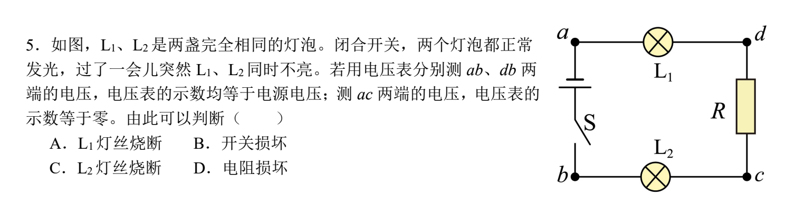

# 物理选择题错题集

> 专门记录物理**选择题**的错题。每道题按下方格式追加。
> 复习时说「**抽查我**」，会优先从这里出选择题。

---

## 第 1 题（20260906）· 用电压表判断串联电路哪里坏了

## 题目

如图，$L_1$、$L_2$ 是两盏完全相同的灯泡。闭合开关，两个灯泡都正常发光，过了一会儿突然 $L_1$、$L_2$ 同时不亮。若用电压表分别测 $ab$、$db$ 两端的电压，电压表的示数均等于电源电压；测 $ac$ 两端的电压，电压表的示数等于零。由此可以判断（ ）

- A. $L_1$ 灯丝烧断
- B. 开关损坏
- C. $L_2$ 灯丝烧断
- D. 电阻损坏

- 来源：错题本拍照
- 难度：⭐⭐ 中考综合
- 考查知识点：串联电路故障判断、电压表读数与断口的关系、欧姆定律（$U=IR$）

### 正确答案

**C（$L_2$ 灯丝烧断）**

### 电路结构（先把图看懂）

这是一条**串联**电路，把图上各点连起来看：

$$a \xrightarrow{L_1} d \xrightarrow{R} c \xrightarrow{L_2} b \xrightarrow{S} \text{负极}, \quad \text{电源正极} \to a$$

也就是说电流的路径是：**正极 → a → $L_1$ → d → R → c → $L_2$ → b → 开关 S → 负极**。

$L_1$、$R$、$L_2$ 三个元件**串在一条线上**，中间 d、c 是 L₁ 和 R 之间、R 和 L₂ 之间的连接点。

### 解题思路

1. **两灯同时不亮 + 是串联电路** → 说明**整条回路里断了一处**（串联只要断一处，处处没电流）。
2. 电压表读数规律（复习用，见文末知识点）：**电压表跨住断口，读数 ≈ 电源电压；没跨住，读数为 0。**
3. 用「哪两点读数 = 电源电压」来定位断口在哪两个点**之间**。

### 解答过程

**第 1 步：看「示数 = 电源电压」的接法。**

- 测 $ab$ 得电源电压：a 连电源正极、b 连开关 S（闭合 S = 导线）→ 所以 b 连负极。a 是正极端、b 是负极端，$ab$ 本来就横跨整个电路，**任何一处断口都在 a、b 之间** → 测 $ab$ 一定是电源电压。✅ 与「电路断了」一致，但不能定位是哪一处。
- 测 $db$ 得电源电压：d 在断口的**正极一侧**，b 在**负极一侧**，断口被 d、b 跨住了 → 读数 = 电源电压。

**第 2 步：看「示数 = 0」的接法（这是定位关键）。**

- 测 $ac$ 得 0：a 和 c 在断口的**同一侧**（都是正极那一侧）→ 圈连不成 → 读数为 0。

**第 3 步：把断口夹出来。**

- $db$ 跨住了断口 → 断口在 d 和 b 之间（即 d→R→c→$L_2$→b 这一段里）；
- $ac$ 没跨住断口 → 断口**不在** a 和 c 之间（即断口不在 $L_1$ 上，也不在 R 上）；
- 两条件取交集：断口既要在「d…b」里，又不能是 $L_1$、不能是 R、不能是开关 → **只能是 $L_2$**（在 c 和 b 之间）。

所以 $L_2$ 灯丝烧断。

**逐个排除选项**：

| 选项 | 假设断口位置 | 与「$ac$ 读数为 0」矛盾吗 | 与「$db$ = 电源电压」矛盾吗 | 结论 |
|------|--------------|---------------------------|------------------------------|------|
| A. $L_1$ 断 | 断口在 a、d 之间 | 矛盾（此时 c 在负极侧，$ac$ 应 = 电源电压） | 矛盾（d 会落到负极侧，$db$ 应 = 0） | ✗ |
| B. 开关 S 损坏（断开） | 断口在 b 与负极之间 | 矛盾（c 在正极侧但 b 断，$ac$ 会 = 电源电压） | 矛盾（b 一侧断了，$db$ 会 = 0） | ✗ |
| C. $L_2$ 断 | 断口在 c、b 之间 | 一致（a、c 同在正极侧 → 0） | 一致（d 在正极侧、b 在负极侧 → 电源电压） | ✓ |
| D. R 损坏 | 断口在 d、c 之间 | 矛盾（c 会落到负极侧，$ac$ 应 = 电源电压） | 矛盾（d 是断口正极侧但 c 已掉到负极侧需再看，实际 $db$ 仍可能含断口，但 $ac$=0 已被排除） | ✗ |

> 注意选项 D：若 R 断（断口在 d、c 之间），c 就掉到「负极那堆」，那么 $ac$ 跨住了断口，读数应为**电源电压**，而不是 0，与题设矛盾 → 排除。

### 验证（把 $L_2$ 断开代入全部条件）

断口在 c、b 之间：
- **正极那堆**：正极、a、d、c（走到 c 前面是断口，走不动了）
- **负极那堆**：b、负极（开关 S 闭合 = 导线，把 b 连到负极）

| 测哪两点 | 两个接线柱所在堆 | 读数 | 题设 | 一致？ |
|----------|------------------|------|------|--------|
| $ab$ | a 正堆、b 负堆 | ≈ 电源电压 | 电源电压 | ✅ |
| $db$ | d 正堆、b 负堆 | ≈ 电源电压 | 电源电压 | ✅ |
| $ac$ | a 正堆、c 正堆 | 0 | 0 | ✅ |

三条全对上，**确定是 $L_2$ 烧断。**

## 相关知识点

- **串联电路一处断 → 处处无电流**：L₁、L₂ 同时不亮，就是因为串联回路里断了一处。
- **电压表读数三步判断法**（和开关断开那题同一套方法）：
  1. 找断口；
  2. 分「正极那堆 / 负极那堆」（不能穿过断口）；
  3. 看电压表两接线柱——同堆 → 读数 0；跨堆（跨住断口）→ 读数 ≈ 电源电压。
- **欧姆定律 $U=IR$**：没电流流过的灯泡两端电压为 0，所以断口同侧的元件两端没电压。
- **故障判断技巧**：哪个元件「烧断」，电压表跨住它就读电源电压，跨不读 0 —— 用多个不同接法的读数把断口「夹」到两个点之间。

## 易错点提醒

- 别以为「读数 = 电源电压」的点就是坏元件：$ab$ 读数 = 电源电压只说明「电路里确实断了」，**不能**直接说明哪坏了，要配合「读数为 0」的接法一起夹出断口。
- 最容易错的是把「$ac$ 读数为 0」理解反：0 说明 a、c 在**同一侧**，即断口在 c 的外侧（靠 b 那边），而不是在 $L_1$ 或 R 上。
- 画图分堆时别忘：**闭合的开关 = 导线**，能把 b 一路连到负极，所以 b 属于「负极那堆」。

## 复盘

- 错因：方法不熟（串联故障用电压表定位）
- 掌握状态：未掌握
- 复习记录：
  - 20260906 归档，待复习
