# 拔高小专题：特殊法测电阻（四大题型）

- 来源：课外班拔高视频《特殊法测电阻（四大题型）》（32 分钟）+ 配套讲义《特殊法测电阻 1》（专题 13）
- 难度：⭐⭐ 中考综合（借助滑动变阻器测最大值、实物改接两问达 ⭐⭐⭐ 超中考，属海淀期末/自招压轴实验）
- 考查知识点：欧姆定律 $R = U / I$、串并联电流电压规律、单安法、双安法、单伏法、双伏法

> 一句话主线：测电阻永远是想办法凑出 $R = U / I$ 里的 $U$ 和 $I$。缺电压表，就用电流和已知电阻「造」出电压；缺电流表，就用电压和已知电阻「造」出电流。视频里讲的「单安、双安、单伏、双伏」四类，本质都是这一句话的不同外壳。

---

## 先看全局：四大题型总表

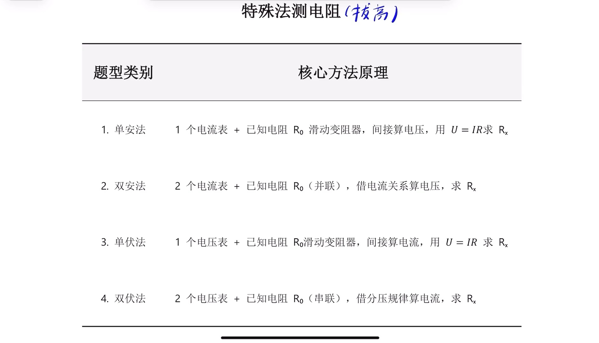

| 题型 | 器材 | 电路特点 | 怎么「造」缺的那个量 |
|---|---|---|---|
| 单安法 | 1 个电流表 + 已知 $R_0$（或滑动变阻器） | 多用串联 | 用电流算电压： $U = I R$ |
| 双安法 | 2 个电流表 + 已知 $R_0$ | 多用并联 | 借并联各支路电压相等，用 $R_0$ 支路电流算出共同电压 |
| 单伏法 | 1 个电压表 + 已知 $R_0$（或滑动变阻器） | 多用串联 | 用电压算电流： $I = U / R$ |
| 双伏法 | 2 个电压表 + 已知 $R_0$ | 多用串联 | 借串联电流相等，用 $R_0$ 的电压算出共同电流 |

拿到题第一步永远是**判断它属于哪一类**：看给的是电流表还是电压表、有几个、有没有已知阻值的 $R_0$。判断对了，套哪条规律就定了。

---

## 题型一　单安法（只有电流表，没有电压表）

**核心难点**：电流能直接读，但电压表坏了/没给， $U_x$ 读不出来。

**破题套路**：想办法把 $U_x$ 用电流写出来。两条常用桥：

1. 若 $R_x$ 与 $R_0$ **并联** → 两者电压相等， $U_x = U_0 = I_0 R_0$，只要再凑出 $R_0$ 的电流 $I_0$ 即可；
2. 若走**电源电压**这条路 → 先在一个「简单电路」状态里用 $I R_0$ 把电源电压表示出来，再在串联状态里用「电源电压减掉某段」得到目标电压。

### 例 1（单安法 · 并联，开关切换测 $R_x$）

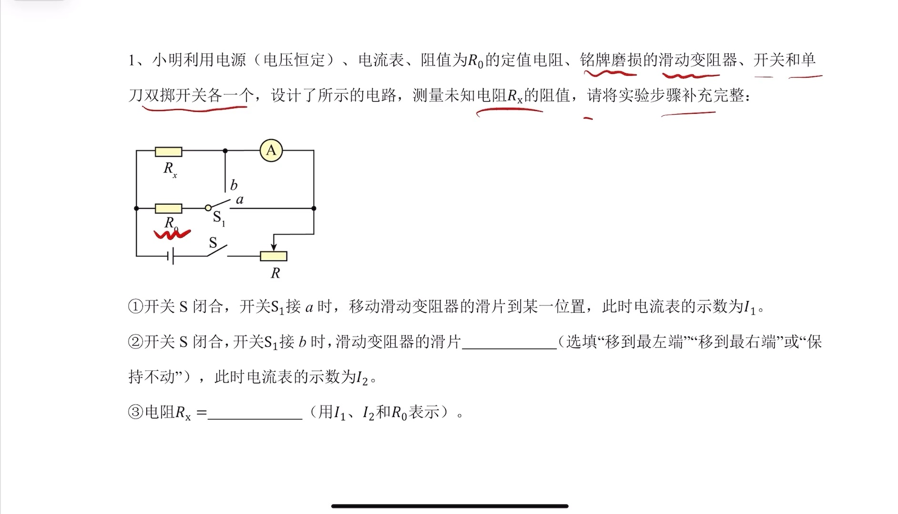

电路： $R_x$ 与 $R_0$ 并联，电流表通过单刀双掷 $S_1$ 分别切到「只测 $R_x$ 支路」和「测干路」。

- 步骤① $S_1$ 接 $a$：电流表只走 $R_x$ 那条支路，读数 $I_1$ 就是 $I_x$。
- 步骤② $S_1$ 接 $b$：电流表在干路上，读数 $I_2$ 是总电流。**这一步滑片必须保持不动**（见下方易错点）。
- 于是 $R_0$ 支路电流 $I_0 = I_2 - I_1$，并联电压相等：

$$U_x = U_0 = I_0 R_0 = (I_2 - I_1) R_0$$

- 代回欧姆定律：

$$R_x = \frac{U_x}{I_x} = \frac{(I_2 - I_1) R_0}{I_1}$$

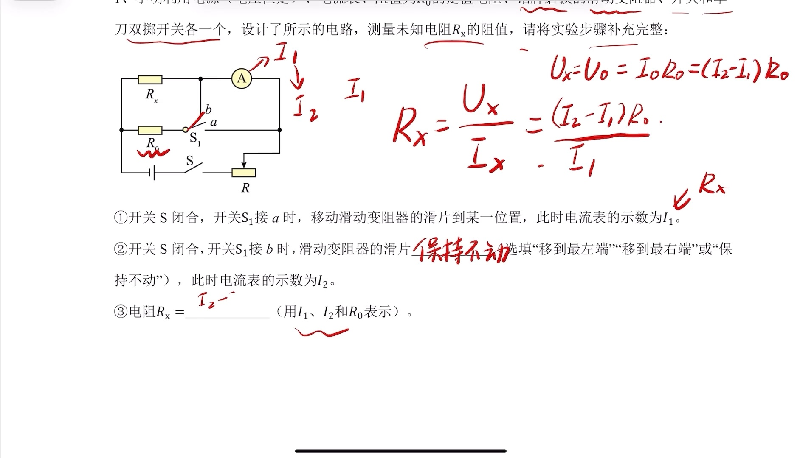

**为什么滑片一定要保持不动？** 接 $a$ 时读出的是 $R_x$ 的电流，接 $b$ 时想用它减出 $R_0$ 的电流，前提是**这两次通过 $R_x$ 的电流完全一样**。滑片一动，干路总电阻变了、并联两端电压也变了， $R_x$ 的电流就不再是刚才那个 $I_1$，减法立刻失效。所以填「保持不动」，不是随便选的。

### 例 2（单安法 · 串联，测滑动变阻器最大阻值）

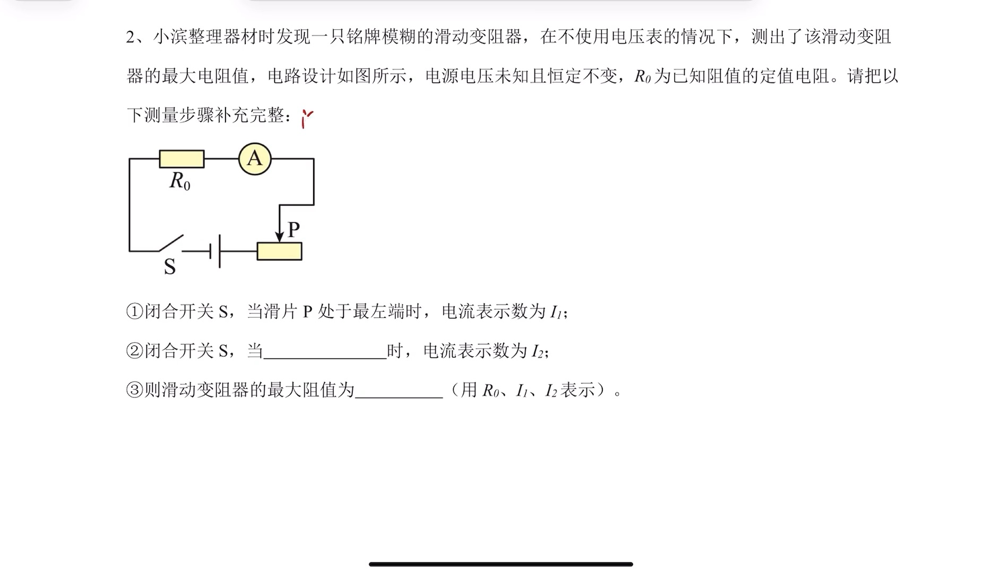

电路： $R_0$ 与「铭牌模糊的滑动变阻器 $R_{滑}$」串联，只有电流表。目标：测变阻器最大阻值。

- 步骤① 滑片 $P$ 移到**最左端**（此时 $R_{滑} = 0$，是只有 $R_0$ 的简单电路），电流表读数 $I_1$。这一步等于把**电源电压**表示出来了：

$$U = I_1 R_0$$

- 步骤② 滑片 $P$ 移到**最右端**（ $R_{滑}$ 取最大），电流表读数 $I_2$。此时 $R_0$ 与 $R_{滑}$ 串联， $R_0$ 两端电压变成：

$$U_0' = I_2 R_0$$

- 变阻器分到的电压 = 电源电压减掉现在的 $R_0$ 电压：

$$U_{滑} = U - U_0' = I_1 R_0 - I_2 R_0 = (I_1 - I_2) R_0$$

- 串联电流处处相等，通过变阻器的电流就是 $I_2$，所以：

$$R_{滑} = \frac{U_{滑}}{I_2} = \frac{(I_1 - I_2) R_0}{I_2}$$

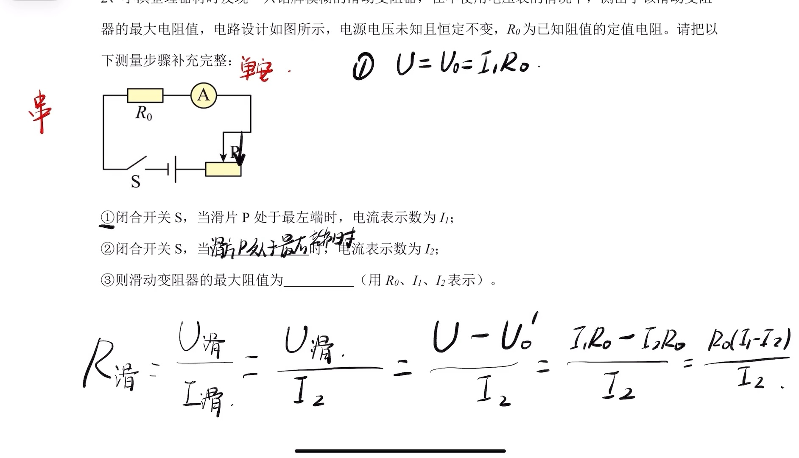

**这里为什么要写成 $U_0'$（读作「U 零 撇」）而不直接写 $U_0$？** 因为滑片移动后电流从 $I_1$ 变成了 $I_2$，同一个 $R_0$ 两端的电压跟着变了。步骤①里的 $U_0 = I_1 R_0$（等于电源电压）和步骤②里的 $U_0' = I_2 R_0$ 是**两个不同状态下的两个值**，不加撇就会自相矛盾。这是「同一电阻在不同电流下电压会变」的典型坑。

---

## 题型二　双安法（两个电流表，没有电压表）

**核心特点**：几乎都出在**并联**电路里。两个电流表一个测干路、一个测 $R_0$ 支路（或直接测两条支路），利用「并联各支路电压相等」把 $U_x$ 算出来。

### 例 3（双安法 · $A_1$ 干路、 $A_2$ 定值支路）

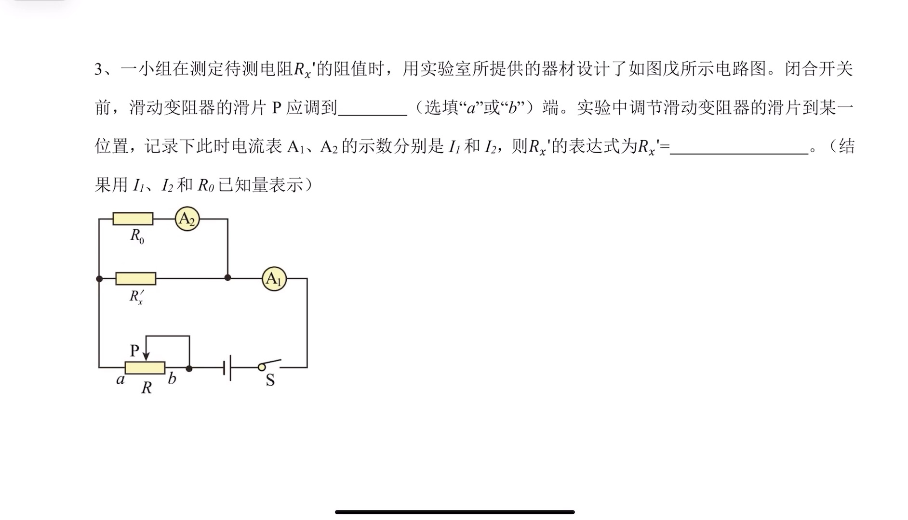

$R_x'$ 与 $R_0$ 并联， $A_1$ 在干路读数 $I_1$， $A_2$ 在 $R_0$ 支路读数 $I_2$。

- 并联电压相等： $U_x = U_0 = I_2 R_0$
- 通过 $R_x'$ 的电流 = 干路减 $R_0$ 支路： $I_x = I_1 - I_2$

$$R_x' = \frac{U_x}{I_x} = \frac{I_2 R_0}{I_1 - I_2}$$

（顺带一问：闭合开关前滑片 $P$ 应拨到**阻值最大端**，即最右端，保护电路。）

### 例 4（双安法 · 两表各测一条支路）

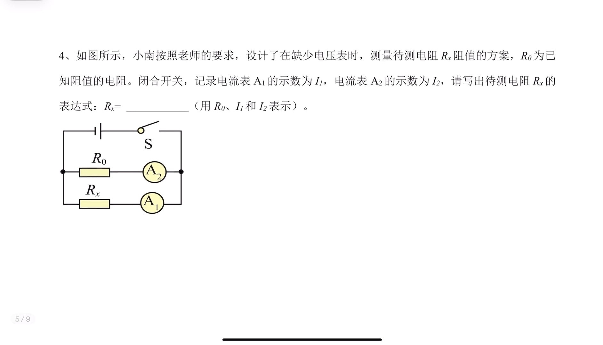

$R_x$ 与 $R_0$ 并联， $A_1$ 直接测 $R_x$ 支路读数 $I_1$， $A_2$ 直接测 $R_0$ 支路读数 $I_2$。这比例 3 更省事，连减法都不用：

- $U_x = U_0 = I_2 R_0$
- $I_x = I_1$（直接读）

$$R_x = \frac{U_x}{I_x} = \frac{I_2 R_0}{I_1}$$

---

## 题型三　单伏法（只有电压表，没有电流表）

**核心难点**：电压能直接读，但电流表没给， $I_x$ 读不出来。

**破题套路**：想办法把 $I_x$ 用电压写出来。最常用的桥——若 $R_x$ 与 $R_0$ **串联**，电流相等， $I_x = I_0 = U_0 / R_0$，只要凑出 $R_0$ 两端电压 $U_0$ 即可。而 $U_0$ 常常要靠「电源电压减 $U_x$」得到，所以**单伏法的第一要务是先把电源电压表示出来**。

### 例 5（单伏法 · 测滑动变阻器最大阻值）

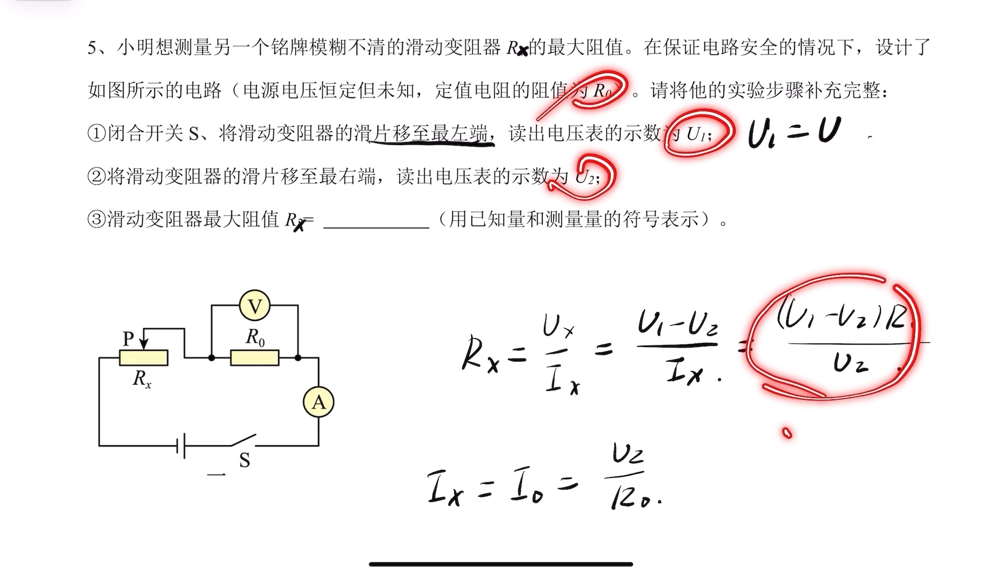

$R_0$ 与变阻器 $R_x$ 串联，电压表并联在 $R_0$ 两端。

- 步骤① 滑片移到**最左端**（ $R_x = 0$，只有 $R_0$ 的简单电路），电压表读数 $U_1$ 就是**电源电压**： $U = U_1$
- 步骤② 滑片移到**最右端**（ $R_x$ 最大），电压表读数 $U_2$ 是 $R_0$ 的电压
- 变阻器电压： $U_x = U_1 - U_2$
- 串联电流相等： $I_x = I_0 = U_2 / R_0$

$$R_x = \frac{U_x}{I_x} = \frac{(U_1 - U_2) R_0}{U_2}$$

### 例 6（单伏法 · 短路法测电源电压）

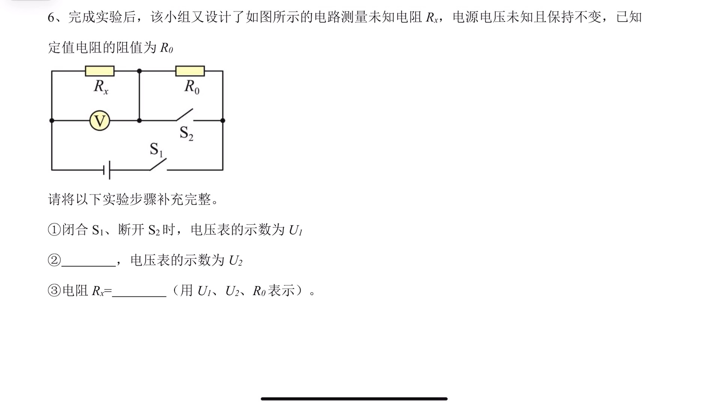

$R_x$ 与 $R_0$ 串联，电压表并联在 $R_x$ 两端， $S_2$ 并联在 $R_0$ 两端（用来短路 $R_0$）。

- 步骤① 闭合 $S_1$、断开 $S_2$： $R_x$、 $R_0$ 串联，电压表读 $R_x$ 的电压 $U_1$
- 步骤② **闭合 $S_1$ 和 $S_2$**： $R_0$ 被短路，只剩 $R_x$ 的简单电路，电压表读数 $U_2$ 就是**电源电压**
- 回到步骤①的串联状态： $R_0$ 电压 $U_0 = U_2 - U_1$，电流 $I_0 = (U_2 - U_1) / R_0$，串联电流相等即 $I_x = I_0$

$$R_x = \frac{U_x}{I_x} = \frac{U_1 R_0}{U_2 - U_1}$$

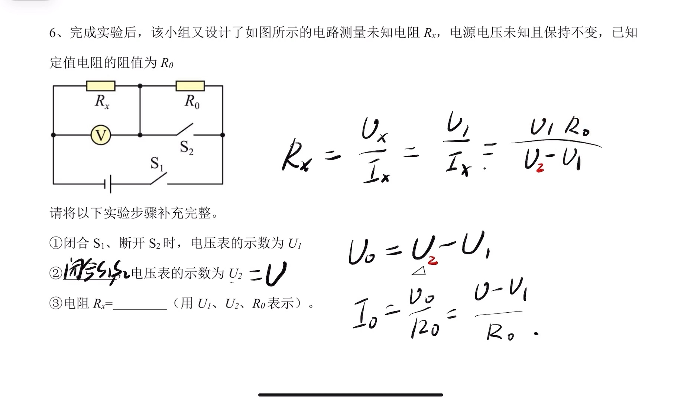

**为什么步骤②非要把 $R_0$ 短路、把电源电压单独测出来？直接用步骤②算 $R_x$ 不是更简单？** 因为在步骤②那个「只有 $R_x$」的简单电路里，电压表虽然读出了 $R_x$ 两端电压（= 电源电压），可电流你没有任何办法知道—— $R_0$ 被短路了，没有已知电阻能帮你把电压换算成电流。**要算 $R_x$ 的电流，就必须让那个已知电阻 $R_0$ 留在电路里。** 所以步骤②的作用不是直接算 $R_x$，而是专门去「抓」电源电压，供步骤①的串联状态做减法用。这一步是单伏法最烧脑的地方，务必想透。

---

## 题型四　双伏法（两个电压表，没有电流表）

**核心特点**：几乎都出在**串联**电路里。两个电压表分别测 $R_0$ 和 $R_x$ 的电压，利用「串联电流处处相等」把 $I_x$ 算出来。

### 例 7（双伏法 · 变阻器最大阻值已知当 $R_0$ 用）

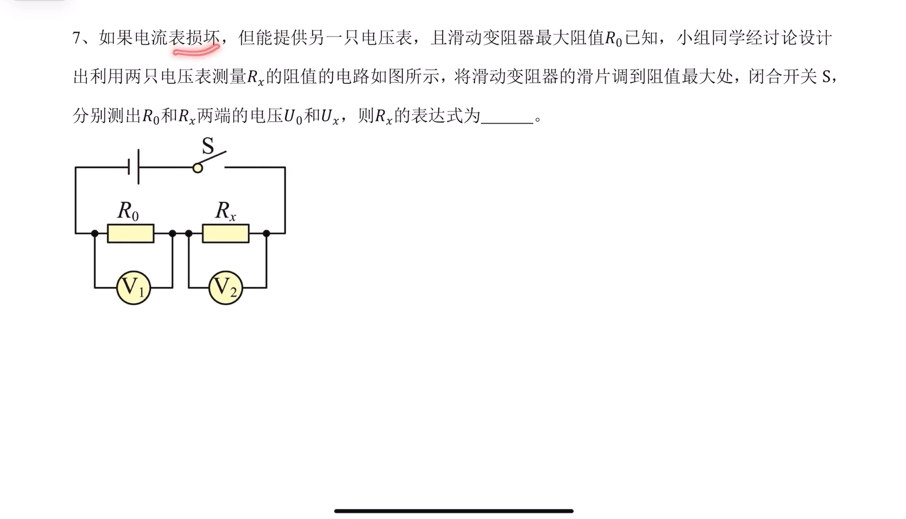

$R_0$（其实是把滑动变阻器滑到最大阻值、当作已知定值用）与 $R_x$ 串联， $V_1$ 测 $R_0$ 电压 $U_0$， $V_2$ 测 $R_x$ 电压 $U_x$。

- 串联电流相等： $I_x = I_0 = U_0 / R_0$

$$R_x = \frac{U_x}{I_x} = \frac{U_x R_0}{U_0}$$

### 例 8（双伏法 · 方案一）

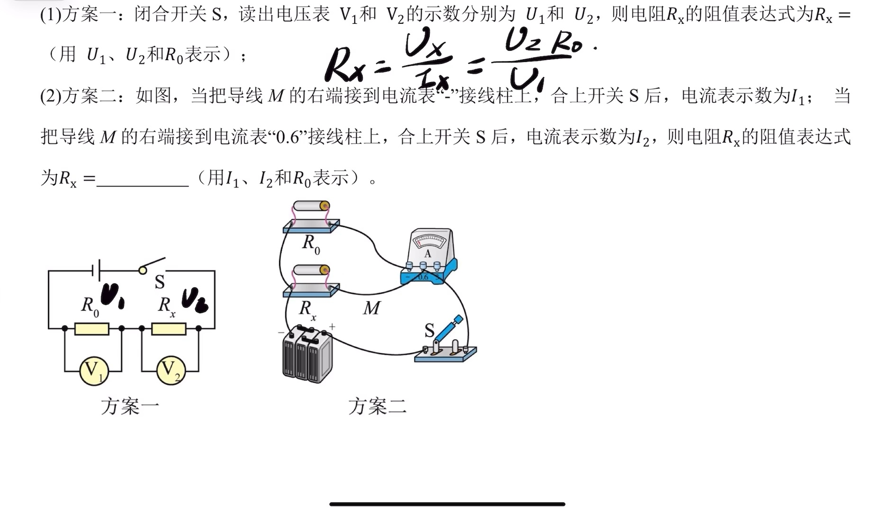

$R_0$ 与 $R_x$ 串联， $V_1$ 读 $U_1$（ $R_0$ 电压）， $V_2$ 读 $U_2$（ $R_x$ 电压）。和例 7 一模一样，只是换了字母：

- $I_x = I_0 = U_1 / R_0$

$$R_x = \frac{U_x}{I_x} = \frac{U_2 R_0}{U_1}$$

---

## 综合末题（实物改接 · 本质是单安法）

这道题把「单安法」藏在**实物图的改接线**里，是海淀常考的「你会不会看图」的压轴变式。

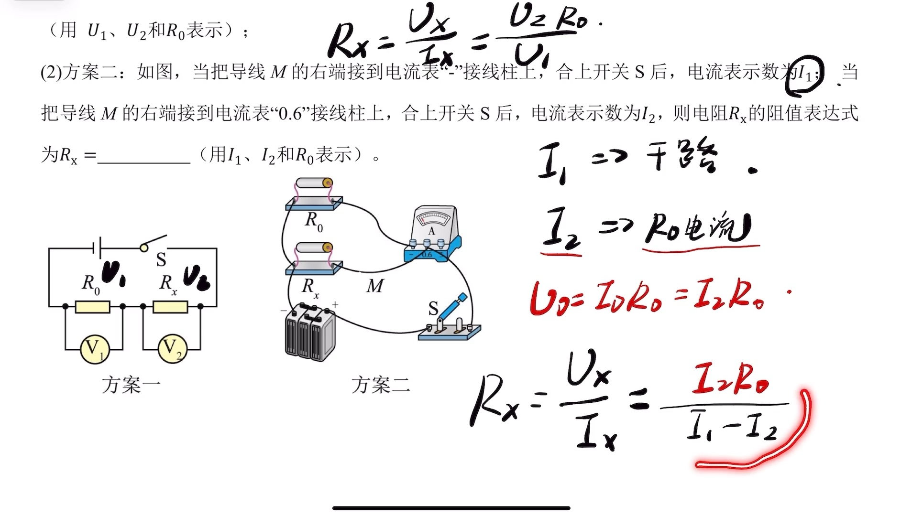

$R_x$ 与 $R_0$ 并联，只有一个电流表，靠把导线 $M$ 的右端改接到不同接线柱来切换测量对象：

- $M$ 接「 $-$」接线柱：电流表在**干路**，读数 $I_1$ = 总电流
- $M$ 接「0.6」接线柱：电流表只在 $R_0$ 支路，读数 $I_2$ = 通过 $R_0$ 的电流
- 于是 $I_x = I_1 - I_2$， $U_x = U_0 = I_2 R_0$

$$R_x = \frac{U_x}{I_x} = \frac{I_2 R_0}{I_1 - I_2}$$

**看图关键**：先判断电流表此刻站在干路还是某条支路上。改一根线，电流表从「数总人数」变成「数一个班的人数」，两者的差就是另一个班的——这正是双安法/单安法里「干路减支路」的思路，只不过用实物改接来考你读图。

---

## 海淀中考物理命题组视角：必要补充

以下是站在北京中考（尤其海淀）实验题命题角度，对这个视频内容必须补的几块。视频讲的是「怎么算」，考试考的是「怎么写规范、怎么变式、怎么不丢分」。

### 1. 特殊法测电阻在中考里怎么考

北京中考物理实验设计题里，「测未知电阻 $R_x$」是高频压轴。标准给法是：**电源（电压不变且未知）、电流表或电压表（常常只给一只，或明说另一只损坏）、定值电阻 $R_0$（或最大阻值已知的滑动变阻器 $R_{滑}$）、若干开关、导线**。要求你：① 画出/补全电路图，或补写实验步骤；② 用已知量和测量量写出 $R_x$ 的表达式。视频这四法就是全部解法来源，**「缺什么表就用已知电阻把另一个量算出来」是唯一的命题底层逻辑**。

### 2. 「等效替代法」——视频没讲但北京常考，务必补上

四大题型之外，北京卷还偏爱**等效替代法**（配套讲义里有、视频没展开）：

- 器材多一个**电阻箱** $R$（能读出示数的可变已知电阻）。
- 做法：先把开关接到 $R_x$，调滑动变阻器使电流表读某个值 $I$；再把开关接到电阻箱 $R$，**保持滑动变阻器不动**，只调电阻箱，让电流表**重新回到同一个 $I$**。此时电阻箱读数就等于 $R_x$。
- 原理：两次电路里「一个元件」对电流的效果完全相同 → 它俩电阻相同。思想方法叫**等效替代法**（注意：不是控制变量法，选择题常拿这两个混淆考你）。

一句话记忆：**等效替代 = 让表针回到老位置，读数直接抄。**

### 3. 三种「已知电阻」外壳要认得

命题人会把 $R_0$ 换成不同马甲，本质不变：

- **定值电阻 $R_0$**：直接给阻值，最常见。
- **最大阻值已知的滑动变阻器**：把滑片移到「最左（阻值 0）」和「最右（阻值最大 = 已知）」两端，制造两个状态——这就是视频例 2、例 5 的套路。看到「铭牌模糊/最大阻值」要立刻反应到「用两端当开关」。
- **电阻箱**：走等效替代法（第 2 点）。

### 4. 表达式书写与规范丢分点

- 表达式**只能用题干给的已知量符号 + 你自己测出来的量符号**（如 $I_1$、 $I_2$、 $U_1$、 $U_2$、 $R_0$）。**绝不能冒出题干里没有的中间量**（如 $U$、 $I_0$）——中考按符号对应给分，多写未知量直接扣分。视频板书里把 $U$、 $I_0$ 写在推导过程中没问题，但**最终答案必须把它们替换成已知量组合**。
- 实验步骤填空要写全「动作 + 读数对象」：例如「闭合 $S_1$、 $S_2$，**读出电压表的示数 $U_2$**」，只写「闭合开关」不写读什么是常见病句，会扣分。
- 涉及「保持滑片不动」「移到最左/最右端」的空，是命题人故意设的概念点，不是凑字数——填错整问全崩。

### 5. 易错点提醒（集中）

- **单安法/双安法用「干路减支路」时，滑片绝不能动**（例 1 步骤②），否则 $R_x$ 电流变了，减法作废。
- **同一电阻在不同电流下电压不同，要加撇区分**（例 2 的 $U_0$ 与 $U_0'$），别把两个状态的电压混成一个。
- **单伏法必须先「造」出电源电压**（例 5 滑片到一端、例 6 短路已知电阻），否则电流无从换算；例 6 里「为什么不能用简单电路那步直接算」是最烧脑也最常考的追问。
- **串联分压、并联分流别用反**：两个电流表 → 想并联；两个电压表 → 想串联。表的数量直接暗示电路结构。
- **等效替代法填「控制变量法」是错的**，正确思想方法是「等效替代法」。
- **实物改接题先定位电流表在干路还是支路**，别凭感觉减。

### 6. 复习优先级建议

- 必会（L1）：四大题型各一条主公式 + 「缺什么造什么」的总思路。
- 必懂（L2）：例 1「滑片保持不动」、例 2「 $U_0$ 加撇」、例 6「为何先测电源电压」这三个追问的道理——懂了就不容易在变式里翻车。
- 建立印象（L3）：等效替代法、实物改接读图。

---

## 自测（合上笔记做，检验是否真会用）

1. 只有一个电流表 + 已知 $R_0$， $R_x$ 与 $R_0$ 并联， $A_1$ 测干路 $I_1$、 $A_2$ 测 $R_0$ 支路 $I_2$，写出 $R_x$。
2. 只有一个电压表 + 已知 $R_0$， $R_x$ 与 $R_0$ 串联， $V_1$ 测 $R_0$ 电压 $U_1$、 $V_2$ 测 $R_x$ 电压 $U_2$，写出 $R_x$。
3. 测滑动变阻器最大阻值时，为什么常常把滑片分别移到最左端和最右端？这两个状态各帮你求出什么？
4. 等效替代法测 $R_x$，最后一步「让电流表回到同一个示数」的依据是什么？这个方法叫什么思想方法？
5. 单伏法里，为什么不能只在「 $R_0$ 被短路、只剩 $R_x$」的简单电路状态下直接算 $R_x$？

参考答案

1. $R_x = \dfrac{I_2 R_0}{I_1 - I_2}$。
2. $R_x = \dfrac{U_2 R_0}{U_1}$。
3. 最左端让变阻器接入为 0，形成只有 $R_0$ 的简单电路，用来把**电源电压**表示出来；最右端让变阻器取最大值，形成 $R_0$ 与它串联的状态，用「电源电压减 $R_0$ 电压」得到变阻器电压，再除电流即得最大阻值。
4. 依据是「同一位置、同一电源下，电流相同说明总效果相同，被替换的元件阻值相同」；思想方法叫**等效替代法**。
5. 因为那个状态下 $R_0$ 被短路、电路里没有已知电阻，无法把电压换算成电流， $I_x$ 求不出来；必须让 $R_0$ 留在串联电路里，才能用 $I = U_0 / R_0$ 造出电流。

---

## 复盘

- 错因：无（新学专题）
- 掌握状态：未掌握
- 复习记录：
  - （待抽查）
