# 第 8 讲 特殊方法测电阻（课外班讲义笔记）

- 来源：课外班讲义（老刘物理第 8 讲，学生版），Scribd 文档 952523546，共 16 页
- 难度：⭐⭐ 中考综合（等效替代、双表误差分析部分达 ⭐⭐⭐ 超中考）
- 考查知识点：特殊方法测电阻（安阻法、伏阻法、借助滑动变阻器、等效替代法）、伏安法误差分析

> 本讲主线：测电阻的本质永远是 $R = U / I$ ——想办法知道待测电阻两端电压 $U_x$ 和通过它的电流 $I_x$。缺电压表就想办法"造"出电压，缺电流表就想办法"造"出电流。

---

## 考点一 安阻法测电阻（只有电流表 + 已知阻值 $R_0$）

**思路**：缺电压表，想方法测电压。

1. 在 $R_x$ 两端**并联**一个已知阻值的电阻 $R_0$；
2. 用电流表测出通过 $R_0$ 的电流 $I_0$；
3. 由 $U_x = U_0 = I_0 R_0$ 算出待测电阻两端电压（并联支路电压相等）。

再测（或算出）通过 $R_x$ 的电流 $I_x$，则 $R_x = U_x / I_x = I_0 R_0 / I_x$。

### 例 1（讲义第 1 页）

"电阻测量盒"：内有电源（电压不变且未知）、已知阻值的定值电阻 $R_0$、开关和电流表，引出两根导线到盒外。盒外两导线接 $R_x$，根据开关闭合、断开时电流表的示数算出 $R_x$，**不符合要求**的电路图是（ ）

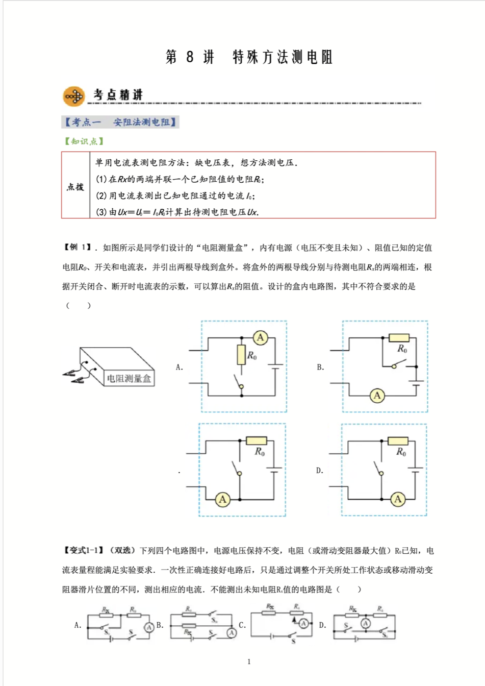

**判断标准**：开关切换的两种状态必须能分别给出" $R_0$ 的电流（或含 $R_0$ 的信息）"和"通过 $R_x$ 的电流"，且电源电压不变这一条件要能用上。若某种接法在两种开关状态下都无法把 $U$ 和 $I_x$ 分开确定（方程数不够），就不符合要求。

### 变式 1-1（双选，讲义第 1 页）

电源电压不变， $R_0$（或滑动变阻器最大值）已知，只通过开关状态或移动滑片测出相应电流，**不能**测出 $R_x$ 的电路图是（ ）

**排查口诀**：每切换一次状态列一个方程。若某个电路两种状态实际是同一个方程（比如开关断开/闭合都不影响测量支路），或滑片移到两端后未知量比方程多，就测不出来。

### 变式 1-2（讲义第 2 页）

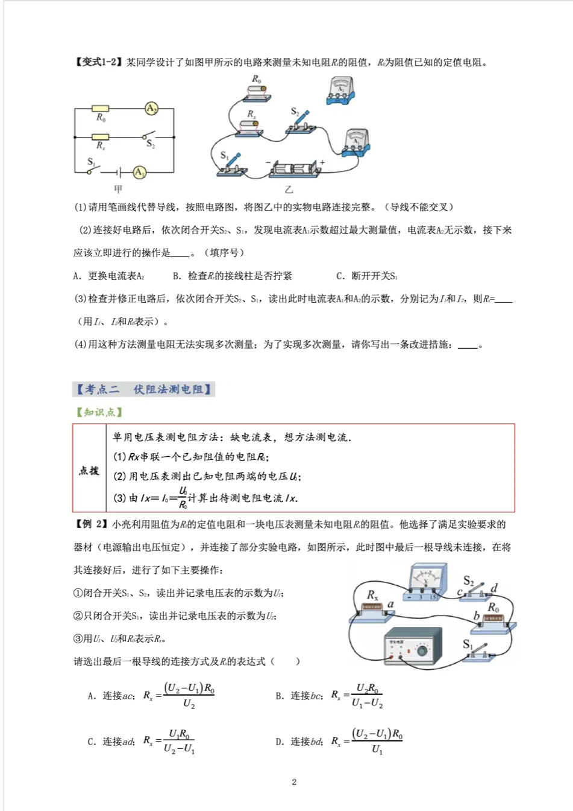

某同学设计图甲电路测 $R_x$（ $R_0$ 已知）：

(1) 按电路图连接实物（导线不交叉）。
(2) 依次闭合 $S_2$、 $S_1$，发现 $A_1$ 示数超过最大测量值、 $A_2$ 无示数，接下来应**立即断开开关 $S_1$**（选 C）。先断电再排查，带电检查是安全隐患。
(3) 修正后闭合 $S_2$、 $S_1$，读 $A_1$、 $A_2$ 示数 $I_1$、 $I_2$。 $A_1$ 测干路、 $A_2$ 测 $R_0$ 支路，则通过 $R_x$ 的电流为 $I_1 - I_2$，并联电压 $U = I_2 R_0$，故

$$R_x = \frac{I_2 R_0}{I_1 - I_2}$$

(4) 无法多次测量的改进措施：**把 $R_0$ 换成滑动变阻器**（或串联滑动变阻器），移动滑片改变电流，实现多次测量取平均。

---

## 考点二 伏阻法测电阻（只有电压表 + 已知阻值 $R_0$）

**思路**：缺电流表，想方法测电流。

1. 把 $R_x$ **串联**一个已知阻值的电阻 $R_0$；
2. 用电压表测出 $R_0$ 两端电压 $U_0$；
3. 由 $I_x = I_0 = U_0 / R_0$ 算出待测电阻的电流（串联电流处处相等）。

再测 $R_x$ 两端电压 $U_x$，则 $R_x = U_x R_0 / U_0$。

### 例 2（讲义第 2 页）

用 $R_0$ 和一块电压表测 $R_x$。操作：① 闭合 $S_1$、 $S_2$，电压表示数 $U_1$；② 只闭合 $S_1$，电压表示数 $U_2$。选导线接法及表达式。

**分析**：两次开关状态对应"电压表测电源总电压"和"电压表测某个电阻的分压"。若 $S_2$ 闭合时 $R_x$ 被短路、电压表测电源电压 $U_1$， $S_2$ 断开时 $R_0$ 与 $R_x$ 串联、电压表测 $R_x$ 电压 $U_2$，则 $R_0$ 分压 $U_1 - U_2$，电流 $I = (U_1 - U_2) / R_0$，得

$$R_x = \frac{U_2 R_0}{U_1 - U_2}$$

对照选项：导线接法必须让电压表在两种开关状态下分别落在"总电压"和" $R_x$ 电压"两个位置，选出表达式为 $R_x = U_2 R_0 / (U_1 - U_2)$ 的那一项（具体接法 ac/bc/ad/bd 需对照讲义第 2 页原图确认）。

### 变式 2-1（讲义第 3 页）

无电流表，用电压表 + 已知 $R_0$ 测 $R_x$，**不可以**实现的电路图是（ ）

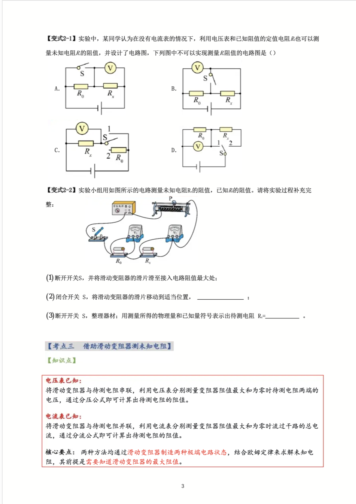

**判断要点**：电压表必须能（直接或间接）同时确定 $R_0$ 的电压和 $R_x$ 的电压。若某个电路中电压表位置固定、开关无论怎样都改不了"测不到 $R_0$ 分压"的局面，就测不出来。特别注意：若开关断开后电压表串联进电路，电压表内阻极大，此时读数近似电源电压，不能提供 $R_0$ 的电流信息。

### 变式 2-2（讲义第 3 页）

用图所示电路测 $R_x$（ $R_0$ 已知），补全步骤：

(2) 闭合 $S$，滑片移到适当位置，**用电压表分别测出 $R_0$ 两端电压 $U_0$ 和 $R_x$ 两端电压 $U_x$**；

$$R_x = \frac{U_x R_0}{U_0}$$

### 考点三 借助滑动变阻器测未知电阻（讲义第 3 页）

**电压表已知（串联分压型）**：将滑动变阻器与 $R_x$ 串联，电压表测 $R_x$ 两端电压。分别测滑片在**阻值最大处**（设最大阻值 $R$）和**阻值为零处**时的电压 $U_1$、 $U_2$：

- 滑片在零处：变阻器不分压，电压表读数即电源电压 $U = U_2$；
- 滑片在最大处： $R$ 与 $R_x$ 串联分压，变阻器分压 $U_2 - U_1$，电流 $I = (U_2 - U_1) / R$，

$$R_x = \frac{U_1 R}{U_2 - U_1}$$

**电流表已知（并联分流型）**：将滑动变阻器与 $R_x$ 并联，电流表在干路。分别测变阻器阻值最大和为零时的干路总电流，利用并联电压相等列方程求解。

**核心要点**：两种方法都是**用滑动变阻器制造两种极端电路状态**，结合欧姆定律求解。前提是**必须知道滑动变阻器的最大阻值**。

### 例 3（讲义第 4 页）

电源电压不变， $R$ 为最大阻值已知的滑动变阻器， $R_0$ 为已知定值电阻，**不拆接电路**测不出 $R_x$ 的是（ ）

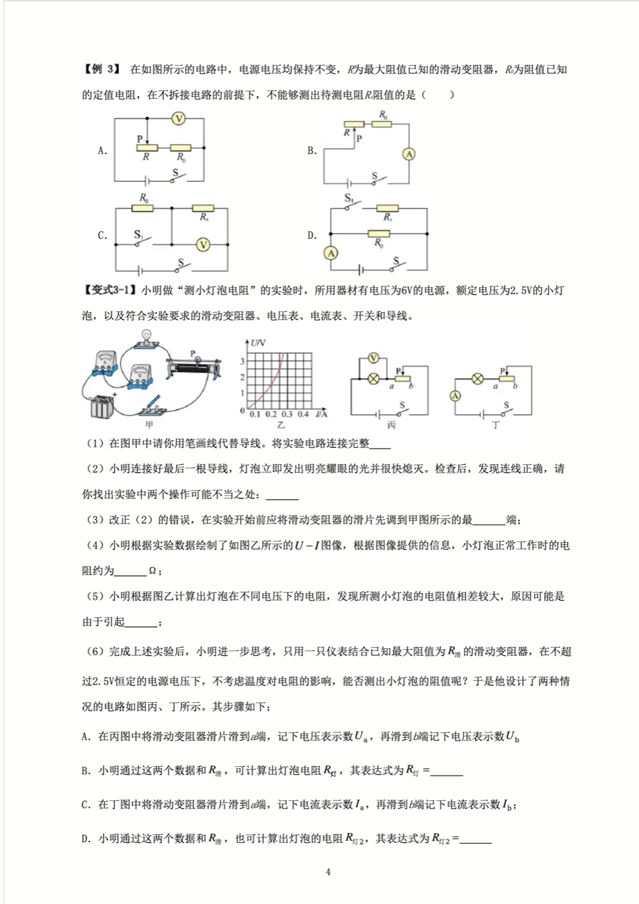

**思路**：不拆接电路意味着只能靠"移动滑片到两个端点"或"断开/闭合开关"制造两种状态。逐一检查每种接法能否列出两个独立方程。

### 变式 3-1（讲义第 4 页，实验综合题）

测小灯泡电阻：电源 6V，灯泡额定电压 2.5V。

(2) 连好最后一根导线灯泡立即发出耀眼的光并很快熄灭——两处操作不当：**连接电路时没有断开开关**、**滑动变阻器滑片没有预先放到阻值最大处**。
(3) 实验开始前滑片应调到使接入阻值**最大**的一端。
(5) 不同电压下灯泡电阻相差较大：**灯丝电阻随温度升高而增大**（不是误差，是真实规律）。
(6) 只用一只表 + 已知最大阻值 $R_{滑}$ 的变阻器测灯泡电阻（电源电压不超过 2.5V 恒定）：

- 丙图（电压表）：滑片在 a 端记下 $U_a$，在 b 端记下 $U_b$。一端使变阻器接入为零（电压表读数为电源电压），另一端全接入串联分压：

$$R_{灯1} = \frac{U_b   R_{滑}}{U_a - U_b}$$

- 丁图（电流表）：滑片在 a 端记 $I_a$、b 端记 $I_b$。一端只有灯泡接入（ $U = I_a R_{灯}$ ），另一端灯泡与最大阻值 $R_{滑}$ 并联、电流表在干路。利用电源电压不变，两支路电压相等： $(I_b - I_a) R_{滑} = I_a R_{灯}$ ，整理得讲义标准结果为

$$R_{灯2} = \frac{(I_b - I_a) R_{滑}}{I_a}$$

（以丁图实际连接为准： $I_a$ 是只有灯泡时的电流， $I_b$ 是灯泡与最大 $R_{滑}$ 并联后的干路电流，变阻器支路电流 $I_b - I_a$，两支路电压相等： $(I_b - I_a) R_{滑} = I_a R_{灯}$。）

### 变式 3-2（讲义第 5 页）

探究电流与电阻的关系：电源 4.5V，定值电阻 5Ω、10Ω、25Ω、50Ω。

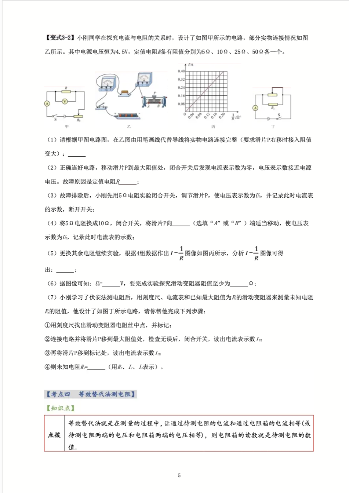

(2) 电流表为零、电压表接近电源电压 → 定值电阻 **断路**（电压表被串联进电路，测的是电源电压）。
(4) 5Ω 换 10Ω 后， $R$ 分压变大，要保持电压表示数 $U_0$ 不变，应**增大**变阻器分压，即滑片向阻值变大方向移动（按图中接线选 A 或 B）。
(5) $I$– $1/R$ 图像为过原点直线 → **电压一定时，电流与电阻成反比**。
(6)(7) 定量计算：控制电压 $U_0$ 不变时，变阻器分压 $4.5 - U_0$，由串联分压 $\frac{4.5 - U_0}{U_0} = \frac{R_{滑}}{R}$， $R$ 越大要求 $R_{滑}$ 越大，把最大的 50Ω 代入即可求变阻器最小阻值。
(7) 刻度尺 + 电流表 + 已知最大阻值 $R_1$ 的变阻器测 $R_x$（图丁： $R_x$ 与变阻器串联，电流表测总电流）：

- 滑片在最大处： $U = I_1 (R_x + R_1)$
- 滑片在中点（刻度尺找中点，接入 $R_1 / 2$）： $U = I_2 (R_x + R_1 / 2)$

两式相等解出：

$$R_x = \frac{I_1 R_1 - I_2 R_1 / 2}{I_2 - I_1} = \frac{(2 I_1 - I_2) R_1}{2 (I_2 - I_1)}$$

---

## 考点四 等效替代法测电阻（电阻箱）

**原理**：让待测电阻 $R_x$ 和电阻箱 $R_0$ 分别接入**同一位置的电路**，保持其他条件不变，若电表示数相同，说明两者"效果相同"，则 $R_x$ 等于电阻箱读数。

关键：**替换前后电路其余部分一律不动**（滑片位置不变、电源不变），只改变"接入的是 $R_x$ 还是电阻箱"。

### 例 4（讲义第 6 页）

$R_x$ 约 500Ω，电源约 3V，电流表（0~0.6A、0~3A）、滑动变阻器 $R_1$、电阻箱 $R_2$（0~999Ω），能**准确**测出 $R_x$ 的电路是（ ）

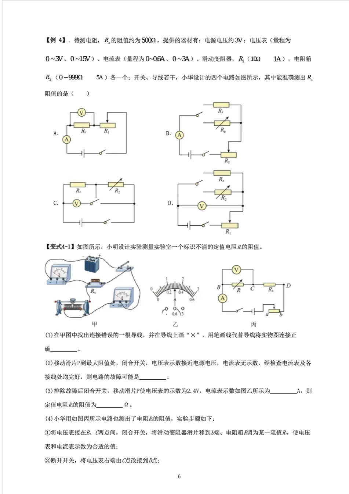

**分析**： $R_x \approx 500\Omega$、 $U \approx 3V$ 时电流约 $3 / 500 = 0.006A$，电流表 0~0.6A 量程分度值 0.02A，**根本读不出**，伏安法误差极大。只有等效替代法（电阻箱读数、不依赖小电流读数）能准确测出。选含电阻箱等效替代的电路（C 或 D，按讲义图判定）。

### 变式 4-1（讲义第 6~7 页）

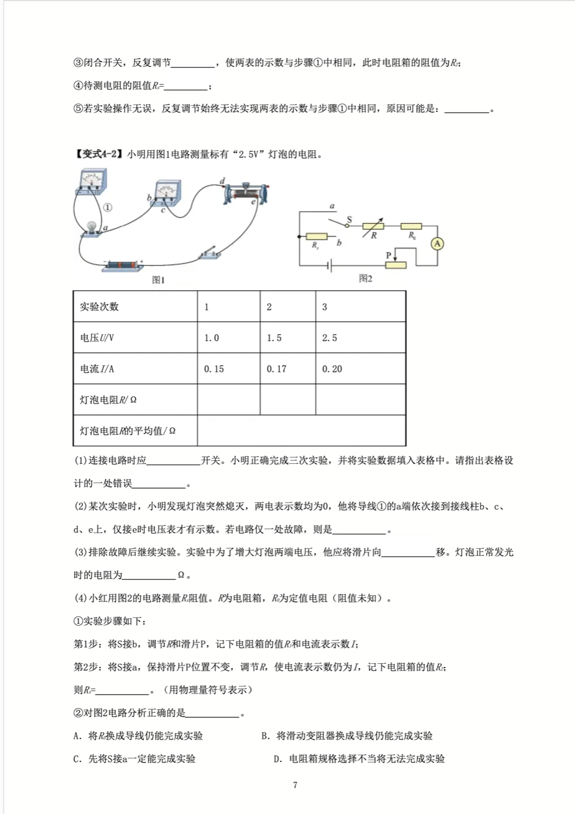

(2) 电压表接近电源电压、电流表无示数、接线完好 → 与电压表并联的元件（ $R_x$ 所在支路）**断路**。
(4) 丙图步骤：① 电压表接 B、C，滑片在 b 端、电阻箱调为 $R_1$，两表读数为合适值；② 断开开关，电压表右端由 C 改接到 D；③ 闭合开关，反复调节 **滑动变阻器和电阻箱**，使两表示数与①相同，此时电阻箱读数 $R_2$；④ 则 $R_x = R_2 - R_1$（电压表从测" $R_x$ 与 $R_1$ 的总电压"改为只测电阻箱电压，两次示数相同意味着电阻箱从 $R_1$ 调到 $R_2$ 恰好补上了 $R_x$ 的份额）。
⑤ 若始终无法使示数相同：可能是**电阻箱最大阻值不够大**（ $R_x$ 太大， $R_2$ 调不到所需值）。

### 变式 4-2（讲义第 7 页）

(1) 连接电路时应**断开**开关。表格设计错误：**设计了"灯泡电阻的平均值"一栏**——灯丝电阻随温度变化，不同电压下电阻本就不同，求平均无意义。
(2) 灯灭、两表均为 0，把导线①的 a 端依次接 b、c、d、e，仅接 e 时电压表才有示数 → 故障在 **d、e 之间**（即灯泡到 e 点段）断路：电压表只有并联在断口两端时才会显示电压。
(3) 要增大灯泡电压 → 减小变阻器分压 → 滑片向使接入阻值变小的方向移。正常发光时 $R = 2.5 / I$（读表中 2.5V 对应电流）。
(4) 图 2 等效替代：S 接 b 时记 $R_1$、电流 $I$；S 接 a、滑片不动、调 $R$ 使电流仍为 $I$，记 $R_2$。两次电路总效果相同： $R_0 + R_1 = R_x + R_2$，故

$$R_x = R_1 - R_2 + R_0$$

选项判断： $R_0$ 起保护电路作用，换成导线仍能完成实验（A 对）；滑动变阻器换成导线则无法控制电流、也可能超量程（B 视具体电路）；电阻箱规格选择不当（最大值不够）将无法完成实验（D 对）。

---

## 课后练习（讲义第 8~16 页）

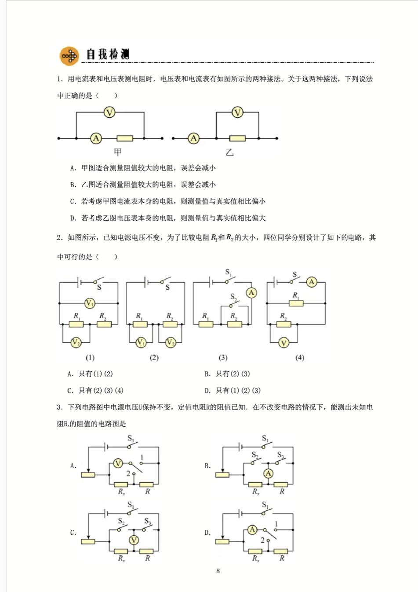

**第 1 题（内接外接误差，⭐⭐⭐ 超中考）**：甲图（电流表外接：电压表直接并联在 $R_x$ 两端）适合测**小**电阻；乙图（电流表内接：电流表与 $R_x$ 串联后整体并联电压表）适合测**大**电阻。考虑电表自身电阻：甲图中电压表分流使电流表读数偏大，测量值偏**小**（C 对）；乙图中电流表分压使电压表读数偏大，测量值偏**大**（D 对）。记忆口诀：**"大内偏大、小外偏小"**——测大电阻用内接、结果偏大；测小电阻用外接、结果偏小。

**第 2 题**：比较 $R_1$、 $R_2$ 大小，可行电路的判断标准：能否通过开关/滑片状态或串联分压关系比较出谁的分压（或电流）更大。

**第 3 题**： $U$ 不变、 $R$ 已知，不改变电路能测出 $R_x$ 的图——本质是安阻/伏阻法的开关切换型。

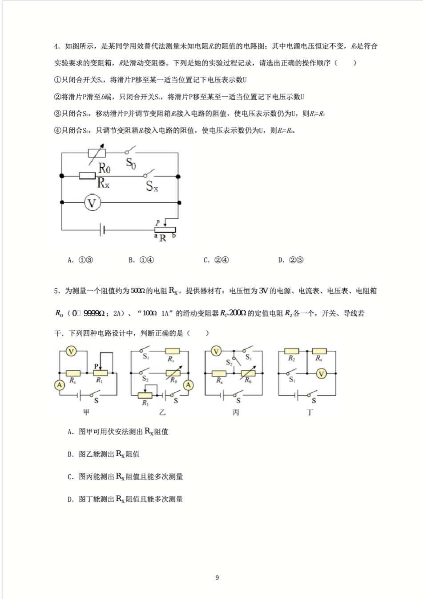

**第 4 题（等效替代操作顺序）**：正确顺序 **②④**（C）：先把滑片移到 b 端（阻值最大、保护电路），只闭合 $S_x$，将滑片移至适当位置记下电压 $U$；再只闭合 $S_0$、保持滑片不动，**只调节电阻箱**使电压表示数仍为 $U$。注意③和④的区别：③里"移动滑片 P 并调节变阻箱"破坏了"其余条件不变"，等效不成立。

**第 5 题**：测约 500Ω 电阻，器材有电阻箱（0~9999Ω）、100Ω 变阻器、200Ω 定值电阻。甲图伏安法因电流太小读不准（A 错）；能"多次测量"的电路必须能改变状态且每次都能列方程（结合图判断，一般选可切换/可调且含电阻箱的方案）。

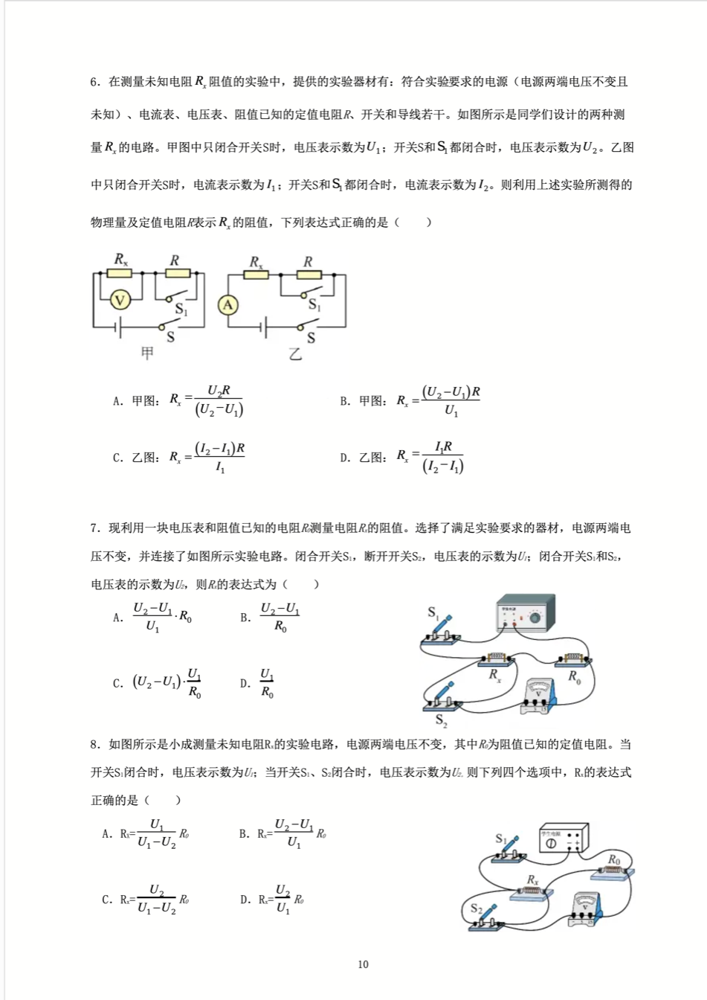

**第 6 题**：甲图（电压表 + 定值电阻 $R$）：常见接法是只闭合 $S$ 时 $R$ 与 $R_x$ 串联、电压表测 $R_x$ 电压 $U_1$； $S$、 $S_1$ 都闭合时 $R$ 被短路，电压表测电源电压 $U_2$。则只闭合 $S$ 时 $R$ 分压 $U_2 - U_1$，电流 $I = (U_2 - U_1) / R$，得 $R_x = U_1 R / (U_2 - U_1)$。
乙图（电流表 + $R$）：只闭合 $S$ 时电流表读数 $I_1$，都闭合时读数 $I_2$。若 $S_1$ 控制 $R$ 支路的通断且电流表在干路，则 $R$ 支路电流 $I_2 - I_1$，电源电压 $U = (I_2 - I_1) R$，故 $R_x = U / I_1 = (I_2 - I_1) R / I_1$。
两式分别与选项对照，选出匹配的项（注意：具体哪个表测哪段以讲义第 10 页原图为准，先判断开关两种状态下表的测量对象再套式）。

**第 7、8 题**：同为"开关通断改变电压表测量对象"型，套路：先判断每种开关状态下电压表分别测谁（总电压/某个分电压），再用串联电路电压分配 + 欧姆定律列式。以第 7 题为例：若 $S_2$ 断开时电压表测 $R_x$ 电压 $U_1$、 $S_2$ 闭合时测电源电压 $U_2$，则 $R_0$ 分压 $U_2 - U_1$， $R_x = U_1 R_0 / (U_2 - U_1)$；若两表位置互换（ $U_1$ 是总电压、 $U_2$ 是分电压），则 $R_x = U_2 R_0 / (U_1 - U_2)$。按原图判断后对照选项。

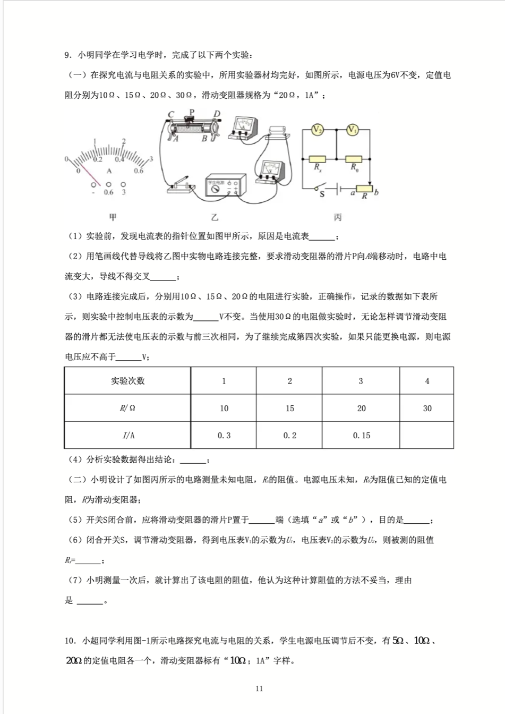

**第 9 题（探究电流与电阻关系 + 测未知电阻综合）**：电源 6V，定值电阻 10/15/20/30Ω，变阻器"20Ω 1A"。
(1) 电流表指针不指零 → 未**调零**。
(3) 由数据 $IR$ 乘积： $0.3 \times 10 = 3V$，控制电压表 3V 不变。30Ω 时要求变阻器分压 3V、阻值等于 30Ω > 20Ω，做不到；若只换电源： $U_{电源} \le U_0 (1 + R_{滑max} / R) = 3 \times (1 + 20 / 30) = 5V$，电源电压应不高于 **5V**。
(4) 结论：电压一定时，电流与电阻成反比。
(5) 闭合前滑片置于阻值最大端（按丙图接线选 a 或 b），目的：**保护电路**。
(6) $V_1$ 测 $R_0$、 $V_2$ 测 $R_x$（串联）： $R_x = U_2 R_0 / U_1$。
(7) 只测一次就下结论不妥：**一次测量存在偶然误差，应多次测量取平均值**。

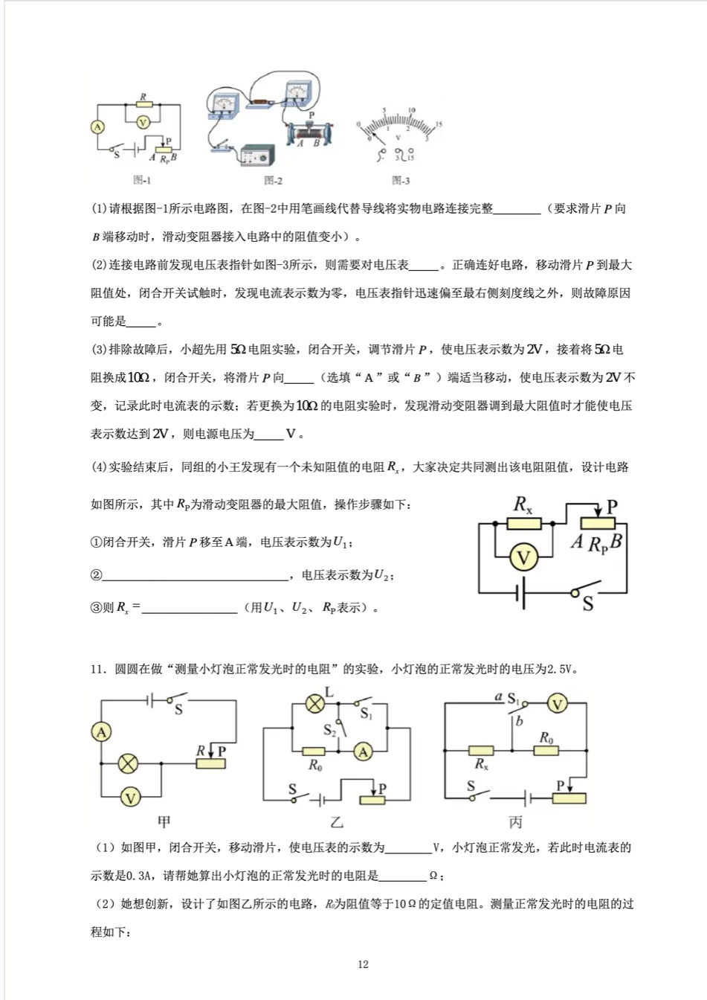

**第 10 题**：5/10/20Ω 电阻，变阻器"10Ω 1A"。
(2) 电压表指针不指零 → 调零；电流表为零、电压表迅速满偏 → 定值电阻**断路**。
(3) 5Ω 换 10Ω 后为保持 2V 需增大变阻器阻值，滑片向 **A**（阻值变大方向，按图）移；换 10Ω 时变阻器调到最大 10Ω 才使电压表到 2V → 变阻器分压 $= 2 \times 10 / 10 = 2V$，电源电压 **4V**。
(4) 测 $R_x$（ $R_P$ 为变阻器最大阻值）：① 滑片在 A 端（接入 0）电压表读数 $U_1$ 即电源电压；② **滑片移至 B 端（全部接入）**，电压表示数 $U_2$（测 $R_x$ 分压）；③ 变阻器分压 $U_1 - U_2$，电流 $(U_1 - U_2) / R_P$，

$$R_x = \frac{U_2 R_P}{U_1 - U_2}$$

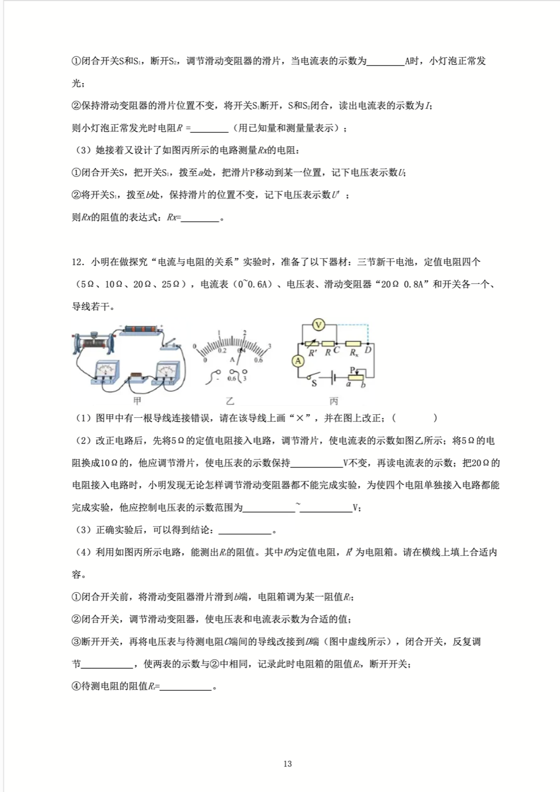

**第 11 题（测灯泡正常发光电阻，缺电压表用 $R_0$ + 电流表替代）**：
(1) 电压表 2.5V 时正常发光， $R = 2.5 / 0.3 \approx 8.3\Omega$。
(2) 乙图：① 闭合 $S$、 $S_1$ 断开 $S_2$，电流表测 $R_0$ 支路？——设计意图是**用电流表和 $R_0$ 当"电压表"用**：当通过 $R_0$（与灯泡并联？）的电流为 $2.5 / 10 = 0.25A$ 时灯泡两端恰为 2.5V，正常发光；② 保持滑片不动切换开关测总电流 $I$，则灯泡电流 $I - 0.25$， $R_{灯} = 2.5 / (I - 0.25)$。
(3) 丙图单刀双掷： $S_1$ 接 a 时电压表测 $R_x$ 与定值电阻的总电压 $U$，接 b 时只测定值电阻电压 $U'$（保持滑片不动），则 $R_x = (U - U') R_0 / U'$（ $R_0$ 为那只定值电阻）。

**第 12 题**：三节干电池 4.5V，5/10/20/25Ω 电阻，变阻器"20Ω 0.8A"。
(2) 图乙电流表读数 $I$，5Ω 时控制电压 $U_0 = I \times 5$；换 10Ω 保持 $U_0$ 不变。20Ω 不能完成 → 求控制电压范围：需 $R_{滑} = R (4.5 - U_0) / U_0 \le 20$，对最大电阻 25Ω： $(4.5 - U_0) / U_0 \le 0.8$， $U_0 \ge 2.5V$；同时电流不超 0.8A： $U_0 / 5 \le 0.8$ 恒成立，且电压表量程内 → 控制电压范围 **2.5V ~ 4.5V**（下限由 25Ω 决定）。
(4) 等效替代：③ 反复调节 **电阻箱**，使两表示数与②相同，记 $R_2$；④ 电压表从测" $R_x$"改为测" $R_x$ 与电阻箱串联整体"（C→D），示数不变意味着电阻箱分担了原 $R_x$ 之外……按本题接法 $R_x = R_2 - R_1$。

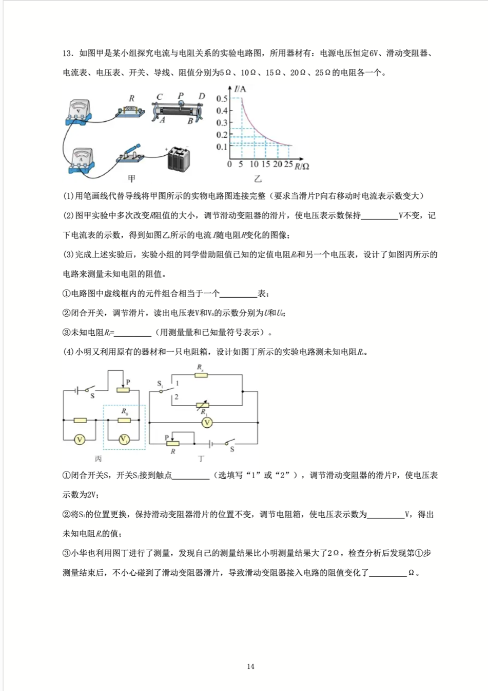

**第 13 题**：电源 6V，5/10/15/20/25Ω。
(2) 由乙图 $I$– $R$ 图像读出控制电压 $U_0 = IR$（图像上取一点计算，通常 2.5V 或 3V）。
(3) 丙图：虚线框内"已知 $R_0$ + 电压表 $V_0$"组合相当于一只**电流表**（用 $U_0 / R_0$ 得电流）； $R_x = U R_0 / U_0$（ $V$ 测 $R_x$ 电压 $U$，与 $R_0$ 串联电流相等）。
(4) 丁图等效替代：① $S_1$ 接 **1**（接入 $R_x$），调滑片使电压表 2V；② $S_1$ 接 2（接入电阻箱），**保持滑片不动**，调电阻箱使电压表仍为 **2V**，读电阻箱即 $R_x$；③ 碰了滑片使结果偏大 2Ω：接 2 时滑片移动后接入阻值比接 1 时**大了 2Ω**（分压关系被破坏，电阻箱读数被抬高）。

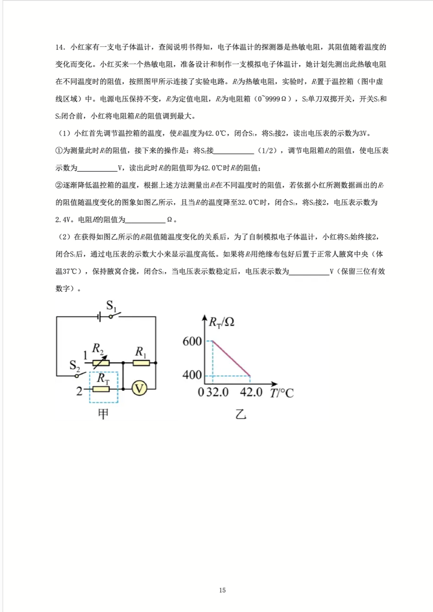

**第 14 题（热敏电阻 + 等效替代，⭐⭐⭐）**：
(1) ① 测 42.0℃ 时 $R_T$： $S_2$ 接 2 读出电压 3V 后，将 $S_2$ 接 **1**，调节电阻箱 $R_2$ 使电压表示数**仍为 3V**，此时 $R_2$ 读数即 $R_T$（等效替代： $R_T$ 与 $R_2$ 都在同一位置、与 $R_1$ 串联，电压相同则分压相同则阻值相同）。
② 32.0℃ 时 $S_2$ 接 2 电压 2.4V。由图乙读出 42.0℃、32.0℃ 对应的 $R_T$ 值，利用"电源电压不变"列两个方程： $U = 3 (R_1 + R_{T1}) / R_{T1}$ 型关系（电压表测定值/热敏哪一段按甲图判断），联立解出 $R_1$。
(2) 腋窝 37℃：由图乙读 37℃ 的 $R_T$，代入 $S_2$ 始终接 2 的串联分压公式求电压表示数（保留三位有效数字）。

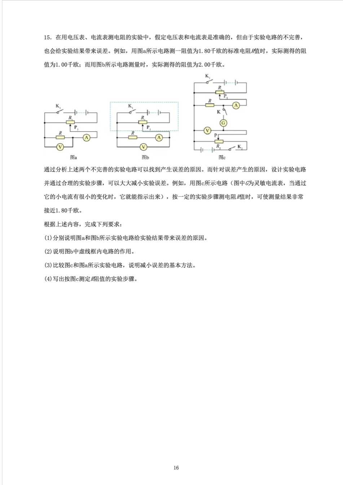

**第 15 题（伏安法误差根源探究，⭐⭐⭐ 超中考）**：1.80kΩ 标准电阻，a 图（内接）测得 1.00kΩ？不——题给 a 图测得 1.00kΩ、b 图测得 2.00kΩ。
(1) a 图误差来源：**电压表分流**（外接法，电流表读数 = 电阻电流 + 电压表电流，电流偏大 → 电阻测量值偏小）；b 图误差来源：**电流表分压**（内接法，电压表读数 = 电阻电压 + 电流表电压 → 测量值偏大）。
(2) b 图虚线框内电路作用：补偿/消除电流表分压带来的影响。
(3) c 图（灵敏电流计 G 接在桥式位置）减小误差的基本方法：**调节使 G 中电流为零**（桥平衡），此时被测电阻支路与电表支路互不干扰，电表内阻不再引入误差。
(4) 步骤要点：闭合开关 → 调节变阻器/电阻使 G 示数为零 → 由平衡条件算 $R$。

---

## 相关知识点汇总

- 欧姆定律： $I = U / R$，变形 $R = U / I$（测电阻的理论依据）
- 串联：电流处处相等，电压按电阻正比分配（分压公式）
- 并联：各支路电压相等，电流按电阻反比分配（分流公式）
- 电阻箱：能直接读出阻值的可变电阻；滑动变阻器：只能改变阻值、读不出数值（除非已知最大值）
- 等效替代思想：效果相同（电表示数相同）→ 阻值相同，是"特殊方法"里最精确的一种
- 实验安全规范：连接电路时断开开关；闭合前滑片放阻值最大处（保护电路）
- 灯丝电阻随温度升高而增大 → 测灯泡电阻**不能**求平均值

## 易错点提醒

- 安阻法要**并联** $R_0$（借它算电压），伏阻法要**串联** $R_0$（借它算电流），别记反
- 等效替代法替换后**滑片绝对不能再动**，动了"等效"就不成立
- 借助滑动变阻器的两种极端状态法，**必须知道变阻器最大阻值**，否则方程解不出
- 判断"能不能测出"：数一数两种状态给出的独立方程个数，未知量（电源电压、 $R_x$）不超过方程个数才能测出；两状态实质是同一方程的测不出
- 电流太小时（如 500Ω、3V → 6mA）电流表读不出，伏安法失效，必须换等效替代
- 开关断开导致电压表串联进电路时，电压表读数≈电源电压，不是故障误判的理由而是断路的证据
- 内接外接误差口诀："大内偏大、小外偏小"

## 复盘

- 错因：无（讲义预习笔记）
- 掌握状态：未掌握
- 复习记录：
  - （待抽查）
